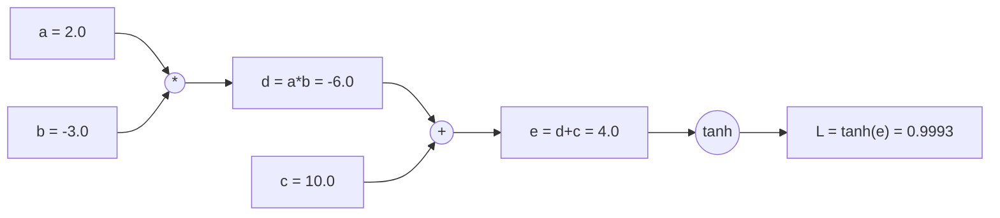
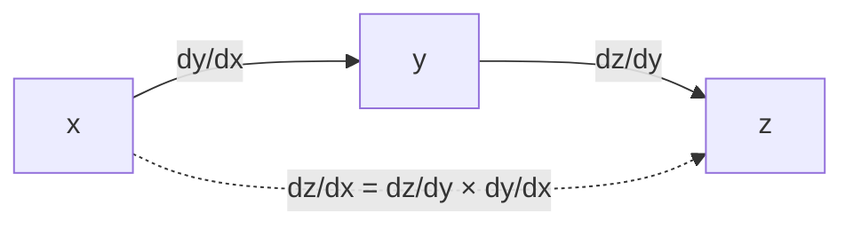
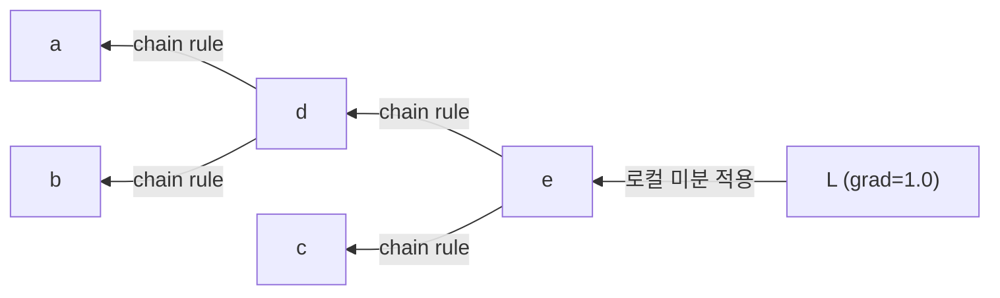
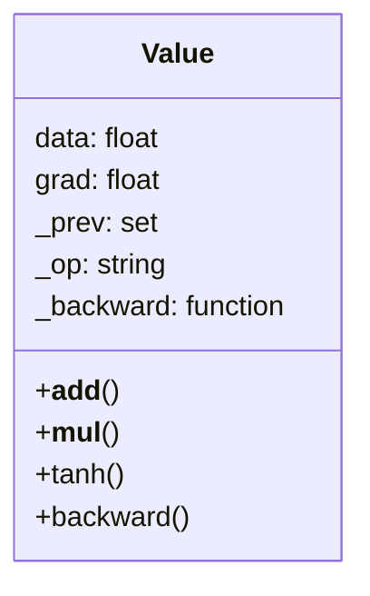
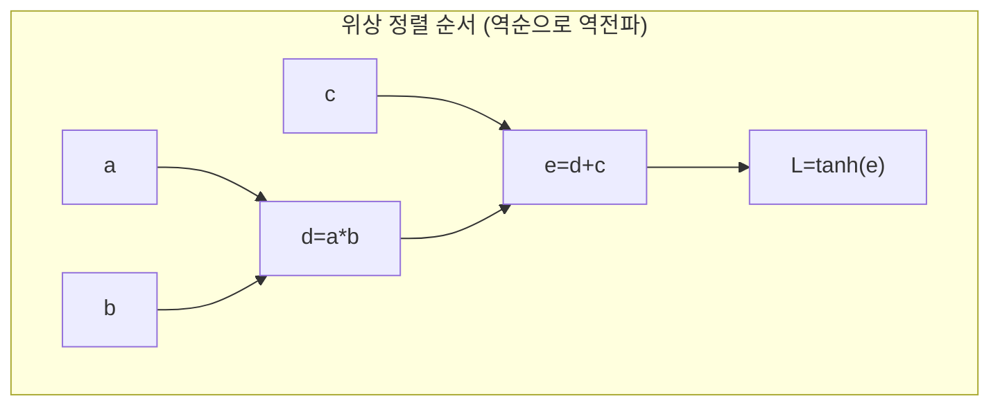
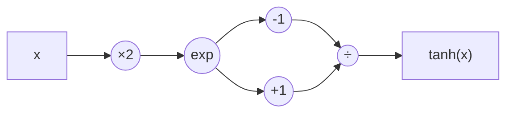
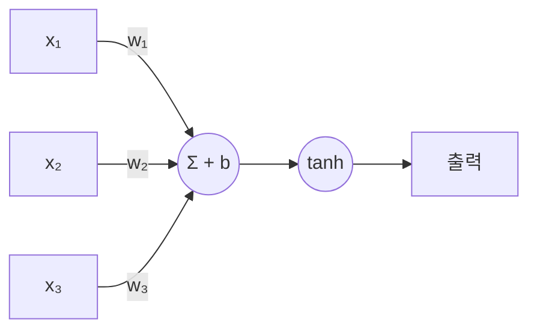
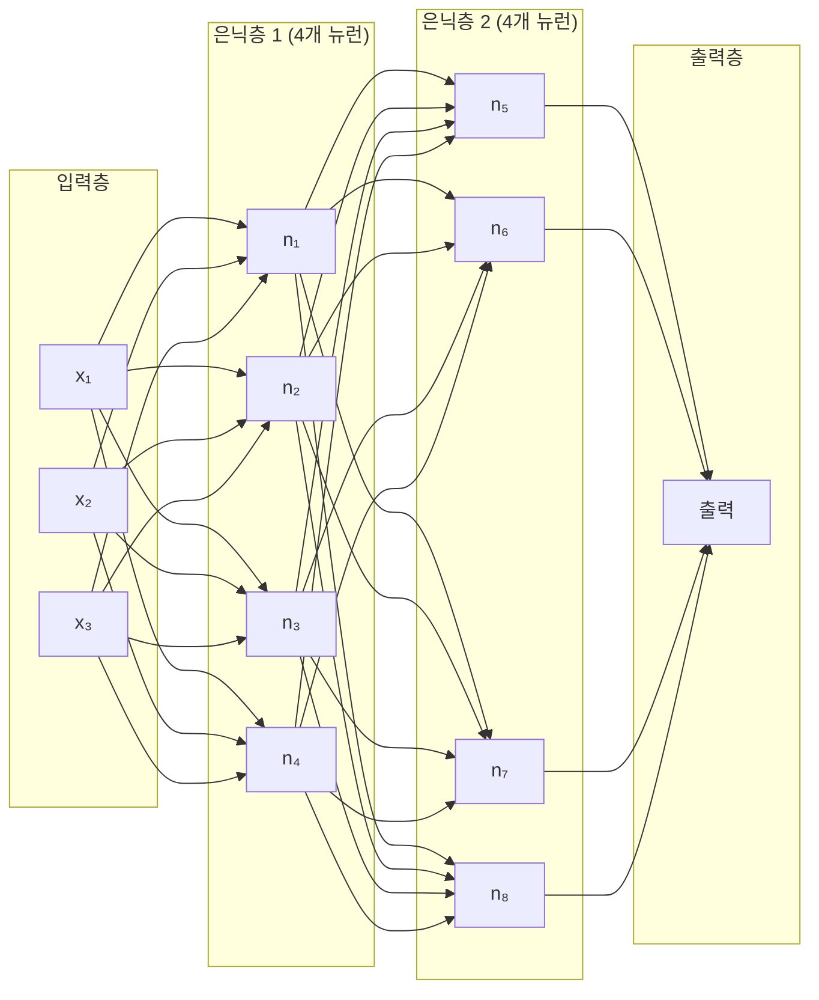
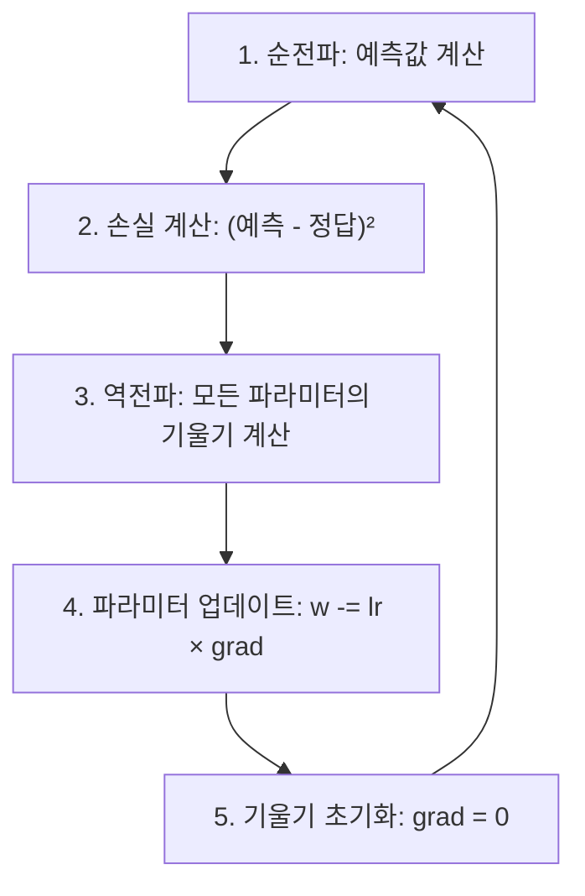

# Micrograd: 신경망의 내부 동작 원리

> 📺 **강의**: Andrej Karpathy - "The spelled-out intro to neural networks and backpropagation: building micrograd"
> 🔗 https://www.youtube.com/watch?v=VMj-3S1tku0

---

## 📌 강의 개요

**Micrograd** = 자동 미분(Autograd) 엔진을 밑바닥부터 구현하는 강의

- 신경망 학습의 핵심인 **역전파(Backpropagation)**를 직접 구현
- PyTorch 같은 딥러닝 프레임워크의 내부 원리를 이해

---

## 📺 00:00 - 10:00 | Micrograd 소개

### Autograd란?

- **Automatic Gradient** = 자동으로 기울기(gradient)를 계산해주는 엔진
- 역전파를 효율적으로 수행하는 알고리즘
- PyTorch, JAX 등 모든 딥러닝 프레임워크의 핵심

### 핵심 아이디어

| 개념 | 설명 |
|------|------|
| **스칼라 값(Value)** | 하나의 숫자를 감싸는 객체 |
| **연산 그래프** | 수학적 표현식을 그래프로 표현 |
| **기울기(grad)** | 각 값이 최종 출력에 미치는 영향 |

---

## 📺 10:00 - 25:00 | 미분과 도함수

### 도함수의 직관적 의미

> "입력을 아주 조금 바꿨을 때, 출력이 얼마나 바뀌는가?"

- 기울기가 **양수** → 입력 증가 시 출력도 증가
- 기울기가 **음수** → 입력 증가 시 출력은 감소
- 기울기가 **0** → 입력 변화에 출력 변화 없음

### 수치 미분 (Numerical Gradient)

- 아주 작은 값(h)만큼 입력을 변화시켜 출력 변화를 관찰
- `(f(x+h) - f(x)) / h` 로 기울기를 근사
- 느리지만 **검증 도구**로 유용 (gradient checking)

---

## 📺 25:00 - 40:00 | 연산 그래프와 순전파

### 연산 그래프 (Computational Graph)

수학적 표현식을 노드와 간선으로 표현:

### 순전파 (Forward Pass)

- 입력에서 출력 방향으로 값을 계산
- 각 노드는 자신의 연산(+, *, tanh 등)을 수행
- 최종 출력(L)까지 값이 전파됨

---

## 📺 40:00 - 55:00 | 역전파와 Chain Rule

### Chain Rule (연쇄 법칙)

> z가 y에 의존하고, y가 x에 의존하면:
> **dz/dx = dz/dy × dy/dx**

### 역전파 (Backward Pass)

- 출력에서 입력 방향으로 기울기를 전파
- 각 노드에서 **로컬 미분 × 상위 기울기**를 계산

### 각 연산의 로컬 미분

| 연산 | 로컬 미분 |
|------|----------|
| **덧셈** (a + b) | dL/da = 1.0, dL/db = 1.0 (기울기 그대로 전달) |
| **곱셈** (a * b) | dL/da = b, dL/db = a (서로의 값으로 교환) |
| **tanh** | dL/dx = 1 - tanh(x)² |

---

## 📺 55:00 - 01:10:00 | Value 클래스 구현

### Value 객체의 구조

| 속성 | 역할 |
|------|------|
| **data** | 실제 숫자 값 |
| **grad** | 이 값의 기울기 (dL/d_self) |
| **_prev** | 이 값을 만든 자식 노드들 |
| **_op** | 어떤 연산으로 만들어졌는지 (+, *, tanh 등) |
| **_backward** | 역전파 시 호출할 함수 |

---

## 📺 01:10:00 - 01:27:00 | 역전파 자동화

### 위상 정렬 (Topological Sort)

역전파는 **출력 → 입력** 순서로 진행해야 하므로, 그래프를 위상 정렬:

역전파 순서: **L → e → d, c → a, b**

### 기울기 누적

- 같은 노드가 여러 경로로 사용되면 기울기를 **더해야** 함 (덮어쓰면 안 됨)
- `grad += 로컬미분 × 상위기울기` (= 아닌 += 사용)

---

## 📺 01:27:00 - 01:40:00 | tanh를 기본 연산으로 분해

### tanh를 exp로 분해

tanh(x) = (e^(2x) - 1) / (e^(2x) + 1)

- 개별 연산(exp, +, -, /, *)마다 역전파 구현
- tanh를 하나의 노드로 할 때와 **동일한 기울기** 결과
- 어떤 수준에서 연산을 묶든 상관없음 → 유연함

---

## 📺 01:40:00 - 01:55:00 | 뉴런과 신경망 구축

### 뉴런 (Neuron)

- 입력 × 가중치 → 합산 + 편향 → 활성화 함수 → 출력
- 가중치(w)와 편향(b)이 학습 대상 **파라미터**

### 신경망 구조: MLP (Multi-Layer Perceptron)

| 구성 요소 | 역할 |
|-----------|------|
| **Neuron** | 입력의 가중합 + 활성화 |
| **Layer** | 여러 뉴런의 모음 |
| **MLP** | 여러 레이어의 연결 |

---

## 📺 01:55:00 - 02:15:00 | 학습 (Training)

### 학습 과정

### 손실 함수 (Loss Function)

- **MSE (Mean Squared Error)**: 각 예측값과 정답의 차이를 제곱하여 평균
- 손실이 0에 가까울수록 모델이 잘 학습된 것

### 학습률 (Learning Rate)

| 학습률 | 결과 |
|--------|------|
| **너무 크면** | 발산 (loss가 증가) |
| **너무 작으면** | 학습이 매우 느림 |
| **적절하면** | 안정적으로 loss 감소 |

### 기울기 초기화가 필요한 이유

- 역전파 시 기울기가 **누적** (+= )됨
- 초기화하지 않으면 이전 스텝의 기울기가 남아 잘못된 업데이트

---

## 📺 02:15:00 - 02:25:00 | PyTorch와의 비교

### Micrograd vs PyTorch

| | Micrograd | PyTorch |
|---|-----------|---------|
| **대상** | 스칼라 (숫자 하나) | 텐서 (다차원 배열) |
| **목적** | 교육용 | 실제 학습용 |
| **핵심 원리** | 동일 | 동일 |
| **성능** | 느림 | GPU 가속 |

### 핵심 메시지

> PyTorch의 Tensor는 Micrograd의 Value와 **동일한 원리**로 동작한다.
> 차이는 스칼라 → 텐서로 확장한 것뿐.

```mermaid
graph LR
    subgraph "Micrograd"
        V["Value(2.0)"]
    end
    subgraph "PyTorch"
        T["Tensor&#40;[2.0, 3.0, ...]&#41;"]
    end
    V -.->|"같은 원리, 다른 규모"| T
```

---

## 🔑 핵심 개념 정리

### 1. 연산 그래프
- 수학 표현식을 **노드(값)**와 **간선(연산)**으로 표현
- 순전파: 입력 → 출력 방향으로 값 계산
- 역전파: 출력 → 입력 방향으로 기울기 전파

### 2. 역전파 = Chain Rule의 반복 적용
- 각 노드에서 **로컬 미분 × 상위 기울기** 계산
- 위상 정렬 순서대로 진행
- 기울기는 **누적** (+=)

### 3. 신경망 학습 루프
- 순전파 → 손실 계산 → 역전파 → 파라미터 업데이트 → 기울기 초기화
- 이 과정을 수백~수천 번 반복

### 4. 뉴런의 구조
- 입력 × 가중치의 합 + 편향 → 활성화 함수
- 학습 = 가중치와 편향을 조정하여 손실을 줄이는 과정

---

## 🎯 학습 체크포인트

- [ ] 도함수의 직관적 의미를 설명할 수 있는가?
- [ ] 연산 그래프가 무엇인지 이해하는가?
- [ ] Chain Rule이 역전파에서 어떻게 사용되는지 설명할 수 있는가?
- [ ] 덧셈/곱셈 노드의 로컬 미분을 계산할 수 있는가?
- [ ] 위상 정렬이 왜 필요한지 이해하는가?
- [ ] 기울기 누적(+=)과 초기화가 왜 필요한지 설명할 수 있는가?
- [ ] 뉴런 → 레이어 → MLP 구조를 설명할 수 있는가?
- [ ] 학습 루프의 5단계를 순서대로 말할 수 있는가?
- [ ] Micrograd와 PyTorch의 관계를 설명할 수 있는가?
