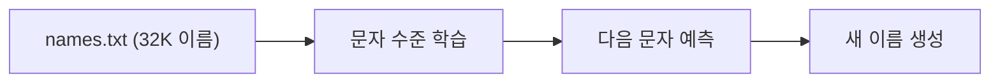
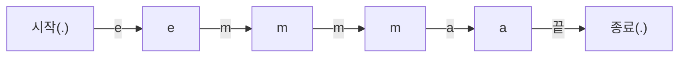
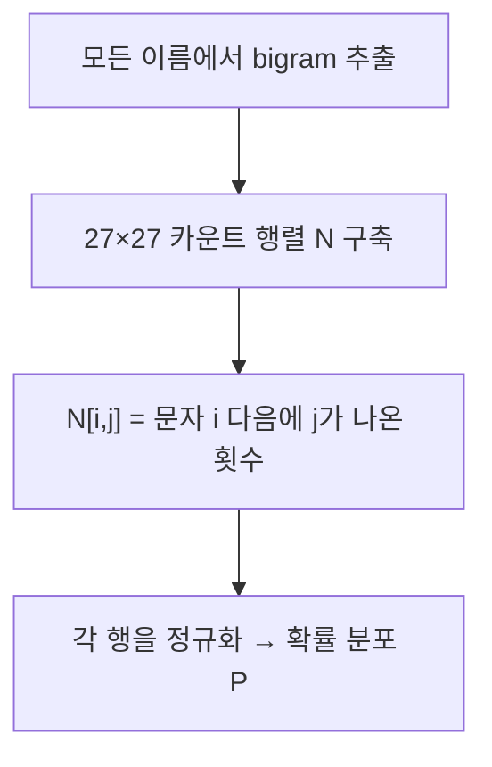
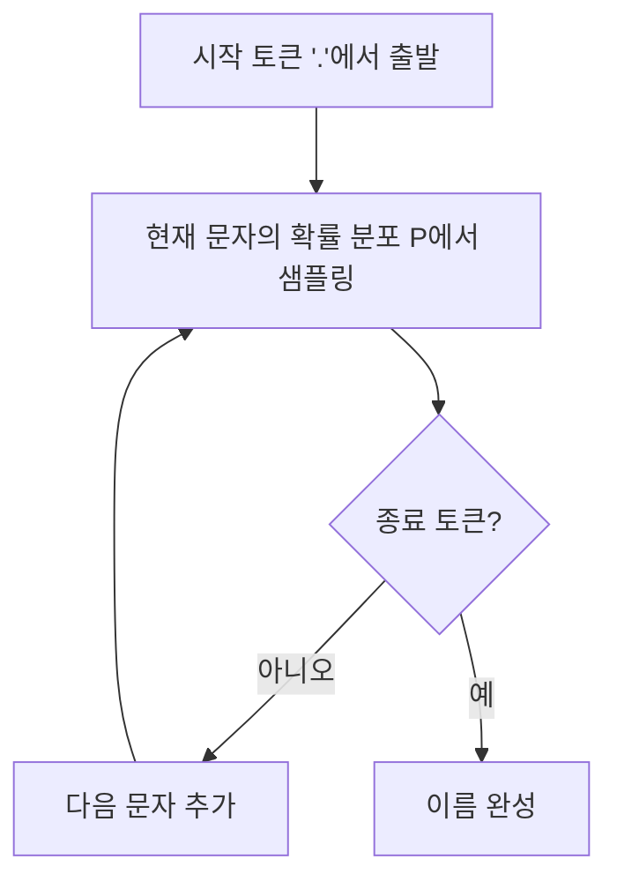
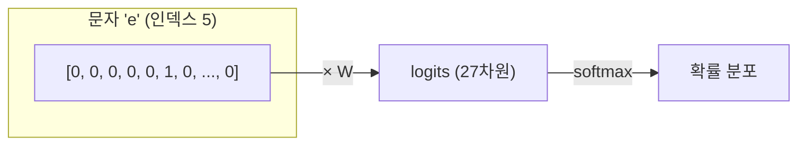
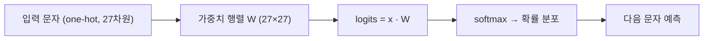
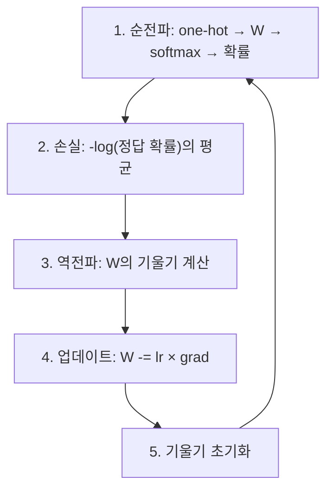
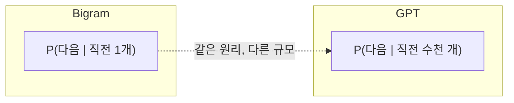

# Makemore Part 1: Bigram 문자 수준 언어 모델

> 📺 **강의**: Andrej Karpathy - "The spelled-out intro to language modeling: building makemore"
> 🔗 https://www.youtube.com/watch?v=PaCmpygFfXo

---

## 📌 강의 개요

**Makemore** = 주어진 데이터와 비슷한 것을 더 만들어내는 문자 수준 언어 모델

- 32,000개의 이름 데이터로 학습
- 새로운 이름을 생성 (dontel, irot, zhendi 등)
- 두 가지 방식으로 동일한 모델 구현: **카운팅** vs **신경망**

---

## 📺 00:00 - 08:00 | Bigram이란?

### 문자 수준 언어 모델

- 단어가 아닌 **개별 문자** 단위로 학습
- "emma" → 'e', 'm', 'm', 'a' 시퀀스로 처리

### Bigram = 연속된 두 문자의 쌍

> "이전 문자가 X일 때, 다음 문자는 무엇일까?"

- 시작/끝을 나타내는 특수 토큰 `.` 사용
- "emma"의 bigram들: `.e`, `em`, `mm`, `ma`, `a.`

---

## 📺 08:00 - 28:00 | 카운팅 기반 Bigram 모델

### 카운트 행렬 (27×27)

26개 알파벳 + 특수토큰 = 27개 문자

| | 행 (row) | 열 (column) |
|---|---------|-------------|
| **의미** | 현재 문자 | 다음 문자 |
| **예시** | N[a, n] = 'a' 다음에 'n'이 나온 횟수 |

### 확률로 변환

- 각 행의 합이 1이 되도록 정규화
- P[i, j] = "문자 i 다음에 문자 j가 올 확률"

---

## 📺 28:00 - 38:00 | 이름 생성 (샘플링)

### 생성 과정

- `torch.multinomial`: 확률 분포에서 랜덤 샘플링
- 확률이 높은 문자가 더 자주 선택됨
- 매번 다른 이름이 생성됨 (확률적)

---

## 📺 38:00 - 55:00 | 모델 평가와 스무딩

### Negative Log Likelihood (NLL)

> 모델이 학습 데이터를 얼마나 잘 설명하는가?

| 지표 | 의미 |
|------|------|
| **NLL ≈ 3.3** | 완전 랜덤 (1/27 확률) |
| **NLL ≈ 2.45** | 우리 Bigram 모델 (더 좋음) |
| **NLL = 0** | 완벽한 예측 (불가능) |

- **낮을수록 좋음** (모델이 데이터를 잘 설명)

### 라플라스 스무딩

- **문제**: 학습 데이터에 없는 bigram → 확률 0 → log(0) = -∞
- **해결**: 모든 카운트에 +1 추가
- 클수록 균등한 분포, 작을수록 뾰족한 분포

---

## 📺 55:00 - 01:15:00 | 신경망 기반 Bigram

### 왜 신경망인가?

| 컨텍스트 | 카운팅 조합 수 |
|----------|---------------|
| Bigram (2개) | 27² = 729 |
| Trigram (3개) | 27³ = 19,683 |
| 4-gram | 27⁴ = 531,441 |

→ 컨텍스트가 길어지면 카운팅은 **폭발적으로 증가**, 신경망은 **확장 가능**

### One-Hot Encoding

- 문자를 숫자 벡터로 변환
- 해당 문자 위치만 1, 나머지 0
- 문자 간 순서/크기 관계 없이 **동등하게 표현**

---

## 📺 01:15:00 - 01:55:00 | 신경망 학습

### 신경망 구조

### 학습 루프

### Cross Entropy Loss

| 정답 확률 | Loss |
|-----------|------|
| 1.0 (확신) | 0 |
| 0.5 | 0.69 |
| 0.01 (거의 틀림) | 4.6 |
| 0.0 | ∞ |

### 핵심 결과

> 신경망 모델의 최종 loss ≈ 2.45 = **카운팅 방식과 동일**

둘은 같은 문제를 다른 방법으로 푼 것이며, Bigram에서는 동일한 결과에 수렴

---

## 🔑 핵심 개념 정리

### 1. 언어 모델

### 2. 카운팅 vs 신경망

| 카운팅 | 신경망 |
|--------|--------|
| 빈도수 직접 세기 | 파라미터 학습 |
| 테이블 저장 | 가중치 행렬 |
| 확장성 제한 | 확장 용이 |
| 스무딩 필요 | 자연스럽게 일반화 |

### 3. Softmax
- 임의의 실수 → 확률 분포 (합=1, 모두 양수)
- exp()로 음수를 양수로, 정규화로 합을 1로

### 4. Cross Entropy Loss
- 정답의 확률이 높으면 loss 낮음
- NLL(Negative Log Likelihood)과 동일

---

## 🎯 학습 체크포인트

- [ ] Bigram이 무엇인지 설명할 수 있는가?
- [ ] 카운트 행렬을 확률로 변환하는 방법을 아는가?
- [ ] One-hot 인코딩이 왜 필요한지 설명할 수 있는가?
- [ ] Softmax 함수의 역할을 이해하는가?
- [ ] Cross Entropy Loss가 어떻게 계산되는지 아는가?
- [ ] 신경망 모델이 카운팅 모델과 같은 결과를 내는 이유를 설명할 수 있는가?
- [ ] 라플라스 스무딩이 왜 필요한지 설명할 수 있는가?
