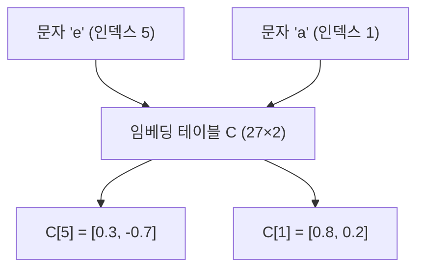
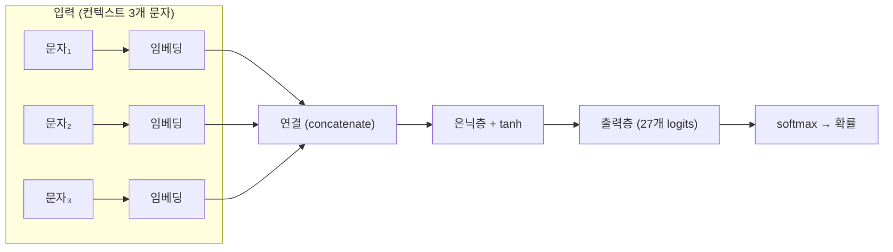
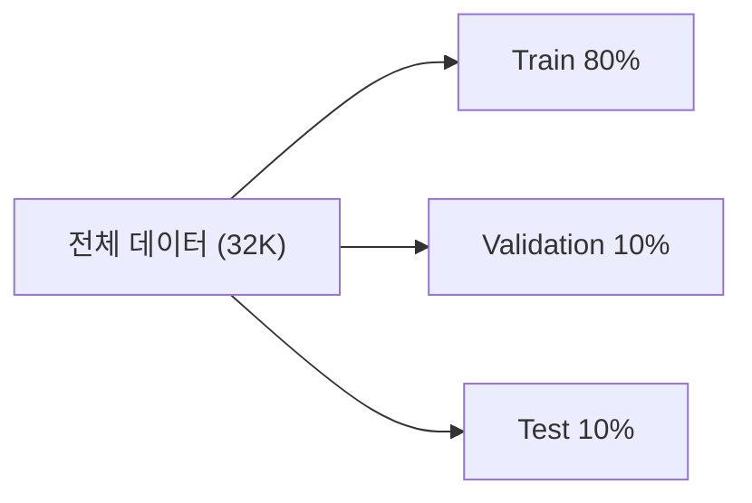
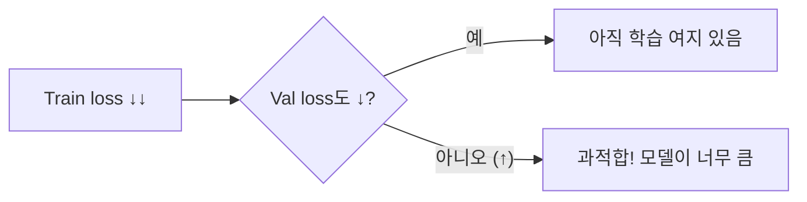

# Makemore Part 2: MLP (Multi-Layer Perceptron)

> 📺 **강의**: Andrej Karpathy - "Building makemore Part 2: MLP"
> 🔗 https://www.youtube.com/watch?v=TCH_1BHY58I
> 📄 **논문**: Bengio et al. 2003 - "A Neural Probabilistic Language Model"

---

## 📌 강의 개요

Bigram의 한계를 넘어, **여러 문자의 컨텍스트**를 보고 다음 문자를 예측하는 MLP 구현

---

## 📺 00:00 - 10:00 | Bigram의 한계와 MLP 동기

### 카운팅의 확장 문제

| 컨텍스트 길이 | 필요한 테이블 크기 | 문제 |
|-------------|-----------------|------|
| 1 (Bigram) | 27² = 729 | OK |
| 2 (Trigram) | 27³ = 19,683 | 대부분 0 |
| 3 | 27⁴ = 531,441 | 희소 (sparse) |

### Bengio et al. 2003 아이디어

- 문자를 **임베딩 벡터**로 변환 (lookup table)
- 여러 문자의 임베딩을 **연결(concatenate)**하여 입력
- 은닉층을 통해 **패턴 학습**

---

## 📺 10:00 - 25:00 | 임베딩 (Embedding)

### 임베딩이란?

> 각 문자를 **저차원 연속 벡터**로 표현

| One-hot (이전) | 임베딩 (현재) |
|---------------|-------------|
| 27차원 (대부분 0) | 2~10차원 (밀집) |
| 고정 | 학습으로 업데이트 |
| 문자 간 관계 없음 | 유사한 문자가 가까이 위치 |

### 임베딩 = 룩업 테이블

- One-hot × W = W의 특정 행 추출 = **테이블 참조(lookup)**와 동일
- 학습을 통해 비슷한 문자가 임베딩 공간에서 가까워짐

---

## 📺 25:00 - 45:00 | MLP 구조

### 전체 아키텍처

### 각 레이어의 역할

| 레이어 | 차원 변화 | 역할 |
|--------|----------|------|
| **임베딩 C** | 인덱스 → (n_embd,) | 문자를 벡터로 변환 |
| **연결** | 3 × (n_embd,) → (3·n_embd,) | 컨텍스트 합치기 |
| **은닉층 W1** | (3·n_embd) → (n_hidden) | 패턴 학습 |
| **출력층 W2** | (n_hidden) → (27) | 다음 문자 확률 |

---

## 📺 45:00 - 01:05:00 | 학습 과정

### 데이터셋 분할

| 세트 | 용도 |
|------|------|
| **Train** | 파라미터 학습 |
| **Validation** | 하이퍼파라미터 튜닝 (학습률, 임베딩 크기 등) |
| **Test** | 최종 성능 평가 (한 번만 사용) |

### 미니배치 (Mini-batch)

- 전체 데이터 대신 **일부(32개 등)만 뽑아서** 학습
- 매 스텝마다 다른 배치 → 노이즈가 있지만 빠름
- 기울기의 **근사치**를 사용하여 효율적으로 학습

### 학습률 찾기

- 보통 0.1 ~ 0.01 범위
- 학습 후반에는 학습률을 줄이면 (decay) 더 안정적

---

## 📺 01:05:00 - 01:20:00 | 하이퍼파라미터 실험

### 주요 하이퍼파라미터

| 파라미터 | 역할 | 실험 범위 |
|---------|------|----------|
| **임베딩 차원** | 문자 벡터 크기 | 2 → 10 |
| **은닉층 크기** | 네트워크 용량 | 100 → 300 |
| **컨텍스트 길이** | 보는 문자 수 | 3 → 더 길게 |
| **학습률** | 업데이트 크기 | 0.1 → 0.01 |
| **배치 크기** | 한 번에 학습할 샘플 수 | 32 |

### 과적합 (Overfitting) 관찰

- Train loss만 낮아지고 Val loss가 올라가면 과적합
- 해결: 모델 축소, 데이터 추가, 정규화

---

## 📺 01:20:00 - 01:30:00 | 임베딩 시각화와 생성

### 임베딩 공간

- 2D 임베딩으로 학습 시 시각화 가능
- **비슷한 역할의 문자**가 가까이 모임 (모음끼리, 자음끼리 등)

### 최종 성능

| 모델 | Validation Loss |
|------|----------------|
| Bigram | ~2.45 |
| MLP (이번 강의) | ~2.17 |

→ 컨텍스트를 더 보는 것만으로 **의미 있는 개선**

---

## 🔑 핵심 개념 정리

### 1. 임베딩
- 이산적인 토큰(문자)을 연속적인 벡터로 변환
- 학습을 통해 의미적으로 유사한 토큰이 가까워짐

### 2. MLP 구조
- 임베딩 → 연결 → 은닉층 → 출력층 → softmax
- 컨텍스트가 길어져도 **파라미터 수가 관리 가능**

### 3. 데이터셋 분할
- Train / Validation / Test 세 가지로 분할
- 과적합을 방지하고 일반화 성능을 측정

### 4. 미니배치 학습
- 전체 데이터 대신 소량씩 뽑아서 학습
- 속도와 정확도의 트레이드오프

---

## 🎯 학습 체크포인트

- [ ] 임베딩이 One-hot 대비 어떤 장점이 있는지 설명할 수 있는가?
- [ ] MLP의 각 레이어 역할을 설명할 수 있는가?
- [ ] Train/Validation/Test 분할의 목적을 아는가?
- [ ] 미니배치가 왜 필요한지 이해하는가?
- [ ] 과적합이 무엇이고 어떻게 감지하는지 아는가?
- [ ] 학습률을 어떻게 찾는지 설명할 수 있는가?
- [ ] Bigram 대비 MLP가 왜 더 좋은 성능을 내는지 설명할 수 있는가?
