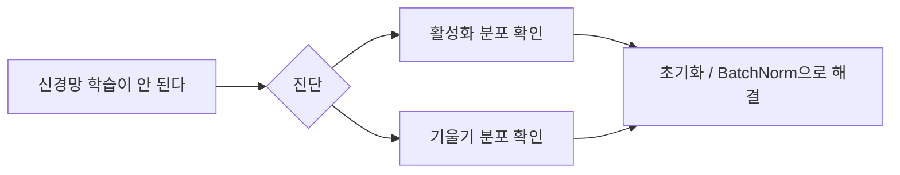
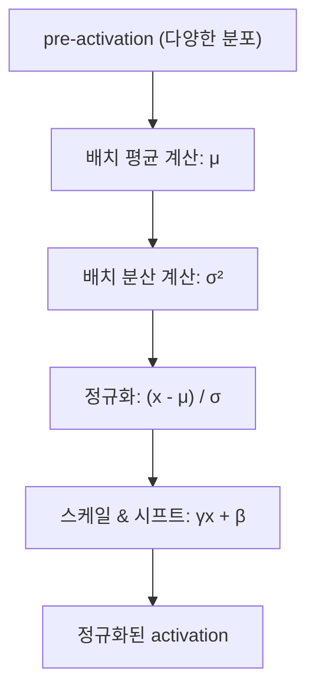
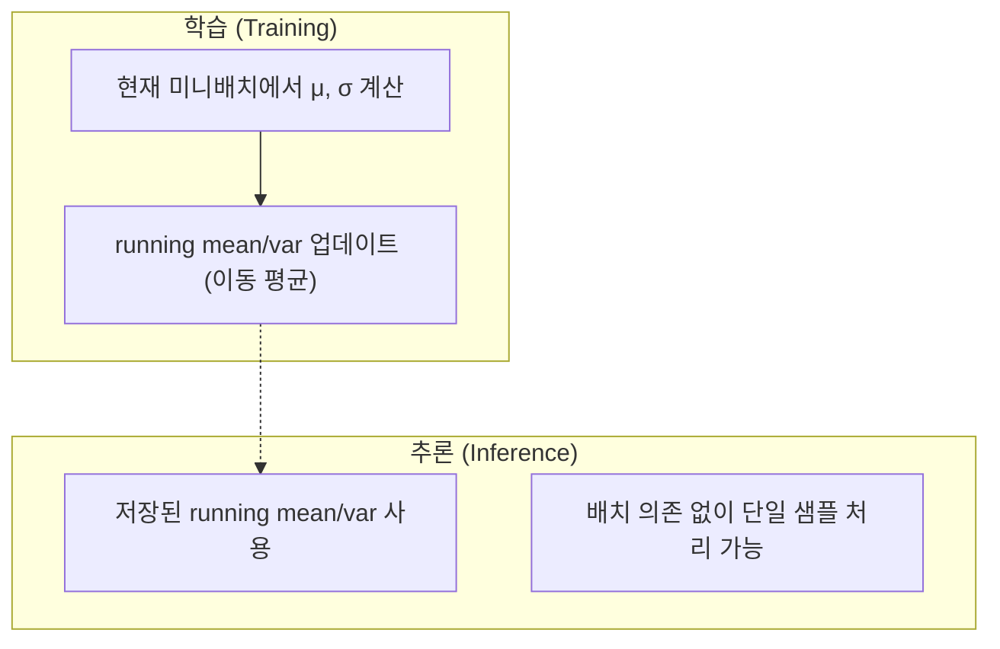
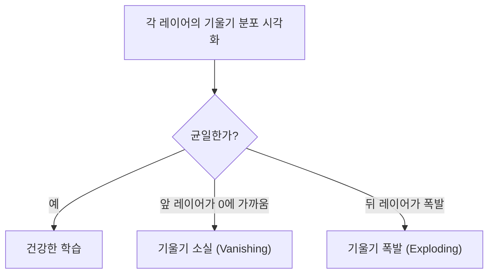
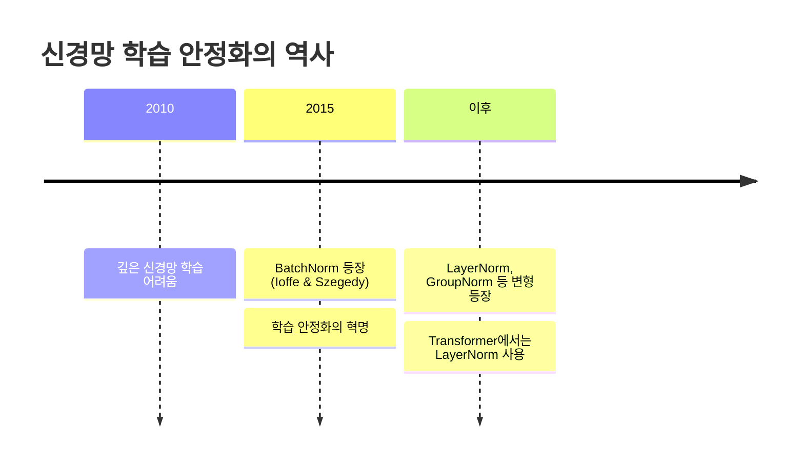

# Makemore Part 3: 활성화, 기울기, BatchNorm

> 📺 **강의**: Andrej Karpathy - "Building makemore Part 3: Activations & Gradients, BatchNorm"
> 🔗 https://www.youtube.com/watch?v=P6sfmUTpUmc

---

## 📌 강의 개요

MLP의 **내부 상태(활성화, 기울기)**를 진단하고 개선하는 방법을 학습

- 신경망이 왜 학습이 안 되는지 **진단하는 기술**
- **Batch Normalization** 도입
- 올바른 가중치 초기화의 중요성

---

## 📺 00:00 - 15:00 | 활성화 분포의 중요성

### tanh의 포화 문제 (Saturation)

| 상태 | tanh 출력 | 기울기 | 문제 |
|------|----------|--------|------|
| **포화** | ≈ ±1 | ≈ 0 | 학습 불가 (기울기 소실) |
| **활성** | -1 ~ 1 사이 | > 0 | 정상 학습 |

### 초기화가 나쁘면?

- 가중치가 너무 크면 → pre-activation이 큼 → tanh 포화 → **기울기 소실**
- 가중치가 너무 작으면 → 모든 뉴런 출력이 0 근처 → **표현력 없음**

---

## 📺 15:00 - 30:00 | 올바른 가중치 초기화

### Kaiming 초기화

> 각 레이어의 출력 분산을 **일정하게** 유지

### 초기화 전략

| 방법 | 핵심 아이디어 |
|------|-------------|
| **Xavier (Glorot)** | fan_in + fan_out 고려, sigmoid/tanh용 |
| **Kaiming (He)** | fan_in 고려, ReLU용 |
| **공통 원칙** | 가중치를 `1/√fan_in`에 비례하여 스케일링 |

### gain 값

- tanh: gain = 5/3 ≈ 1.67
- ReLU: gain = √2 ≈ 1.41
- 활성화 함수가 "축소"시키는 정도를 보상

---

## 📺 30:00 - 50:00 | Batch Normalization

### BatchNorm의 핵심 아이디어

> 각 레이어의 pre-activation을 **강제로 정규화** (평균=0, 분산=1)

### BatchNorm의 구성 요소

| 요소 | 역할 | 학습 여부 |
|------|------|----------|
| **μ (평균)** | 배치에서 계산 | 비학습 (통계) |
| **σ (표준편차)** | 배치에서 계산 | 비학습 (통계) |
| **γ (gain)** | 스케일 조절 | 학습 파라미터 |
| **β (bias)** | 시프트 조절 | 학습 파라미터 |

### 왜 효과적인가?

- 어떤 초기화를 해도 **활성화가 적절한 범위** 유지
- 기울기 흐름이 안정적
- 더 높은 학습률 사용 가능 → 빠른 학습

---

## 📺 50:00 - 01:05:00 | BatchNorm의 학습 vs 추론

### 학습 시 vs 추론 시

### Running Statistics

- 학습 중 각 배치의 μ, σ를 **이동 평균(exponential moving average)**으로 누적
- 추론 시에는 이 누적된 값을 사용
- 학습/추론 모드 전환이 필요 → `model.train()` / `model.eval()`

---

## 📺 01:05:00 - 01:20:00 | 기울기 흐름 진단

### 기울기가 건강한지 확인하는 방법

### 기울기 대 데이터 비율

- `grad / data` 비율이 적절한지 확인
- 너무 크면 학습이 불안정
- 너무 작으면 학습이 느림
- 일반적으로 **~1e-3 정도**가 적절

---

## 📺 01:20:00 - 01:30:00 | 전체 정리

### BatchNorm의 역사적 의의

### BatchNorm의 한계

| 한계 | 설명 |
|------|------|
| **배치 의존성** | 배치 크기가 작으면 불안정 |
| **학습/추론 차이** | 모드 전환 필요 (버그 원인) |
| **순서 의존 데이터** | RNN 등에 적용 어려움 |

→ 이후 **LayerNorm**이 Transformer에서 대체

---

## 🔑 핵심 개념 정리

### 1. 활성화 포화
- tanh/sigmoid의 포화 영역에 들어가면 기울기 ≈ 0
- 올바른 초기화로 방지

### 2. Kaiming 초기화
- 레이어 출력 분산을 일정하게 유지하는 가중치 스케일링
- `1/√fan_in` 에 비례

### 3. Batch Normalization
- pre-activation을 정규화 (평균=0, 분산=1)
- 학습 가능한 γ, β로 최종 스케일 조절
- 학습 시 배치 통계, 추론 시 running 통계 사용

### 4. 진단 기술
- 활성화 분포, 기울기 분포를 시각화하여 학습 상태 진단
- grad/data 비율로 업데이트 크기 확인

---

## 🎯 학습 체크포인트

- [ ] tanh 포화가 왜 문제인지 설명할 수 있는가?
- [ ] Kaiming 초기화의 원리를 이해하는가?
- [ ] BatchNorm의 4개 구성요소(μ, σ, γ, β)를 설명할 수 있는가?
- [ ] 학습 시와 추론 시 BatchNorm의 차이를 아는가?
- [ ] 기울기 소실/폭발을 어떻게 진단하는지 설명할 수 있는가?
- [ ] BatchNorm이 왜 학습을 안정화시키는지 이해하는가?
- [ ] BatchNorm의 한계와 대안(LayerNorm)을 아는가?
