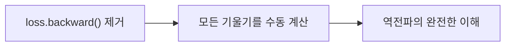
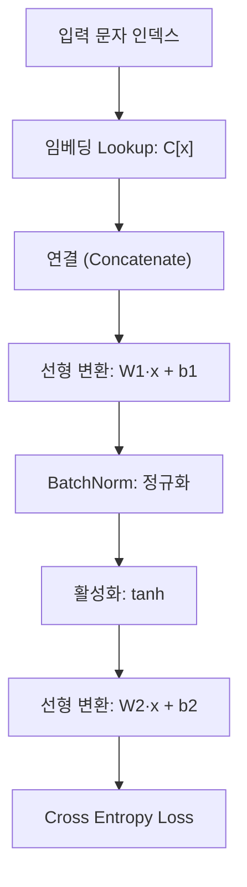
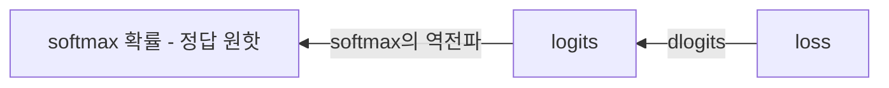
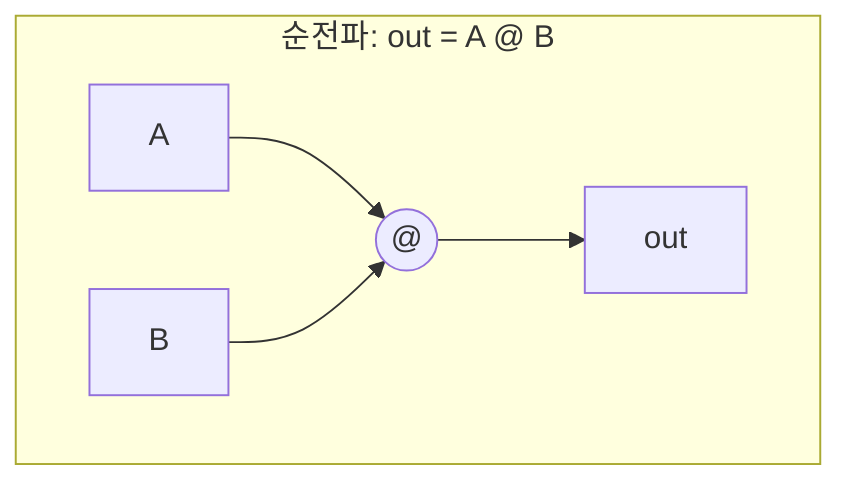
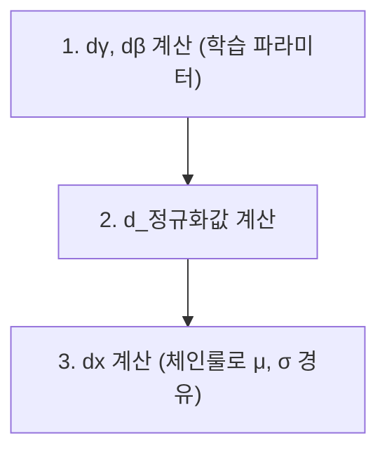
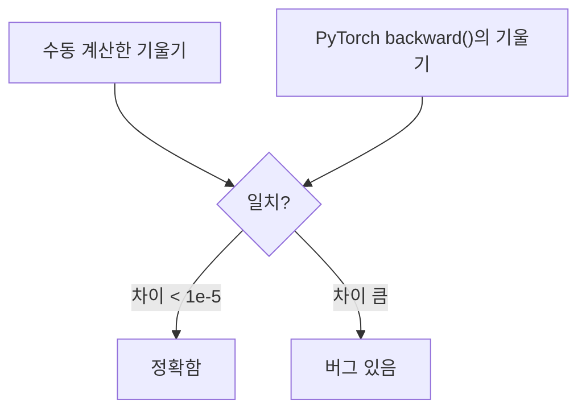
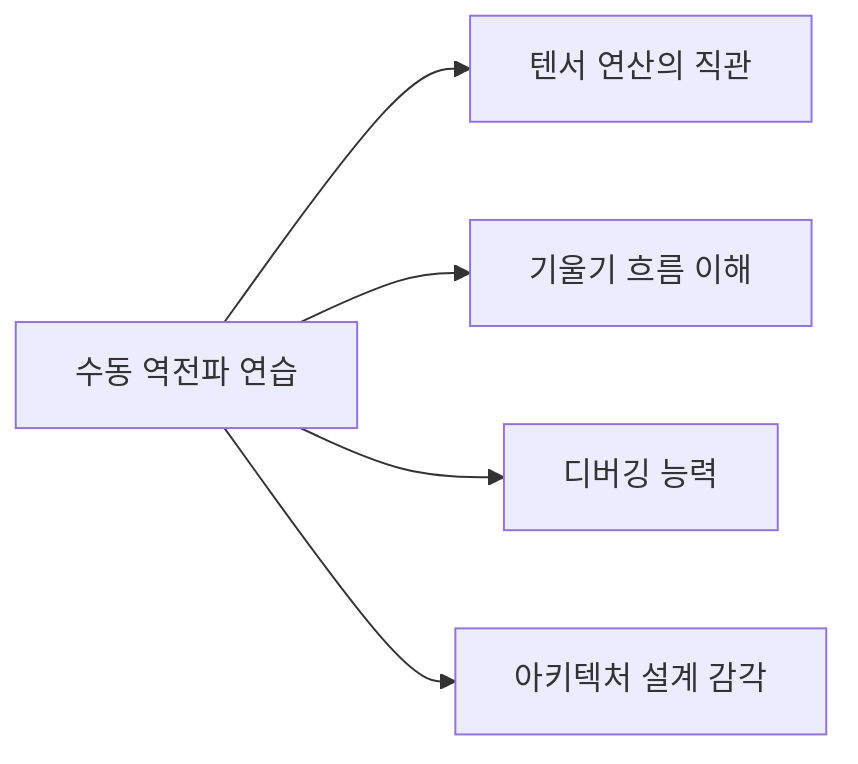

# Makemore Part 4: 역전파 닌자 되기

> 📺 **강의**: Andrej Karpathy - "Building makemore Part 4: Becoming a Backprop Ninja"
> 🔗 https://www.youtube.com/watch?v=q8SA3rM6ckI

---

## 📌 강의 개요

PyTorch의 `loss.backward()`를 쓰지 않고 **텐서 수준에서 직접 역전파를 구현**

- 역전파가 "Leaky Abstraction"인 이유
- 각 연산의 기울기를 **수동으로** 계산
- 내부 동작을 이해해야 디버깅과 최적화 가능

---

## 📺 00:00 - 10:00 | 왜 수동 역전파인가?

### 역전파는 "Leaky Abstraction"

> 자동 역전파를 블랙박스로 쓰면 문제가 생길 수 있다

| 문제 상황 | 원인 |
|----------|------|
| 학습이 안 됨 | 기울기 소실/폭발 |
| 느린 학습 | 비효율적 기울기 흐름 |
| NaN 발생 | 수치 불안정 |

→ 내부를 이해해야 **진단과 해결이 가능**

---

## 📺 10:00 - 30:00 | 순전파 복습

### MLP의 순전파 단계

각 단계를 **역순으로** 기울기를 구해야 함

---

## 📺 30:00 - 01:00:00 | 핵심 역전파 규칙들

### Cross Entropy의 역전파

- softmax + cross entropy를 결합하면 기울기가 매우 깔끔
- **dlogits = softmax 확률 - 정답 (one-hot)**
- 정답 위치만 -1에 가깝고, 나머지는 작은 양수

### 행렬 곱의 역전파

| 구하고 싶은 것 | 공식 |
|--------------|------|
| **dA** | dout @ B.T |
| **dB** | A.T @ dout |

→ 행렬 곱의 역전파는 **전치(transpose)를 사용한 행렬 곱**

### BatchNorm의 역전파

가장 복잡한 부분으로, 3단계로 진행:

- 평균과 분산이 **입력에 의존**하므로 경로가 복잡
- 모든 샘플이 배치 통계를 통해 **서로 연결**됨

### tanh의 역전파

- `dtanh = 1 - tanh(x)²`
- 이미 순전파에서 tanh 값을 저장해두면 간단

---

## 📺 01:00:00 - 01:30:00 | 기울기 검증

### Gradient Checking

- 수치 미분 `(f(x+h) - f(x)) / h`로도 검증 가능
- 모든 단계에서 **PyTorch 결과와 비교**하여 확인

### 자주 하는 실수

| 실수 | 결과 |
|------|------|
| 기울기 누적 대신 덮어쓰기 | 일부 경로 기울기 소실 |
| 브로드캐스팅 무시 | 차원 불일치 |
| 전치 방향 오류 | 기울기 값이 완전히 다름 |

---

## 📺 01:30:00 - 01:50:00 | 실용적 교훈

### 수동 역전파에서 배우는 것

### 효율적 역전파의 열쇠

- **Fused operations**: softmax + cross entropy를 결합하면 수치적으로 안정적이고 효율적
- 중간 결과를 **캐싱**: 순전파 값을 저장해두면 역전파에서 재사용
- 텐서 차원을 항상 의식: 브로드캐스팅이 기울기에 미치는 영향

---

## 🔑 핵심 개념 정리

### 1. 역전파의 기본 규칙

| 연산 | 역전파 |
|------|--------|
| **덧셈** (a + b) | 기울기를 그대로 분배 |
| **곱셈** (a * b) | 서로의 값으로 교환 |
| **행렬곱** (A @ B) | dA = dout @ B.T, dB = A.T @ dout |
| **tanh(x)** | 1 - tanh²(x) |
| **softmax + CE** | softmax 확률 - 정답 one-hot |

### 2. BatchNorm 역전파
- 가장 복잡: 배치 통계(μ, σ)가 모든 샘플에 의존
- γ, β의 기울기는 간단, 입력 x의 기울기가 복잡

### 3. Gradient Checking
- 수동 기울기를 PyTorch 자동 미분과 비교
- 차이가 1e-5 이하면 정확

### 4. 실전 교훈
- 역전파를 이해하면 아키텍처 설계 감각이 생김
- Fused operations로 효율성과 안정성 확보

---

## 🎯 학습 체크포인트

- [ ] 행렬곱의 역전파 공식을 도출할 수 있는가?
- [ ] softmax + cross entropy의 결합 기울기를 이해하는가?
- [ ] BatchNorm 역전파가 왜 복잡한지 설명할 수 있는가?
- [ ] 브로드캐스팅이 기울기 계산에 미치는 영향을 아는가?
- [ ] Gradient Checking의 방법과 목적을 설명할 수 있는가?
- [ ] "Leaky Abstraction"이 무엇을 의미하는지 이해하는가?
