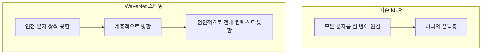
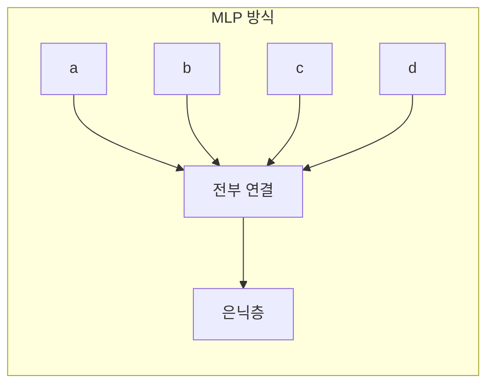
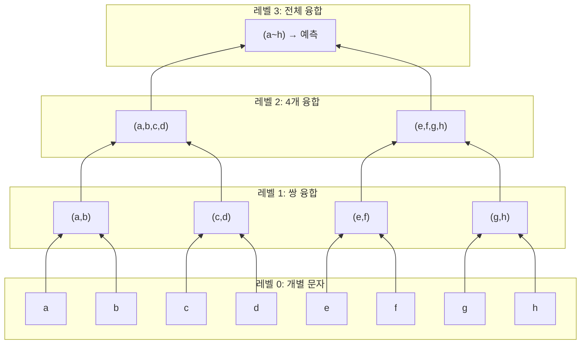
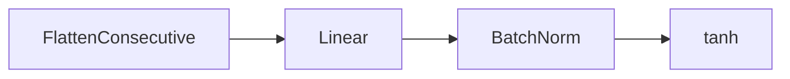
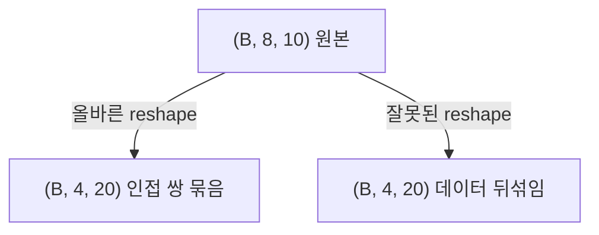
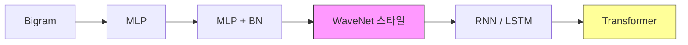

# Makemore Part 5: WaveNet 구조 구현

> 📺 **강의**: Andrej Karpathy - "Building makemore Part 5: Building a WaveNet"
> 🔗 https://www.youtube.com/watch?v=t3YJ5hKiMQ0
> 📄 **논문**: DeepMind WaveNet (2016)

---

## 📌 강의 개요

단순 MLP를 넘어 **더 깊고 계층적인 구조**로 확장

- 더 긴 컨텍스트를 효과적으로 처리
- 정보를 **점진적으로 융합**하는 트리 구조
- WaveNet 논문의 핵심 아이디어를 적용

---

## 📺 00:00 - 15:00 | 기존 MLP의 한계

### 모든 문자를 한 번에 넣는 문제

- 8개 문자를 한 번에 연결 → 매우 큰 입력 벡터
- 정보가 **한 번에 압축** → 병목
- 문자 간의 **지역적 패턴**을 먼저 잡기 어려움

### WaveNet의 아이디어

> 인접한 문자부터 **점진적으로** 정보를 융합

---

## 📺 15:00 - 35:00 | 계층적 융합 구조

### 트리 구조 처리

### MLP vs WaveNet 스타일 비교

| | MLP | WaveNet 스타일 |
|---|-----|---------------|
| **융합 방식** | 한 번에 전부 | 점진적 계층적 |
| **깊이** | 얕음 (1-2층) | 깊음 (log₂N 층) |
| **지역 패턴** | 감지 어려움 | 자연스럽게 감지 |
| **파라미터** | 큰 첫 번째 레이어 | 균등하게 분산 |

---

## 📺 35:00 - 55:00 | 구현: FlattenConsecutive

### 핵심 모듈

```mermaid
graph LR
    A["(B, 8, emb)"] -->|"FlattenConsecutive(2)"| B["(B, 4, 2·emb)"]
    B -->|"Linear + BN + tanh"| C["(B, 4, hidden)"]
    C -->|"FlattenConsecutive(2)"| D["(B, 2, 2·hidden)"]
    D -->|"Linear + BN + tanh"| E["(B, 2, hidden)"]
    E -->|"FlattenConsecutive(2)"| F["(B, 1, 2·hidden)"]
    F -->|"Linear"| G["(B, 27) logits"]
```

### 각 레이어 블록

이 블록을 **반복 쌓기**:
- 매번 시퀀스 길이가 절반으로 줄어듦
- 채널(feature) 차원은 커짐
- log₂(컨텍스트 길이) 만큼의 블록 필요

---

## 📺 55:00 - 01:10:00 | 텐서 reshape의 이해

### PyTorch의 view/reshape

- 데이터를 복사하지 않고 **형태만 변경**
- 메모리 레이아웃이 중요
- 잘못된 reshape는 데이터를 섞어버림

### contiguous와 view

- `view`는 메모리가 연속적이어야 동작
- `reshape`는 필요시 자동으로 복사
- **디버깅 시 텐서 내용을 직접 확인**하는 습관 중요

---

## 📺 01:10:00 - 01:25:00 | 성능과 실험

### 결과 비교

| 모델 | 구조 | Val Loss |
|------|------|----------|
| Bigram | 1개 문자 | ~2.45 |
| MLP (Part 2) | flat, 1층 | ~2.17 |
| WaveNet 스타일 | 계층적, 깊음 | ~2.02 |

→ **계층적 구조가 일관되게 더 좋은 성능**

### torch.nn 모듈화

- `Linear`, `BatchNorm1d`, `Tanh` 등을 **모듈로 구성**
- `Sequential`로 레이어를 깔끔하게 연결
- PyTorch의 실제 사용 패턴과 동일

---

## 📺 01:25:00 - 01:35:00 | 다음 단계 전망

### 시리즈 진행 방향

- 지금까지: 고정 컨텍스트 길이
- 다음: **가변 길이** 시퀀스 처리 (RNN → Transformer)

---

## 🔑 핵심 개념 정리

### 1. 계층적 융합
- 인접한 요소부터 점진적으로 병합
- 지역적 패턴을 먼저 잡고 전역 패턴으로 확장
- WaveNet, CNN 등의 핵심 원리

### 2. FlattenConsecutive
- 인접한 n개의 토큰을 하나로 합치는 연산
- 시퀀스 길이를 1/n로 줄이고 채널을 n배로

### 3. 깊은 네트워크의 이점
- 추상화 수준을 점진적으로 높임
- 파라미터를 효율적으로 사용
- 더 복잡한 패턴 학습 가능

### 4. 텐서 reshape 주의사항
- 메모리 레이아웃을 이해하고 사용
- 잘못된 reshape는 데이터를 의미 없이 섞음

---

## 🎯 학습 체크포인트

- [ ] MLP가 긴 컨텍스트에서 비효율적인 이유를 설명할 수 있는가?
- [ ] WaveNet의 계층적 융합 구조를 그릴 수 있는가?
- [ ] FlattenConsecutive의 역할을 이해하는가?
- [ ] 텐서 reshape가 어떻게 동작하는지 설명할 수 있는가?
- [ ] 깊은 네트워크가 얕은 네트워크보다 유리한 이유를 아는가?
- [ ] 이 구조가 RNN/Transformer와 어떤 관계인지 설명할 수 있는가?
