# Let's Build GPT: nanoGPT 구현

> 📺 **강의**: Andrej Karpathy - "Let's build GPT: from scratch, in code, spelled out."
> 🔗 https://www.youtube.com/watch?v=kCc8FmEb1nY
> 📄 **논문**: Vaswani et al. 2017 - "Attention Is All You Need"

---

## 📌 강의 개요

**GPT (Generative Pre-trained Transformer)**를 밑바닥부터 구현

- Shakespeare 텍스트로 학습하여 셰익스피어 스타일 텍스트 생성
- Transformer 아키텍처의 모든 구성 요소를 직접 구현
- ChatGPT의 핵심 원리를 이해

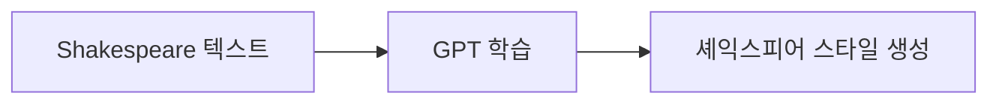

---

## 📺 00:00 - 15:00 | Transformer 개요

### GPT = Decoder-only Transformer

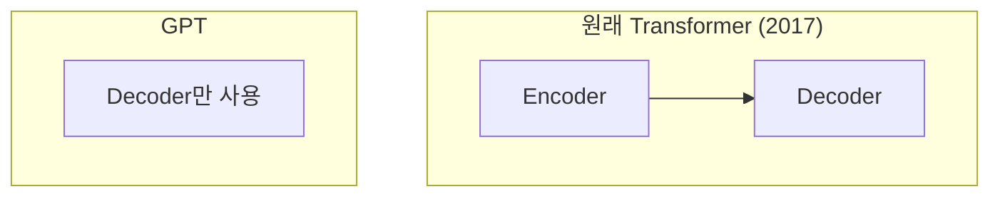

### 핵심 구성 요소

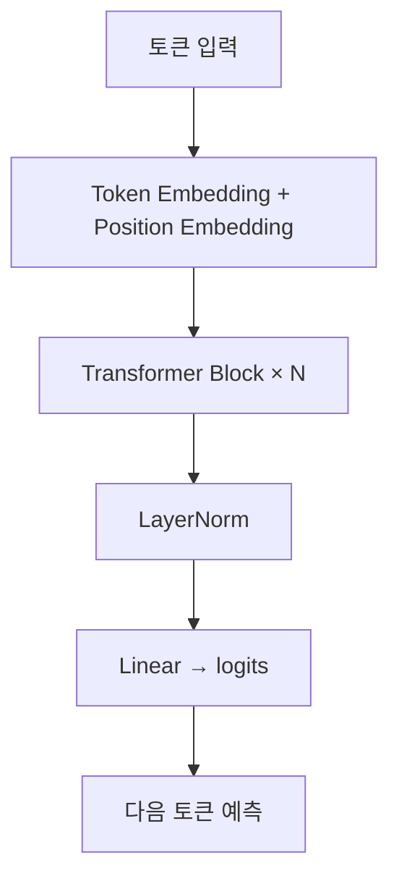

---

## 📺 15:00 - 30:00 | 데이터 준비

### 문자 수준 토크나이저

| 항목 | 값 |
|------|-----|
| 데이터 | Shakespeare 전체 텍스트 (~1M 문자) |
| 어휘 크기 | 65 (개별 문자) |
| 인코딩 | 문자 → 정수 매핑 |

### 배치 구성

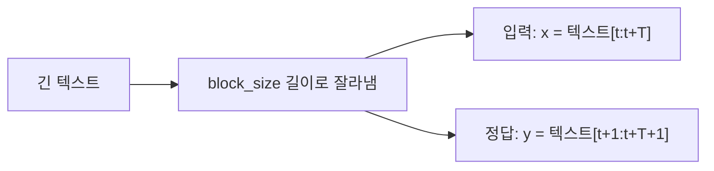

- **block_size (T)**: 한 번에 보는 최대 컨텍스트 길이
- **batch_size (B)**: 병렬 처리할 시퀀스 수
- 하나의 배치에 B×T개의 독립적 예측 문제 포함

---

## 📺 30:00 - 50:00 | Self-Attention

### Attention이란?

> "각 토큰이 **다른 모든 토큰에게 정보를 요청**하는 메커니즘"

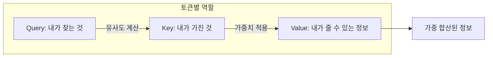

### Attention 계산 과정

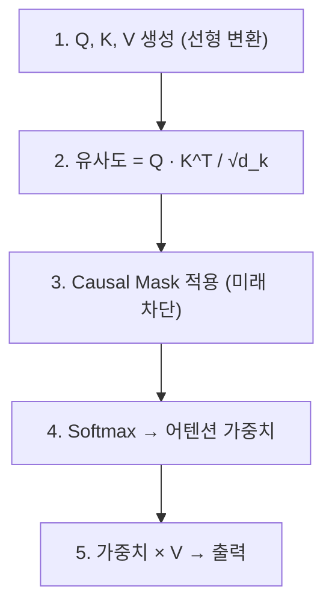

### Causal Mask (인과적 마스크)

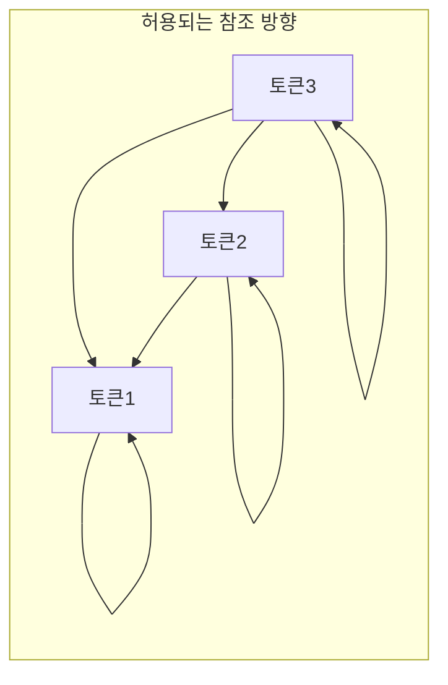

- 각 토큰은 **자신과 이전 토큰만** 참조 가능
- 미래 토큰은 -∞로 마스킹 → softmax 후 0
- 자기회귀(autoregressive) 생성을 가능하게 함

---

## 📺 50:00 - 01:10:00 | Multi-Head Attention

### 왜 Multi-Head?

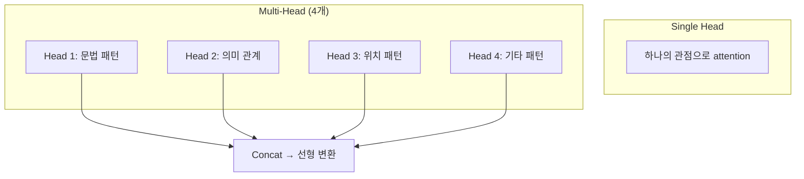

- 임베딩 차원을 head 수로 **쪼개서** (복사 아님) 병렬 처리
- 각 head가 **다른 관점**의 관계를 학습
- 결과를 합쳐서 풍부한 표현

### head 차원 계산

| 항목 | 예시 |
|------|------|
| n_embd | 64 |
| n_head | 4 |
| head_size | 64 / 4 = 16 |

---

## 📺 01:10:00 - 01:30:00 | Transformer Block

### 블록 구조

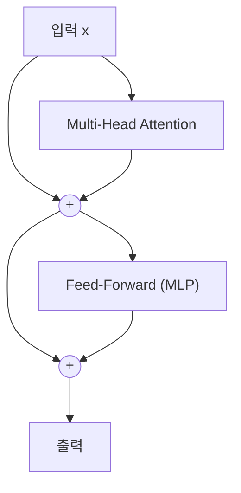

### 핵심 설계 요소

| 요소 | 역할 |
|------|------|
| **Residual Connection (+)** | 기울기가 깊은 레이어까지 직접 흐름 |
| **LayerNorm** | 각 레이어의 활성화를 정규화 |
| **Feed-Forward** | 토큰별 독립적인 비선형 변환 |

### Residual Connection의 중요성

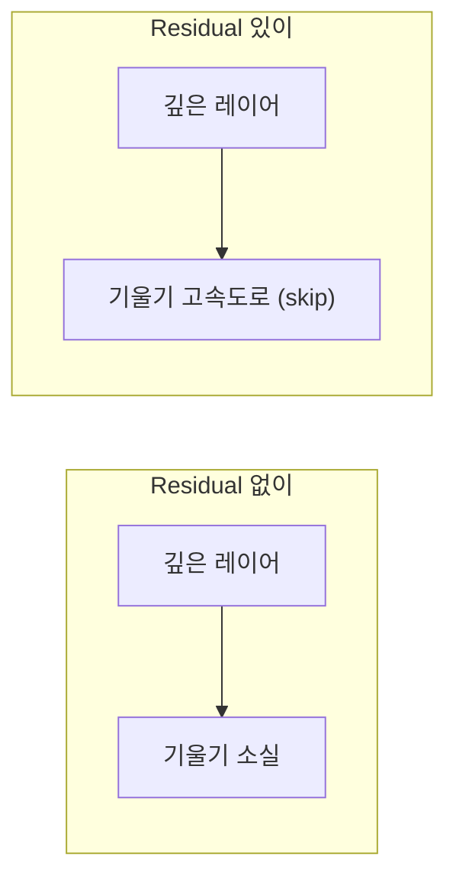

- 입력을 출력에 **더함** → 기울기가 직통으로 흐를 수 있는 경로
- 매우 깊은 네트워크 학습을 가능하게 함

### Feed-Forward Network

- 각 토큰에 **독립적으로** 적용되는 2층 MLP
- Attention이 "소통"이라면, FFN은 "생각"
- 보통 hidden 차원을 4배로 확장했다 축소

---

## 📺 01:30:00 - 01:50:00 | 전체 GPT 구조

### 전체 아키텍처

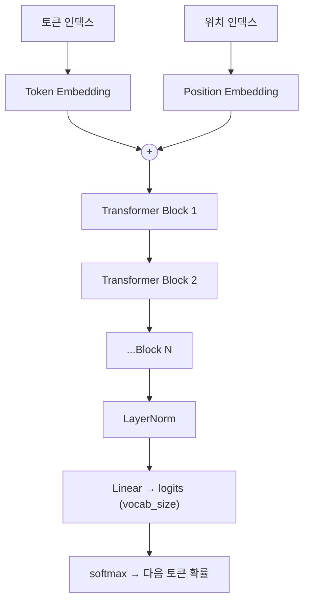

### Position Embedding

- Attention은 순서 정보가 없음 (집합처럼 동작)
- **위치 임베딩**을 더해서 순서 정보 제공
- 각 위치(0, 1, 2, ...)마다 학습되는 벡터

### 하이퍼파라미터

| 파라미터 | nanoGPT (강의) | GPT-3 |
|---------|---------------|-------|
| n_layer | 4 | 96 |
| n_head | 4 | 96 |
| n_embd | 64 | 12,288 |
| block_size | 8 | 2,048 |
| 파라미터 수 | ~200K | 175B |

---

## 📺 01:50:00 - 02:00:00 | 학습과 생성

### 학습 루프

- Adam 옵티마이저 사용 (SGD보다 효과적)
- Cross Entropy Loss로 다음 토큰 예측
- 수천 스텝 학습 후 셰익스피어풍 텍스트 생성

### 생성 과정

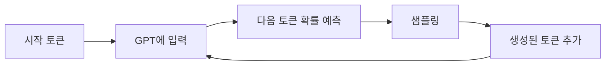

- 자기회귀(autoregressive): 생성한 토큰을 다시 입력으로
- block_size 초과 시 가장 오래된 토큰을 잘라냄

---

## 📺 02:00:00 - 02:15:00 | ChatGPT로의 확장

### GPT → ChatGPT 경로

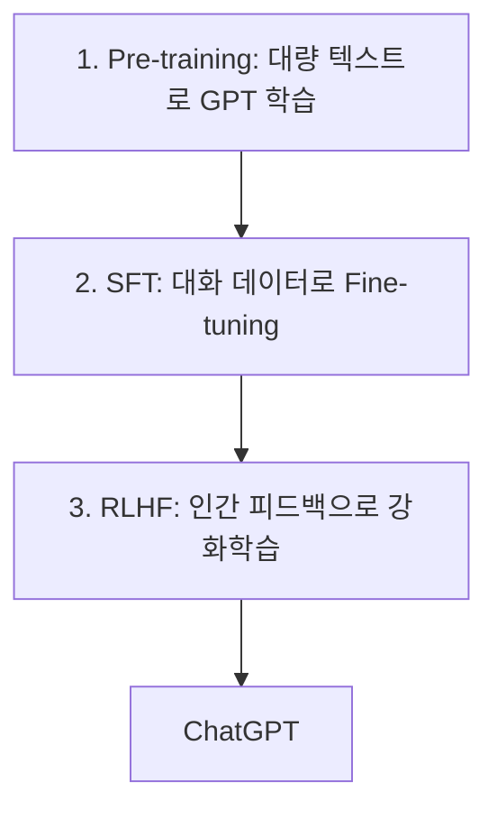

| 단계 | 설명 |
|------|------|
| **Pre-training** | 인터넷 텍스트로 다음 토큰 예측 |
| **SFT** | 질문-답변 형식으로 미세조정 |
| **RLHF** | 인간 선호도를 반영하여 최적화 |

---

## 🔑 핵심 개념 정리

### 1. Self-Attention
- 각 토큰이 다른 토큰들과 정보를 교환
- Q, K, V 를 통한 유사도 기반 가중 합산
- Causal mask로 미래 정보 차단

### 2. Multi-Head Attention
- 여러 관점에서 동시에 attention
- 임베딩을 쪼개서 (복사X) 각 head에 분배
- 결과를 concat + 선형 변환

### 3. Transformer Block
- Attention + Feed-Forward + Residual + LayerNorm
- 이 블록을 N번 쌓아서 깊은 네트워크 구성

### 4. Position Embedding
- Attention은 순서 무관 → 위치 정보를 별도로 추가

### 5. Residual Connection
- 기울기가 깊은 레이어까지 직접 흐르는 "고속도로"

---

## 🎯 학습 체크포인트

- [ ] Self-Attention의 Q, K, V 역할을 설명할 수 있는가?
- [ ] Causal Mask가 왜 필요한지 이해하는가?
- [ ] Multi-Head Attention에서 head가 "쪼개기"인 이유를 아는가?
- [ ] Residual Connection이 깊은 네트워크에서 왜 중요한지 설명할 수 있는가?
- [ ] Transformer Block의 구성 요소를 나열할 수 있는가?
- [ ] Position Embedding이 왜 필요한지 설명할 수 있는가?
- [ ] GPT → ChatGPT의 3단계를 순서대로 말할 수 있는가?
- [ ] Feed-Forward가 Attention과 어떻게 다른 역할을 하는지 이해하는가?
