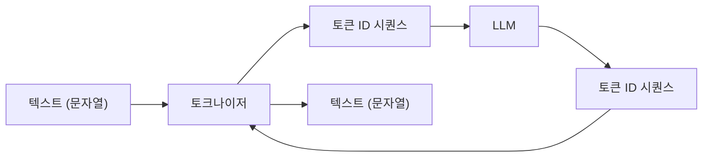
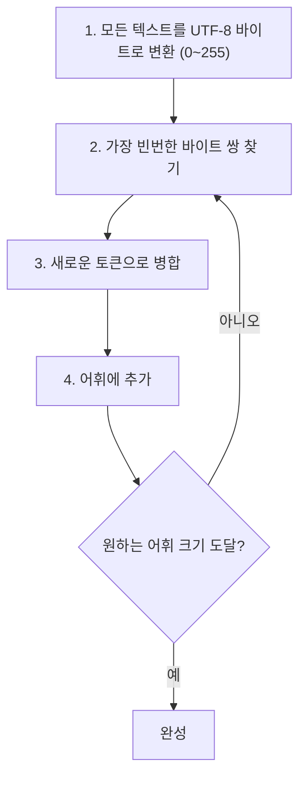
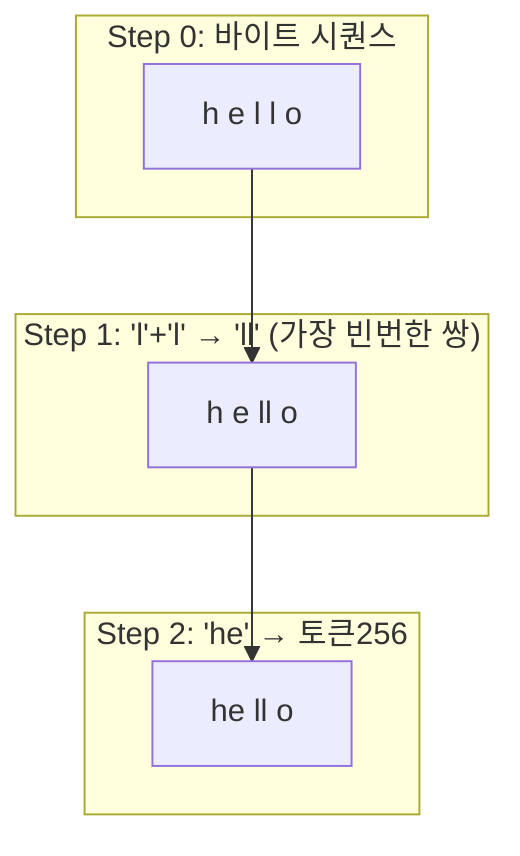
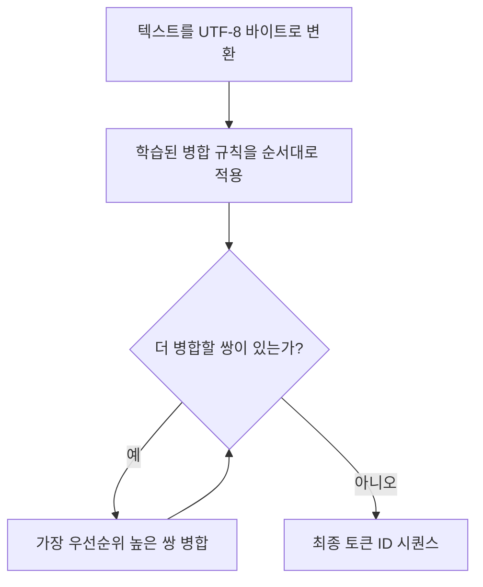
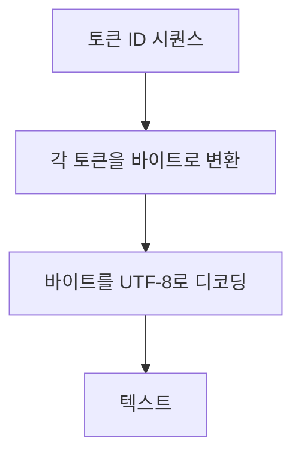
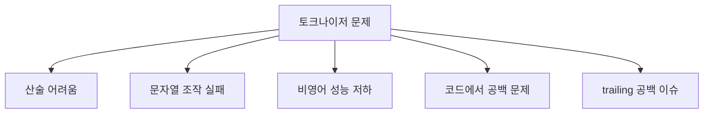

# GPT Tokenizer 구현

> 📺 **강의**: Andrej Karpathy - "Let's build the GPT Tokenizer"
> 🔗 https://www.youtube.com/watch?v=zduSFxRajkE

---

## 📌 강의 개요

LLM의 **가장 귀찮지만 필수적인 부분** - 토크나이저를 밑바닥부터 구현

- 문자 수준이 아닌 **서브워드(subword)** 토크나이저
- BPE (Byte Pair Encoding) 알고리즘
- LLM의 많은 "이상한 행동"이 토크나이저에서 기인

---

## 📺 00:00 - 15:00 | 왜 토크나이저인가?

### 문자 수준의 한계

| 방식 | 어휘 크기 | 시퀀스 길이 | 문제 |
|------|----------|-----------|------|
| **문자 수준** | ~65 | 매우 긺 | 너무 긴 시퀀스, 비효율 |
| **단어 수준** | ~100K+ | 짧음 | OOV(미등록어) 문제 |
| **서브워드** | ~50K | 적절 | 균형잡힌 선택 |

### 서브워드 토크나이저

- "Hello world" → ["Hello", " world"] (공백 포함)
- 자주 나오는 문자 조합을 하나의 토큰으로 병합
- 흔한 단어는 통째로, 희귀 단어는 조각으로

---

## 📺 15:00 - 35:00 | BPE (Byte Pair Encoding)

### BPE 알고리즘

### BPE 예시

- 시작: 256개 바이트 토큰 (0~255)
- 반복: 가장 빈번한 쌍을 병합하여 새 토큰 생성
- GPT-4: ~100K 어휘 = 256 + ~99,744번의 병합

---

## 📺 35:00 - 55:00 | UTF-8과 바이트

### 유니코드 → UTF-8 → 바이트

| 문자 | 유니코드 | UTF-8 바이트 |
|------|---------|-------------|
| 'A' | U+0041 | 1바이트: 65 |
| '한' | U+D55C | 3바이트: 237, 149, 156 |
| '😀' | U+1F600 | 4바이트: 240, 159, 152, 128 |

### 바이트 수준 BPE의 장점

- **모든 텍스트**를 처리 가능 (OOV 없음)
- 기본 어휘: 0~255 (256개 바이트)
- 한국어, 이모지 등 모든 유니코드 지원

---

## 📺 55:00 - 01:15:00 | 인코딩과 디코딩

### 인코딩 (텍스트 → 토큰 ID)

### 디코딩 (토큰 ID → 텍스트)

- 인코딩은 **탐욕적(greedy)**: 가장 긴 매칭부터
- 디코딩은 단순한 **룩업 테이블** 참조

---

## 📺 01:15:00 - 01:35:00 | 특수 토큰과 실전 이슈

### 특수 토큰 (Special Tokens)

| 토큰 | 용도 |
|------|------|
| `<\|endoftext\|>` | 문서 경계 표시 |
| `<\|im_start\|>` | ChatML 메시지 시작 |
| `<\|im_end\|>` | ChatML 메시지 끝 |

- BPE 어휘에 **추가**하는 특수 토큰
- 학습 데이터의 구조를 표시하는 역할

### GPT 시리즈의 토크나이저 변천

| 모델 | 토크나이저 | 어휘 크기 |
|------|----------|----------|
| GPT-2 | BPE (바이트 수준) | ~50,257 |
| GPT-3 | 동일 | ~50,257 |
| GPT-4 | cl100k_base (tiktoken) | ~100,256 |

---

## 📺 01:35:00 - 01:55:00 | 토크나이저가 만드는 이상한 현상

### LLM의 이상한 행동 = 토크나이저 탓

| 현상 | 원인 |
|------|------|
| 산술이 어려움 | 숫자가 일관되지 않게 토큰화 |
| 문자열 뒤집기 실패 | 하나의 토큰 안에 여러 문자가 숨어있음 |
| 한국어가 더 느림 | 같은 내용이 더 많은 토큰 필요 |
| Python 들여쓰기 문제 | 공백 개수에 따라 다른 토큰 |

### 어휘 크기의 트레이드오프

| | 작은 어휘 | 큰 어휘 |
|---|---------|---------|
| **시퀀스 길이** | 길어짐 | 짧아짐 |
| **임베딩 테이블** | 작음 | 큼 |
| **토큰 빈도** | 높음 | 낮음 (학습 부족) |
| **유연성** | 높음 | 낮음 |

---

## 📺 01:55:00 - 02:05:00 | SentencePiece와 tiktoken

### 주요 토크나이저 라이브러리

| 라이브러리 | 특징 |
|-----------|------|
| **SentencePiece** (Google) | 유니코드 코드포인트에서 시작, 바이트 폴백 |
| **tiktoken** (OpenAI) | UTF-8 바이트에서 시작, 빠른 Rust 구현 |
| **HuggingFace tokenizers** | 다양한 알고리즘 지원 |

### BPE 외의 알고리즘

| 알고리즘 | 특징 |
|---------|------|
| **BPE** | 빈번한 쌍 병합 (가장 보편적) |
| **WordPiece** | BERT에서 사용, likelihood 기반 |
| **Unigram** | 전체 어휘에서 시작해 제거해나감 |

---

## 🔑 핵심 개념 정리

### 1. 토크나이저의 역할
- 텍스트 ↔ 정수 시퀀스 변환
- LLM의 입출력 인터페이스
- 모델 성능에 큰 영향

### 2. BPE 알고리즘
- 바이트(256개)에서 시작
- 가장 빈번한 쌍을 반복 병합
- 원하는 어휘 크기까지 확장

### 3. UTF-8 바이트 수준
- 모든 유니코드 텍스트를 처리 가능
- OOV(미등록어) 문제 없음
- 비영어는 더 많은 토큰 필요

### 4. 토크나이저와 LLM 행동
- 많은 LLM의 이상한 행동이 토크나이저에서 기인
- 숫자, 문자열, 비영어, 코드 등에서 영향

---

## 🎯 학습 체크포인트

- [ ] BPE 알고리즘의 과정을 단계별로 설명할 수 있는가?
- [ ] 문자/단어/서브워드 토크나이저의 장단점을 비교할 수 있는가?
- [ ] UTF-8 인코딩이 왜 바이트 수준 BPE의 기반인지 설명할 수 있는가?
- [ ] 토크나이저가 LLM의 이상한 행동을 만드는 사례를 아는가?
- [ ] 인코딩과 디코딩 과정을 설명할 수 있는가?
- [ ] 어휘 크기의 트레이드오프를 이해하는가?
- [ ] 특수 토큰의 역할을 설명할 수 있는가?
