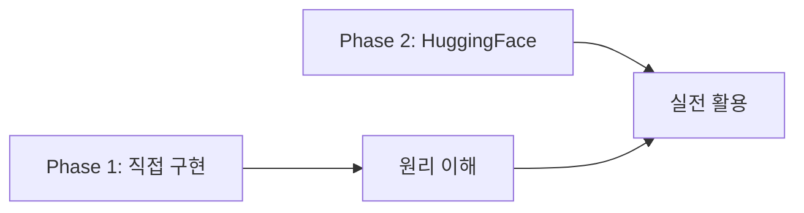
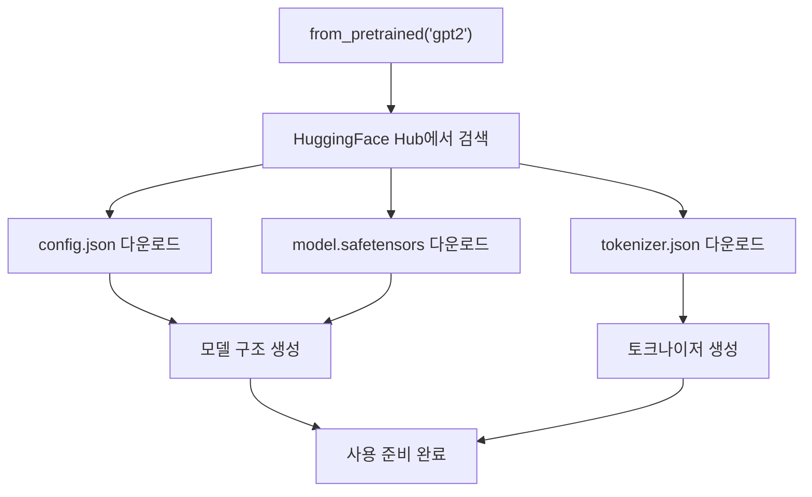
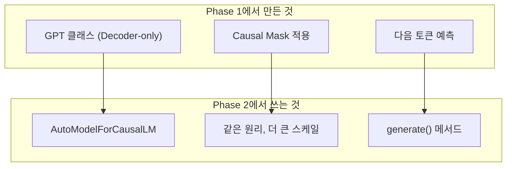

# HuggingFace Transformers 기초

> Phase 1에서 밑바닥부터 구현한 Transformer를 이제 **실전 라이브러리**로 다룬다

---

## 핵심 질문: 왜 HuggingFace인가?

Phase 1에서 GPT를 직접 구현했지만, 실무에서는 이미 학습된 수십억 파라미터 모델을 가져다 쓴다.
HuggingFace는 이 모델들의 **공유/로드/사용을 표준화**한 생태계.



---

## Auto 클래스: 모든 것의 시작점

HuggingFace의 핵심은 `Auto` 접두사가 붙은 클래스들.
모델 이름만 주면 **알아서** 맞는 구조를 로드한다.

| Auto 클래스 | 역할 | Phase 1 대응 |
|-------------|------|-------------|
| `AutoTokenizer` | 텍스트 → 토큰 ID | Phase 1에서 만든 BasicTokenizer |
| `AutoModel` | 모델 구조 + 가중치 로드 | Phase 1에서 만든 GPT 클래스 |
| `AutoConfig` | 모델 설정 (n_head, n_layer 등) | Phase 1의 하이퍼파라미터 |

### from_pretrained의 마법



- `config.json`: n_head=12, n_layer=12 같은 설정
- `model.safetensors`: 학습된 가중치 (수억~수십억 개 숫자)
- `tokenizer.json`: BPE 병합 규칙 + 어휘 테이블

---

## 3가지 모델 구조

Phase 1에서 배운 Encoder/Decoder 차이가 여기서 실전으로 나온다.

| 구조 | HuggingFace 클래스 | 대표 모델 | 특징 |
|------|-------------------|-----------|------|
| **Encoder-only** | `AutoModel` | BERT, RoBERTa | 양방향, 분류/유사도 |
| **Decoder-only** | `AutoModelForCausalLM` | GPT-2, Llama | 단방향, 텍스트 생성 |
| **Encoder-Decoder** | `AutoModelForSeq2SeqLM` | T5, BART | 번역, 요약 |

### Phase 1과의 연결



---

## Model Card 읽기

HuggingFace Hub의 모든 모델에는 Model Card가 있다. 모델을 쓰기 전에 반드시 확인할 항목:

| 항목 | 확인 내용 |
|------|----------|
| **모델 크기** | 파라미터 수 → 필요 VRAM 가늠 |
| **라이선스** | 상업적 사용 가능 여부 |
| **학습 데이터** | 어떤 데이터로 학습됐는가 |
| **용도** | 어떤 태스크에 적합한가 |
| **제한사항** | 알려진 편향, 약점 |

### VRAM 추정 공식

```
필요 VRAM ≈ 파라미터 수 × 정밀도 바이트
- 7B 모델 × FP16(2바이트) = ~14GB
- 7B 모델 × INT4(0.5바이트) = ~3.5GB
```

---

## 핵심 정리

1. **Auto 클래스** — 모델 이름만 주면 알아서 맞는 구조 로드
2. **from_pretrained** — Hub에서 config + 가중치 + 토크나이저 다운로드
3. **3가지 구조** — Encoder-only(BERT), Decoder-only(GPT), Encoder-Decoder(T5)
4. **Model Card** — 모델 쓰기 전 반드시 읽기 (크기, 라이선스, 용도)

---

## 학습 체크포인트

- [ ] AutoTokenizer, AutoModelForCausalLM의 역할을 설명할 수 있는가?
- [ ] from_pretrained이 내부에서 무엇을 하는지 아는가?
- [ ] Encoder-only, Decoder-only, Encoder-Decoder의 차이를 아는가?
- [ ] Model Card에서 확인해야 할 항목을 아는가?
- [ ] 모델 크기로 필요 VRAM을 추정할 수 있는가?
