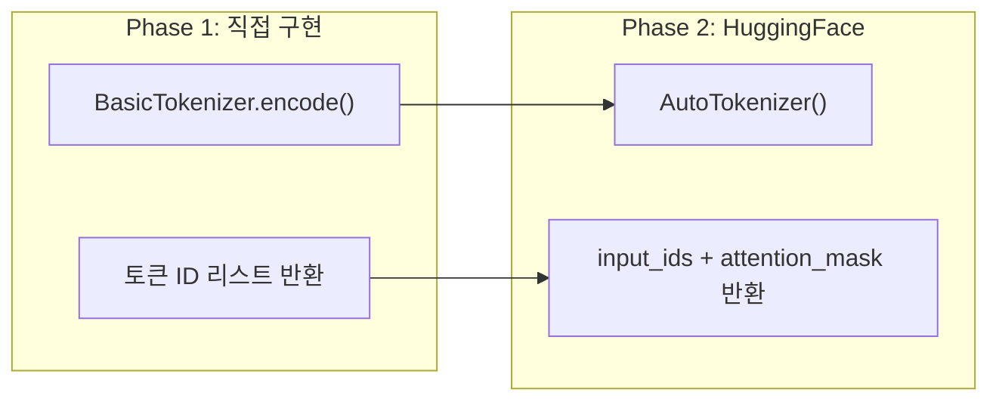
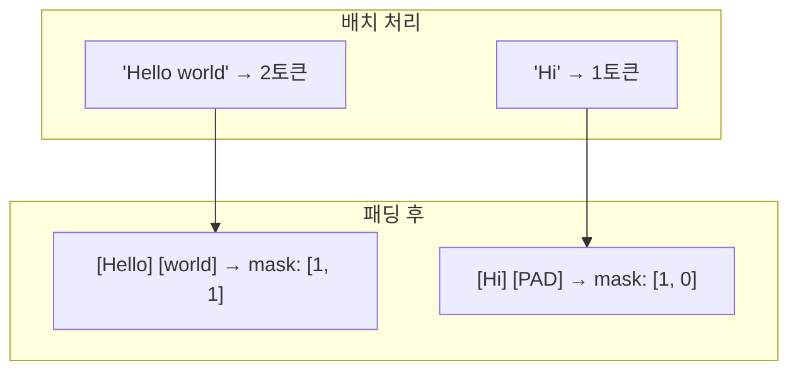
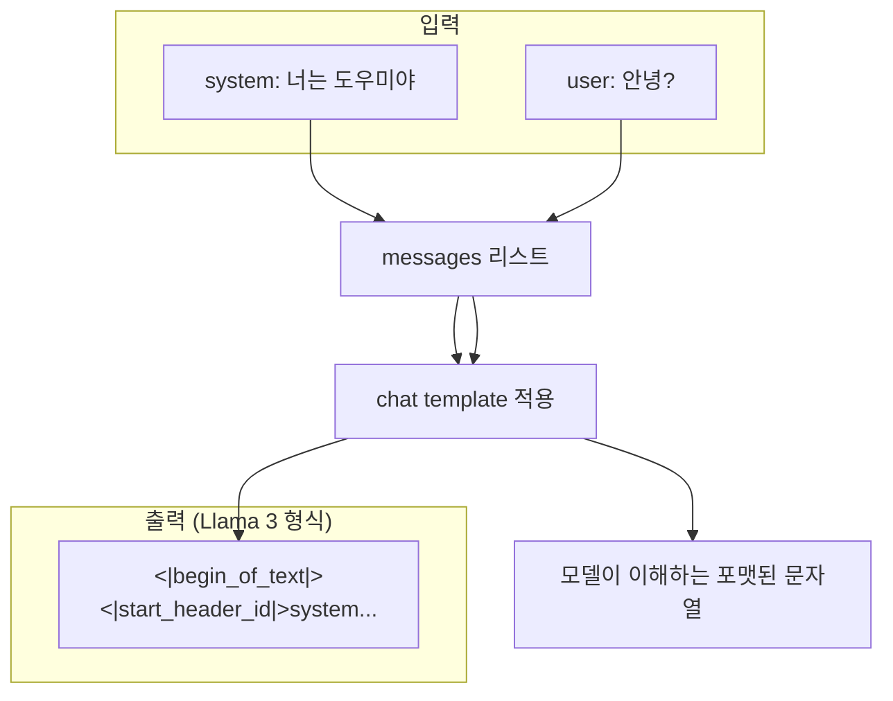

# HuggingFace Tokenizer 실전

> Phase 1에서 BPE를 직접 구현했다. 이제 실전 토크나이저의 **입출력 형식과 특수 기능**을 익힌다.

---

## Phase 1 → Phase 2 연결

Phase 1에서 만든 `encode()`는 토큰 ID 리스트만 반환했다.
실전 토크나이저는 **모델이 필요로 하는 추가 정보**도 함께 반환한다.

---

## 토크나이저 출력 구조

| 출력 필드 | 의미 | 예시 |
|-----------|------|------|
| `input_ids` | 토큰 ID 시퀀스 (Phase 1에서 만든 것) | `[101, 7592, 102]` |
| `attention_mask` | 실제 토큰=1, 패딩=0 | `[1, 1, 1, 0, 0]` |
| `token_type_ids` | 문장 A=0, 문장 B=1 (BERT용) | `[0, 0, 0, 1, 1]` |

### attention_mask가 필요한 이유

배치 처리 시 문장 길이가 다르면 짧은 문장에 패딩을 채운다.
모델이 패딩을 무시하도록 "어디까지가 진짜 토큰인지" 알려주는 마스크.

---

## Special Tokens (특수 토큰)

Phase 1에서 개념만 봤던 특수 토큰이 실전에서 어떻게 쓰이는지.

### 모델별 특수 토큰

| 모델 | BOS (시작) | EOS (끝) | PAD (패딩) |
|------|-----------|----------|-----------|
| GPT-2 | 없음 | `<\|endoftext\|>` | `<\|endoftext\|>` (EOS 재사용) |
| Llama 3 | `<\|begin_of_text\|>` | `<\|end_of_text\|>` | `<\|finetune_right_pad_id\|>` |
| BERT | `[CLS]` | `[SEP]` | `[PAD]` |

### 왜 모델마다 다른가?

각 모델이 학습될 때 이 특수 토큰을 사용했기 때문.
**반드시 해당 모델의 토크나이저를 사용**해야 하는 이유.

---

## Chat Template

ChatGPT 같은 대화형 모델은 "누가 말했는지"를 구분하는 형식이 필요하다.

### Chat Template이란?

### 모델별 Chat Template 비교

| 모델 | 형식 |
|------|------|
| **ChatML** (GPT) | `<\|im_start\|>system\n...<\|im_end\|>` |
| **Llama 3** | `<\|start_header_id\|>system<\|end_header_id\|>\n...` |
| **Mistral** | `[INST] ... [/INST]` |

핵심: `apply_chat_template()` 메서드가 알아서 해당 모델 형식으로 변환해준다.

---

## Padding과 Truncation

실전에서 가장 많이 마주치는 설정.

| 설정 | 의미 | 언제 필요 |
|------|------|----------|
| `padding=True` | 짧은 문장에 PAD 토큰 추가 | 배치 처리 시 |
| `truncation=True` | 긴 문장을 max_length에서 자름 | 모델 최대 길이 초과 시 |
| `max_length=512` | 최대 토큰 수 지정 | 메모리 관리 |
| `return_tensors="pt"` | PyTorch 텐서로 반환 | 모델 입력 시 |

### padding_side

| 설정 | 의미 | 용도 |
|------|------|------|
| `padding_side="right"` | 오른쪽에 PAD 추가 | 학습 시 (기본값) |
| `padding_side="left"` | 왼쪽에 PAD 추가 | **생성(generate) 시 필수** |

생성 시 왼쪽 패딩인 이유: 모델이 오른쪽 끝에서 다음 토큰을 생성하므로, 실제 토큰이 오른쪽에 있어야 함.

---

## 핵심 정리

1. **input_ids + attention_mask** — 토크나이저는 토큰 ID 외에 마스크도 반환
2. **Special tokens** — 모델마다 다르므로 반드시 해당 모델의 토크나이저 사용
3. **Chat template** — 대화형 모델의 역할 구분 형식, `apply_chat_template()`으로 자동 적용
4. **Padding/Truncation** — 배치 처리와 메모리 관리의 핵심 설정
5. **padding_side** — 학습은 right, 생성은 left

---

## 학습 체크포인트

- [ ] input_ids와 attention_mask의 역할을 설명할 수 있는가?
- [ ] 왜 모델마다 다른 토크나이저를 써야 하는지 아는가?
- [ ] Chat template이 무엇이고 apply_chat_template()이 뭘 하는지 아는가?
- [ ] padding_side가 왜 생성 시 "left"여야 하는지 설명할 수 있는가?
- [ ] truncation과 max_length의 관계를 아는가?
