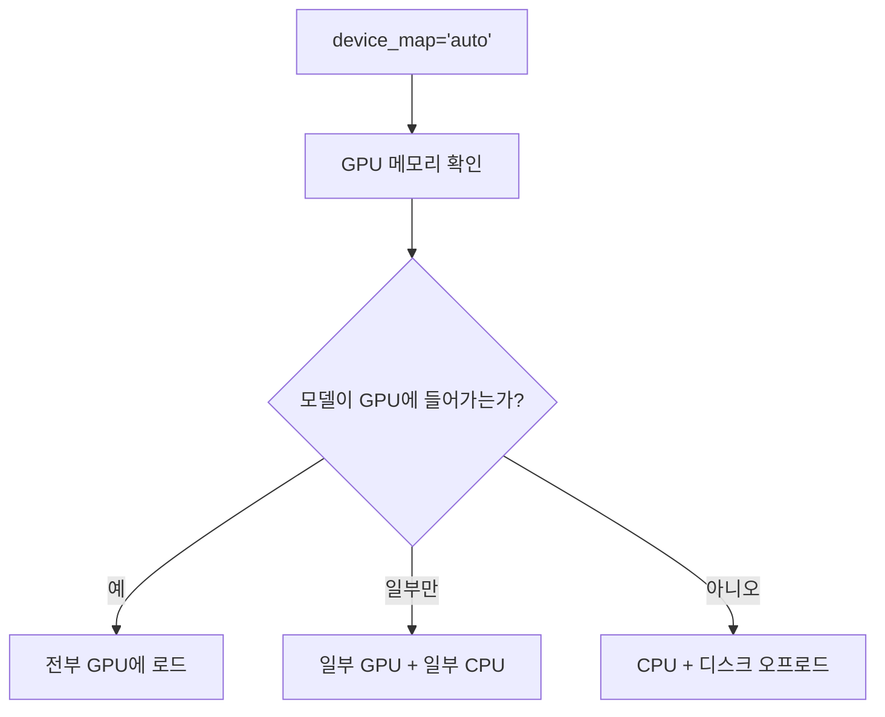
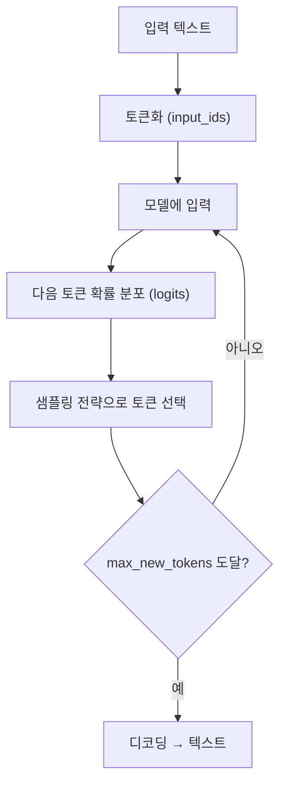
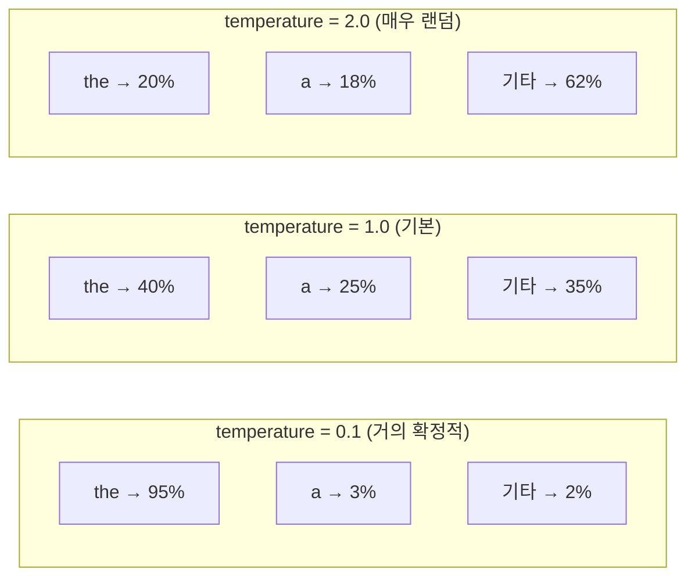

# 모델 로드와 추론

> 사전학습된 모델을 로드하고, 텍스트를 생성하는 전체 과정

---

## 모델 로드: 정밀도와 메모리

같은 모델도 **어떤 정밀도로 로드하느냐**에 따라 VRAM 사용량이 크게 달라진다.

### 정밀도별 비교

| 정밀도 | 파라미터당 크기 | 7B 모델 VRAM | 품질 |
|--------|---------------|-------------|------|
| FP32 (기본) | 4 bytes | ~28GB | 최고 (학습용) |
| FP16 / BF16 | 2 bytes | ~14GB | 거의 동일 |
| INT8 | 1 byte | ~7GB | 약간 손실 |
| INT4 (QLoRA) | 0.5 bytes | ~3.5GB | 손실 있지만 실용적 |

### torch_dtype 옵션

| 설정 | 의미 | 용도 |
|------|------|------|
| `torch.float32` | 32비트 (기본) | 정밀 계산, 학습 |
| `torch.float16` | 16비트 반정밀도 | GPU 추론 |
| `torch.bfloat16` | 16비트 (범위 넓음) | Ampere+ GPU 추론/학습 |
| `"auto"` | 모델 config 따름 | 가장 안전한 선택 |

### device_map

- `"auto"`: 자동으로 GPU/CPU 분배 (가장 편리)
- `"cpu"`: 강제 CPU (GPU 없을 때)
- `"cuda:0"`: 특정 GPU 지정

---

## 텍스트 생성: generate()

Phase 1에서 다음 토큰 예측을 반복하며 텍스트를 만들었다.
`generate()`는 그 과정을 자동화 + 다양한 샘플링 전략 제공.

### 생성 과정

### 핵심 샘플링 파라미터

| 파라미터 | 기본값 | 역할 |
|----------|--------|------|
| `max_new_tokens` | - | 최대 생성 토큰 수 |
| `temperature` | 1.0 | 확률 분포 날카로움 조절 |
| `top_k` | 50 | 상위 k개 토큰만 후보로 |
| `top_p` | 1.0 | 누적 확률 p까지만 후보로 |
| `do_sample` | False | True여야 temperature/top_k/top_p 작동 |
| `repetition_penalty` | 1.0 | 반복 억제 (>1.0일수록 억제) |

### temperature 직관

- **낮은 temperature**: 확률이 높은 토큰에 집중 → 일관되지만 반복적
- **높은 temperature**: 확률 분포가 평탄 → 다양하지만 횡설수설

### top_k vs top_p

| 방식 | 동작 | 장점 |
|------|------|------|
| **top_k=50** | 확률 상위 50개 토큰만 후보 | 간단, 예측 가능 |
| **top_p=0.9** | 누적 확률 90%까지의 토큰만 후보 | 상황에 따라 후보 수 자동 조절 |

실전 권장: `temperature=0.7, top_p=0.9, do_sample=True`

---

## Greedy vs Beam Search vs Sampling

| 방식 | 설명 | 품질 | 다양성 |
|------|------|------|--------|
| **Greedy** | 매번 가장 높은 확률 선택 | 보통 | 없음 |
| **Beam Search** | 여러 후보를 동시에 탐색 | 높음 | 낮음 |
| **Sampling** | 확률 분포에서 랜덤 선택 | 다양 | 높음 |
| **Top-k/p Sampling** | Sampling + 후보 제한 | 좋음 | 적절 |

- `do_sample=False` → Greedy (기본)
- `do_sample=False, num_beams=5` → Beam Search
- `do_sample=True, temperature=0.7` → Sampling

---

## 핵심 정리

1. **정밀도 선택** — FP16/BF16이 추론의 기본, INT4는 VRAM 부족 시
2. **device_map="auto"** — GPU/CPU 자동 분배
3. **generate()** — 다음 토큰 예측 반복의 자동화
4. **temperature** — 낮으면 확정적, 높으면 랜덤
5. **top_p=0.9 + temperature=0.7** — 실전 권장 설정

---

## 학습 체크포인트

- [ ] FP16과 INT4의 차이와 용도를 설명할 수 있는가?
- [ ] device_map="auto"가 내부에서 뭘 하는지 아는가?
- [ ] temperature, top_k, top_p의 효과를 직관적으로 설명할 수 있는가?
- [ ] do_sample=False일 때 temperature가 무시되는 이유를 아는가?
- [ ] Greedy, Beam Search, Sampling의 차이를 설명할 수 있는가?
