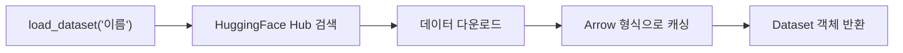
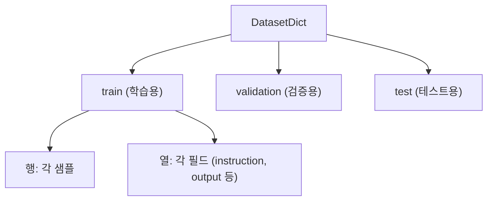
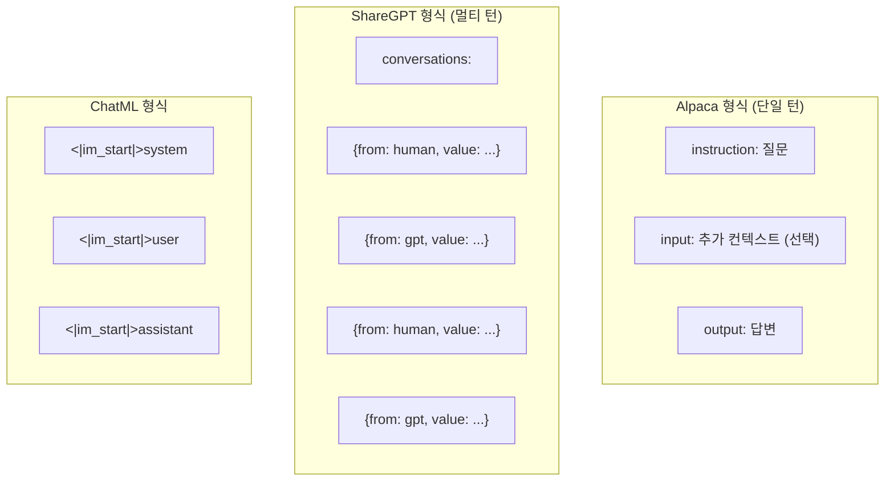

# Datasets 라이브러리와 데이터 전처리

> 모델이 아무리 좋아도 **데이터가 나쁘면 결과도 나쁘다**. 데이터 다루기의 기본을 익힌다.

---

## 왜 HuggingFace Datasets인가?

| 기능 | pandas | HF Datasets |
|------|--------|-------------|
| 대용량 처리 | 메모리에 전부 로드 | **메모리 매핑** (디스크에서 읽기) |
| 전처리 | apply/map | **map() + 멀티프로세싱** |
| 허브 연동 | 없음 | `load_dataset("이름")`으로 즉시 로드 |
| 토크나이저 연동 | 수동 | **자연스러운 통합** |

핵심 장점: 100GB 데이터도 RAM 1GB로 처리 가능 (Apache Arrow 기반 메모리 매핑)

---

## 데이터셋 로드

### 허브에서 로드

### 데이터셋 구조

- `DatasetDict`: train/validation/test 분할을 담는 딕셔너리
- `Dataset`: 실제 데이터 (행 = 샘플, 열 = 필드)

---

## 핵심 메서드

### map() — 데이터 변환의 핵심

| 파라미터 | 역할 |
|----------|------|
| `function` | 각 샘플에 적용할 함수 |
| `batched=True` | 배치 단위 처리 (빠름) |
| `num_proc=4` | 멀티프로세싱 (병렬 처리) |
| `remove_columns` | 변환 후 불필요한 열 제거 |

### filter() — 데이터 필터링

조건에 맞는 샘플만 남긴다.

### select() / shuffle() / train_test_split()

| 메서드 | 역할 |
|--------|------|
| `select(range(100))` | 처음 100개만 선택 |
| `shuffle(seed=42)` | 랜덤 셔플 |
| `train_test_split(test_size=0.1)` | 학습/테스트 분할 |

---

## 파인튜닝용 데이터 형식

### 주요 형식 3가지

| 형식 | 구조 | 용도 |
|------|------|------|
| **Alpaca** | instruction + input + output | 단일 QA, 간단한 태스크 |
| **ShareGPT** | conversations 리스트 | 멀티턴 대화 |
| **ChatML** | 특수 토큰으로 역할 구분 | OpenAI 스타일 대화 |

### 데이터 → 토큰화 흐름

---

## 커스텀 데이터셋 만들기

### from_dict / from_json / from_csv

| 소스 | 메서드 |
|------|--------|
| Python dict | `Dataset.from_dict({"col": [...]})` |
| JSON 파일 | `load_dataset("json", data_files="data.json")` |
| CSV 파일 | `load_dataset("csv", data_files="data.csv")` |
| pandas DataFrame | `Dataset.from_pandas(df)` |

---

## 데이터 품질 체크리스트

| 항목 | 확인 내용 |
|------|----------|
| **중복** | 동일/유사 샘플 제거 |
| **길이** | 너무 짧거나 긴 샘플 필터링 |
| **언어** | 한국어 데이터에 영어 섞임 여부 |
| **형식** | JSON 파싱 오류, 필드 누락 |
| **토큰 길이** | max_length 초과 샘플 비율 확인 |

---

## 핵심 정리

1. **load_dataset()** — Hub에서 즉시 로드, 로컬 파일도 지원
2. **map()** — 데이터 변환의 핵심 (토큰화, 포맷팅)
3. **3가지 형식** — Alpaca(단일턴), ShareGPT(멀티턴), ChatML(역할구분)
4. **메모리 매핑** — 대용량 데이터도 RAM 걱정 없이 처리
5. **데이터 품질** — 파인튜닝 성공의 80%는 데이터 품질

---

## 학습 체크포인트

- [ ] load_dataset()으로 허브/로컬 데이터를 로드할 수 있는가?
- [ ] map()과 filter()의 차이와 용도를 아는가?
- [ ] Alpaca, ShareGPT, ChatML 형식의 차이를 설명할 수 있는가?
- [ ] 커스텀 데이터셋을 만들 수 있는가? (dict, json, csv)
- [ ] 데이터 품질 문제를 식별하고 정제할 수 있는가?
