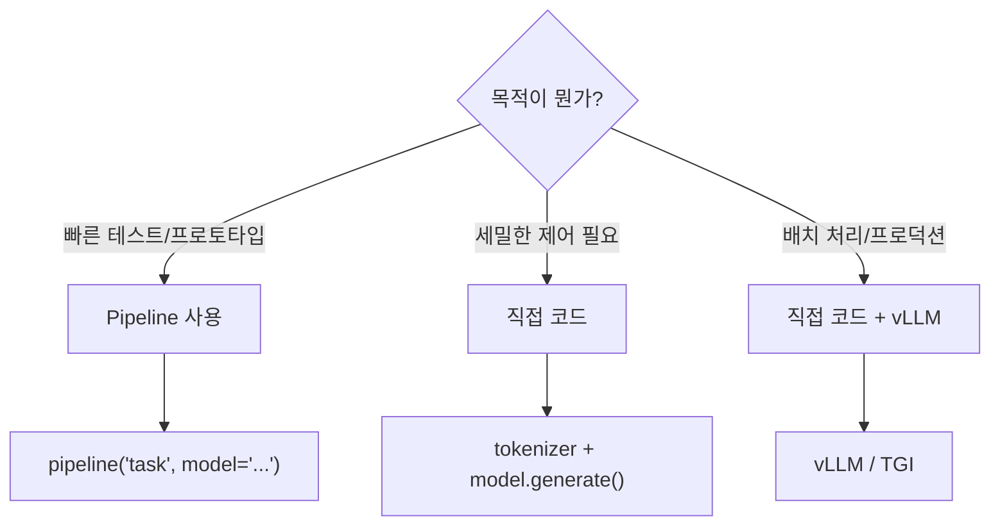
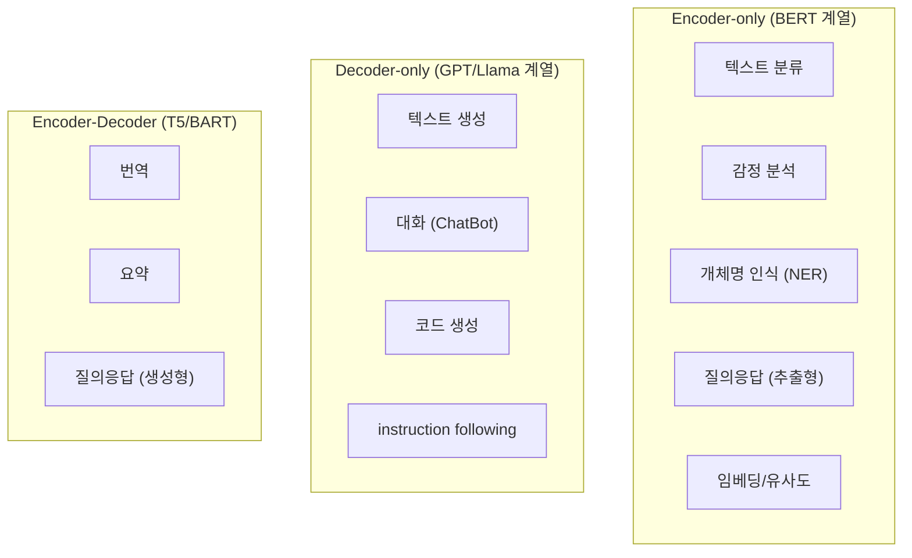

# Pipeline API 활용

> 토크나이저 → 모델 → 후처리를 **한 줄로** 끝내는 고수준 API

---

## Pipeline이란?

지금까지 배운 과정을 하나로 묶은 것:

### 직접 하기 vs Pipeline

| | 직접 코드 | Pipeline |
|---|---------|----------|
| 코드 | 토크나이저 로드 → 인코딩 → 모델 로드 → 추론 → 디코딩 | 한 줄 |
| 유연성 | 높음 (모든 설정 가능) | 보통 (주요 설정만) |
| 용도 | 프로덕션, 커스텀 로직 | 프로토타입, 빠른 실험 |

---

## 주요 Pipeline 태스크

### 텍스트 생성 (text-generation)

| 설정 | 설명 |
|------|------|
| 모델 타입 | Decoder-only (GPT, Llama) |
| 입력 | 프롬프트 텍스트 |
| 출력 | 생성된 텍스트 |

### 텍스트 분류 (text-classification)

| 설정 | 설명 |
|------|------|
| 모델 타입 | Encoder-only (BERT) |
| 입력 | 분류할 텍스트 |
| 출력 | 라벨 + 점수 |

### 질의응답 (question-answering)

| 설정 | 설명 |
|------|------|
| 모델 타입 | Encoder-only (BERT) |
| 입력 | 질문 + 컨텍스트 |
| 출력 | 답변 + 위치 + 점수 |

### 요약 (summarization)

| 설정 | 설명 |
|------|------|
| 모델 타입 | Encoder-Decoder (T5, BART) |
| 입력 | 긴 텍스트 |
| 출력 | 요약된 텍스트 |

### 번역 (translation)

| 설정 | 설명 |
|------|------|
| 모델 타입 | Encoder-Decoder (MarianMT, T5) |
| 입력 | 원문 |
| 출력 | 번역문 |

### Feature Extraction (임베딩 추출)

| 설정 | 설명 |
|------|------|
| 모델 타입 | Encoder-only |
| 입력 | 텍스트 |
| 출력 | 벡터 (임베딩) |
| 활용 | RAG의 임베딩 생성, 유사도 검색 |

---

## Pipeline vs 직접 코드: 언제 뭘 쓰나

| 상황 | 선택 |
|------|------|
| "이 모델 성능 어떤지 빠르게 보자" | Pipeline |
| "생성 파라미터 세밀하게 조절" | 직접 코드 |
| "Chat template 적용해서 대화" | 직접 코드 |
| "1000개 문장 배치 처리" | 직접 코드 또는 vLLM |
| "모델 비교 실험" | Pipeline (편리) |

---

## 모델 타입별 적합한 태스크 정리

이 관계를 이해하면 "어떤 태스크에 어떤 모델을 써야 하는지" 바로 판단 가능.

---

## 핵심 정리

1. **Pipeline** — 토크나이저 + 모델 + 후처리를 한 줄로
2. **태스크별 Pipeline** — text-generation, text-classification, QA, summarization 등
3. **Pipeline은 프로토타입용** — 프로덕션은 직접 코드
4. **모델 타입 = 태스크 적합성** — Encoder(분류), Decoder(생성), Enc-Dec(변환)

---

## 학습 체크포인트

- [ ] pipeline()으로 텍스트 생성, 분류, QA를 실행할 수 있는가?
- [ ] Pipeline과 직접 코드의 차이와 적합한 상황을 아는가?
- [ ] 모델 타입(Encoder/Decoder/Enc-Dec)별 적합한 태스크를 아는가?
- [ ] Feature Extraction pipeline이 RAG와 어떻게 연결되는지 아는가?
- [ ] 태스크에 맞는 모델을 HuggingFace Hub에서 찾을 수 있는가?
