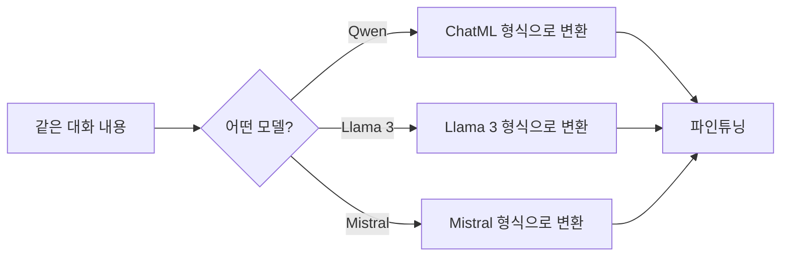
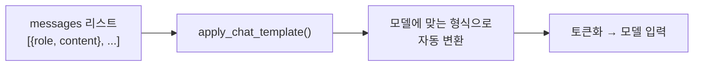
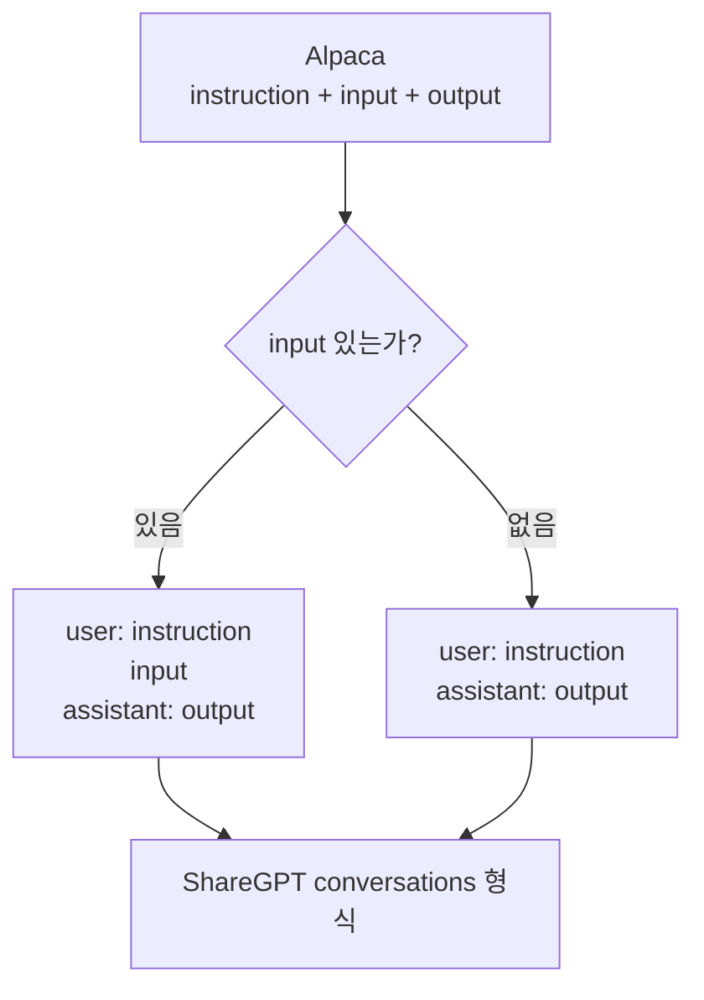
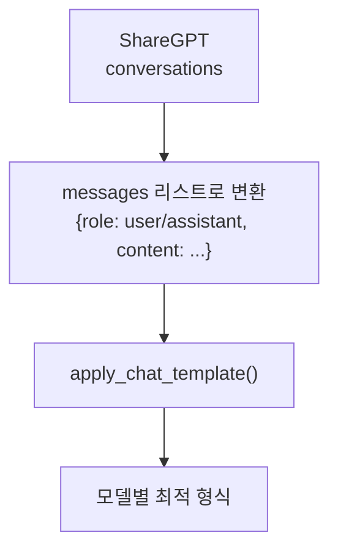

# Chat Template & 데이터 형식 심화

> Phase 2에서 3가지 형식을 "비교"했다면, Phase 3에서는 **직접 변환하고 적용**한다

---

## 1. Chat Template이란?

모델이 **"누가 말했는지"를 구분하는 약속된 형식**이다.

같은 대화라도 모델마다 구분 방식이 완전히 다르다:

| 모델 | 역할 구분 방식 | 특징 |
|------|---------------|------|
| ChatML (Qwen) | `<\|im_start\|>role` ... `<\|im_end\|>` | 가장 범용적 |
| Llama 3 | `<\|start_header_id\|>role<\|end_header_id\|>` | Meta 전용 |
| Mistral | `[INST]` ... `[/INST]` | 단순한 구조 |

---

## 2. 왜 모델마다 다른가?

각 모델이 **사전학습 시 사용한 형식이 다르기 때문**이다.

모델은 특수 토큰의 패턴을 보고 "여기서부터 user 발화", "여기서부터 assistant 응답"을 구분한다. 잘못된 template을 쓰면 모델이 역할 구분을 못 하고 품질이 급락한다.



---

## 3. 형식별 상세 구조

### ChatML (Qwen, Yi 계열)

```
<|im_start|>system
당신은 도움이 되는 AI입니다.<|im_end|>
<|im_start|>user
안녕하세요<|im_end|>
<|im_start|>assistant
안녕하세요! 무엇을 도와드릴까요?<|im_end|>
```

### Llama 3

```
<|begin_of_text|><|start_header_id|>system<|end_header_id|>

당신은 도움이 되는 AI입니다.<|eot_id|><|start_header_id|>user<|end_header_id|>

안녕하세요<|eot_id|><|start_header_id|>assistant<|end_header_id|>

안녕하세요! 무엇을 도와드릴까요?<|eot_id|>
```

### Mistral

```
[INST] 안녕하세요 [/INST]안녕하세요! 무엇을 도와드릴까요?</s>
```

---

## 4. apply_chat_template()

HuggingFace의 `apply_chat_template()`은 모델의 토크나이저에 내장된 Jinja2 템플릿을 사용해서 자동으로 올바른 형식을 생성한다.



**핵심**: 직접 형식을 하드코딩하지 말고, `apply_chat_template()`을 쓰면 모델이 바뀌어도 코드 변경이 없다.

---

## 5. 데이터 형식 변환 전략

### Alpaca → ShareGPT 변환



### ShareGPT → 모델별 Template 변환



---

## 6. 싱글턴 vs 멀티턴

| 구분 | 싱글턴 | 멀티턴 |
|------|--------|--------|
| 형식 | Alpaca | ShareGPT |
| 턴 수 | 1 질문 → 1 응답 | 여러 턴의 대화 |
| 적합한 태스크 | QA, 코드 생성, 분류 | 챗봇, 대화형 에이전트 |
| 데이터 수집 난이도 | 쉬움 | 어려움 |
| 파인튜닝 효과 | 특정 태스크에 집중 | 대화 능력 전반 향상 |

---

## 7. Phase 2 → Phase 3 연결

| Phase 2에서 배운 것 | Phase 3에서 심화하는 것 |
|---------------------|------------------------|
| 3가지 형식 비교 (개념) | 형식 간 변환 코드 작성 |
| Chat Template 소개 | apply_chat_template() 실전 사용 |
| GPT-2 토크나이저 | 여러 모델 토크나이저 비교 |

---

## 핵심 원칙

> **파인튜닝 대상 모델의 chat template에 맞춰서 데이터를 변환하라.**
> 형식이 틀리면 모델이 역할을 구분하지 못하고, 학습 효과가 급감한다.
