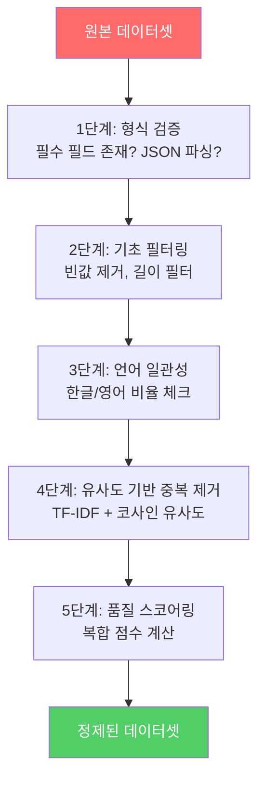
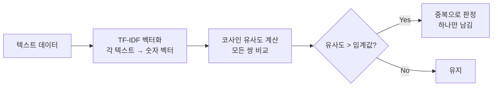

# 고급 데이터 정제

> Phase 2의 기초 정제(길이 필터, 빈값 제거)를 넘어 **품질 스코어링과 유사도 기반 중복 제거**로 진화

---

## 1. Phase 2 vs Phase 3 정제 비교

| 기준 | Phase 2 (기초) | Phase 3 (고급) |
|------|---------------|---------------|
| 중복 제거 | 앞 100자 exact match | TF-IDF 코사인 유사도 기반 |
| 길이 필터 | 단순 문자 수 기준 | 토큰 수 + 분포 기반 이상치 제거 |
| 품질 판단 | 있다/없다 (이진) | 품질 스코어 (0~1 연속값) |
| 언어 체크 | 없음 | 한글/영어 비율 검사 |
| 형식 검증 | 없음 | JSON 파싱, 필수 필드 존재 여부 |

---

## 2. 정제 파이프라인 전체 흐름

---

## 3. 유사도 기반 중복 제거

### 왜 exact match로는 부족한가

| 샘플 A | 샘플 B | exact match | 유사도 |
|--------|--------|:-----------:|:------:|
| "Python으로 Hello를 출력하세요" | "Python으로 Hello를 출력하세요" | 중복 | 1.0 |
| "Python으로 Hello를 출력하세요" | "파이썬으로 Hello를 출력해주세요" | 통과 | 0.85 |
| "리스트 정렬 방법을 알려주세요" | "리스트를 정렬하는 방법 알려줘" | 통과 | 0.80 |

두 번째, 세 번째 쌍은 사실상 같은 의미인데 exact match로는 잡지 못한다.

### TF-IDF + 코사인 유사도 방식

**임계값 가이드**: 0.85 이상이면 거의 같은 내용. 0.7~0.85는 검토 필요.

---

## 4. 품질 스코어링

하나의 지표가 아니라 **여러 기준의 복합 점수**로 판단한다:

| 기준 | 측정 방법 | 가중치 (예시) |
|------|----------|:------------:|
| 길이 적절성 | 너무 짧거나 긴 정도 | 25% |
| 어휘 다양성 | 고유 단어 / 전체 단어 비율 | 25% |
| 형식 완성도 | instruction-output 쌍 완성 여부 | 25% |
| 정보 밀도 | 의미 있는 내용 포함 여부 | 25% |

### 품질 점수 활용

---

## 5. 언어 일관성 체크

한국어 파인튜닝 데이터에서 흔한 문제:

| 문제 | 예시 | 해결 |
|------|------|------|
| 영어 혼재 | instruction은 한글, output은 영어 | 한글 비율 체크 |
| 인코딩 깨짐 | "한국어 í…스트" | 깨진 문자 패턴 탐지 |
| 번역체 | "그것은 매우 좋은 것입니다" | 자연스러움 판단 (고급) |

---

## 6. 정제 전후 지표 비교

정제가 잘 됐는지 확인하는 지표:

| 지표 | 의미 |
|------|------|
| 데이터 수 변화 | 원본 대비 몇 % 남았는가 |
| 평균 길이 변화 | 극단적 샘플 제거 확인 |
| 어휘 다양성 | 중복 제거로 다양성 증가 확인 |
| 길이 분포 | 히스토그램으로 이상치 제거 확인 |

---

## 핵심 원칙

> **데이터 100개를 잘 정제한 것이 1000개를 대충 넣은 것보다 낫다.**
> 파인튜닝 성공의 80%는 데이터 품질이 결정한다.
