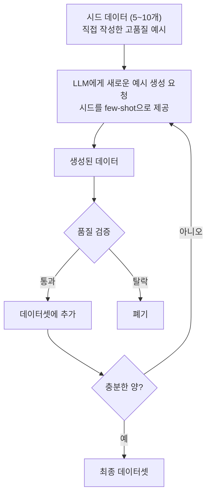
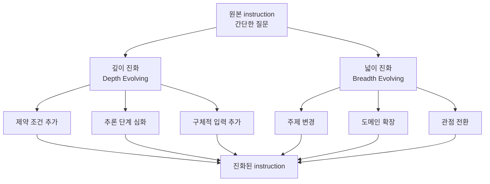

# 합성 데이터 생성

> 실제 데이터가 부족할 때, LLM을 활용해 **학습 데이터를 만들어내는** 기법

---

## 1. 왜 합성 데이터가 필요한가

| 상황 | 문제 | 합성 데이터 해결 |
|------|------|-----------------|
| 도메인 특화 | 법률/의료 데이터가 수백 개뿐 | LLM으로 수천 개 생성 |
| 다양성 부족 | 비슷한 패턴만 반복 | 의도적으로 다양한 변형 생성 |
| 비용 문제 | 전문가 라벨링이 너무 비쌈 | LLM이 초안 생성, 사람이 검수 |
| 프라이버시 | 실제 데이터 사용 불가 | 가상 데이터로 대체 |

---

## 2. Self-Instruct 방식

Stanford Alpaca가 사용한 방법. **소수의 시드 데이터에서 출발하여 LLM으로 확장**한다.

### 핵심 포인트

- 시드 데이터의 품질이 전체 품질을 결정한다
- 생성할 때마다 다른 시드를 few-shot으로 보여줘서 다양성 확보
- 매 라운드마다 품질 필터링 필수

---

## 3. Evol-Instruct 방식 (WizardLM)

기존 instruction을 **점진적으로 복잡하게 진화**시키는 방법.

### 깊이 진화 예시

| 단계 | instruction |
|:----:|------------|
| 원본 | "피보나치 수열을 구현하세요" |
| +제약 | "재귀 없이 피보나치 수열을 구현하세요" |
| +심화 | "재귀 없이 피보나치 수열을 O(1) 공간으로 구현하세요" |
| +구체화 | "재귀 없이 피보나치 수열의 n번째 수를 O(1) 공간, O(n) 시간으로 구현하고, n이 음수일 때의 예외 처리도 포함하세요" |

---

## 4. 합성 데이터 품질 검증

생성만 하고 검증하지 않으면 오히려 모델 성능이 하락한다.

### 검증 체크리스트

| 항목 | 확인 내용 |
|------|----------|
| 정확성 | output이 instruction에 대한 올바른 답인가? |
| 일관성 | instruction과 output의 언어/형식이 일치하는가? |
| 다양성 | 비슷한 instruction이 반복되지 않는가? |
| 난이도 분포 | 쉬운 것부터 어려운 것까지 골고루 있는가? |
| 유해성 | 부적절하거나 편향된 내용이 없는가? |

### 검증 전략

---

## 5. 주의사항

### 반드시 피해야 할 것

| 위험 | 설명 |
|------|------|
| 모델 붕괴 (Model Collapse) | 합성 데이터만으로 학습하면 다양성이 감소하고 품질이 하락 |
| 환각 증폭 | LLM이 생성한 잘못된 정보가 학습되면 환각이 강화됨 |
| 벤치마크 오염 | 합성 데이터 생성 시 벤치마크 문제를 참조하면 평가가 무의미 |
| 저작권 이슈 | LLM이 학습 데이터를 그대로 뱉어낼 수 있음 |

### 권장 비율

> **실제 데이터 : 합성 데이터 = 7 : 3** 정도가 안전선.
> 합성 데이터 비율이 50%를 넘으면 품질 저하 위험이 급증한다.

---

## 6. Self-Instruct vs Evol-Instruct 비교

| 기준 | Self-Instruct | Evol-Instruct |
|------|:------------:|:-------------:|
| 시작점 | 시드 데이터 (5~10개) | 기존 데이터셋 |
| 방향 | 새로운 instruction 생성 | 기존 instruction 복잡화 |
| 다양성 | 높음 (새로 생성) | 중간 (기존 기반 변형) |
| 난이도 제어 | 어려움 | 쉬움 (단계적 진화) |
| 적합한 경우 | 데이터가 아예 없을 때 | 기존 데이터 품질 향상 |

---

## 핵심 원칙

> **합성 데이터는 "없는 것보다 나은 대안"이지, "좋은 데이터의 대체재"가 아니다.**
> 소량의 고품질 실제 데이터 + 합성 데이터 보강이 최적 전략이다.
