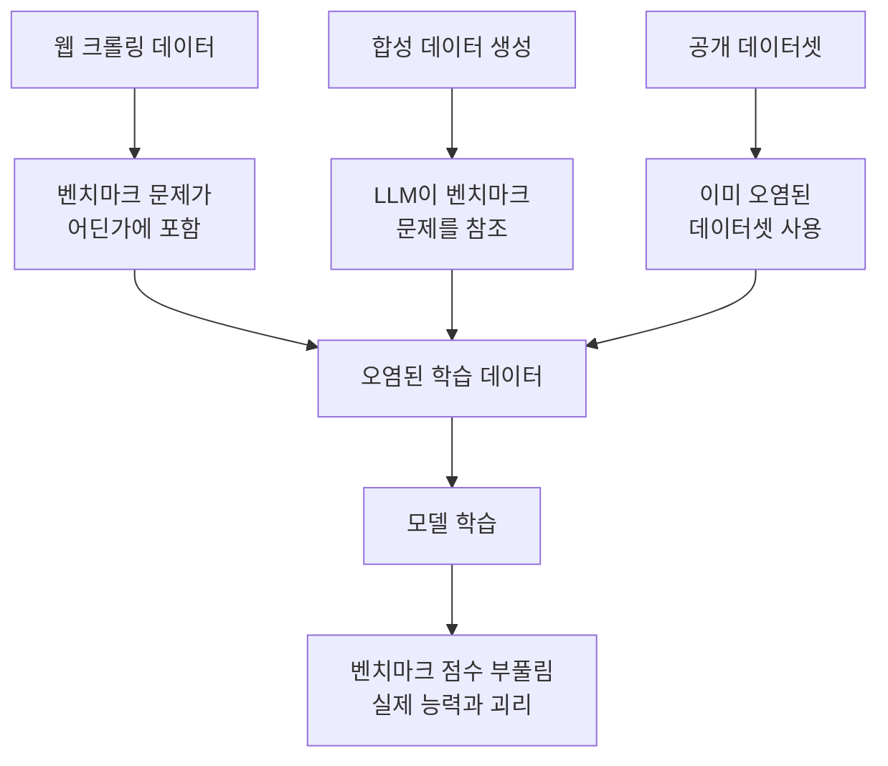
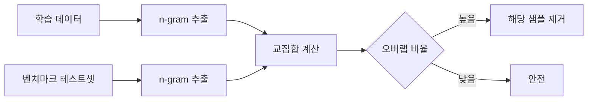
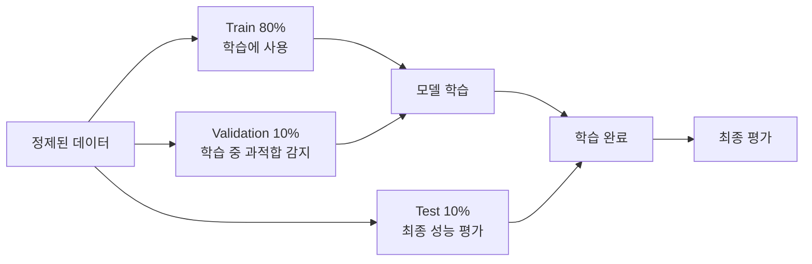
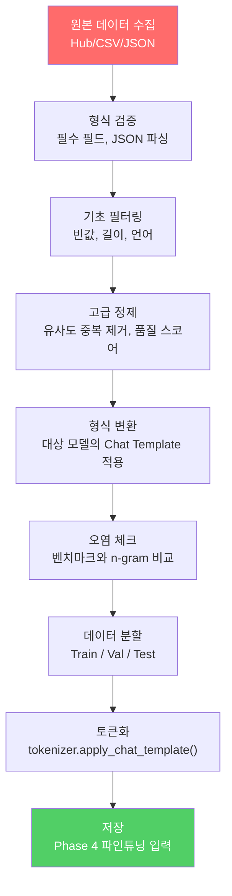

# 데이터 파이프라인 완성

> 정제 + 형식 변환 + 오염 방지 + 분할을 하나의 **재현 가능한 파이프라인**으로 통합

---

## 1. 데이터 오염(Contamination)이란

파인튜닝 데이터에 **벤치마크 테스트셋이 섞여 들어가는** 현상.

| 상황 | 결과 |
|------|------|
| 오염 없음 | MMLU 65점 → 실제 능력 65점 |
| 오염 있음 | MMLU 85점 → 실제 능력 65점 (시험지를 미리 본 것) |

벤치마크 점수가 높아 보이지만 실제 능력은 그대로다. **자기기만**이 된다.

### 오염 발생 경로

---

## 2. 오염 방지 전략

### n-gram 오버랩 체크

학습 데이터와 벤치마크 테스트셋 사이의 텍스트 겹침을 탐지한다.

**n-gram**: 연속된 n개 단어. n=8~13이 탐지에 적합.

### 체크해야 할 벤치마크

| 벤치마크 | 측정 항목 |
|----------|----------|
| MMLU | 범용 지식 |
| HumanEval | 코딩 능력 |
| GSM8K | 수학 추론 |
| HellaSwag | 상식 추론 |
| ARC | 과학 지식 |

---

## 3. Train / Validation / Test 분할

### 분할 시 주의사항

| 원칙 | 이유 |
|------|------|
| 랜덤 분할 전 셔플 | 데이터 순서에 의한 편향 방지 |
| 시드 고정 (seed=42) | 재현 가능성 확보 |
| 유사 데이터는 같은 분할에 | 유사 instruction이 train과 test에 나뉘면 과적합 감지 불가 |

---

## 4. 전체 파이프라인 통합

---

## 5. 데이터 카드 작성

파이프라인 실행 결과를 기록하는 메타데이터.

| 항목 | 내용 |
|------|------|
| 원본 소스 | 데이터 출처 |
| 원본 크기 | 정제 전 샘플 수 |
| 정제 후 크기 | 최종 샘플 수 (제거율) |
| 형식 | ChatML / Llama 3 / 기타 |
| 분할 비율 | Train:Val:Test |
| 평균 토큰 수 | 입력/출력 각각 |
| 품질 스코어 분포 | 평균, 중앙값, 최소 |
| 오염 체크 결과 | 벤치마크별 오버랩 비율 |

---

## 6. Phase 3 → Phase 4 연결

| Phase 3 산출물 | Phase 4에서 사용 |
|---------------|-----------------|
| Chat Template 적용된 데이터 | SFTTrainer의 입력 |
| Train/Val 분할 | 학습/평가 데이터 |
| 데이터 카드 | 실험 기록, 재현성 |
| 토큰 길이 분포 | max_seq_length 설정 근거 |

---

## 핵심 원칙

> **파이프라인은 "한 번 돌리고 끝"이 아니라, Phase 4에서 문제가 발견될 때마다 돌아와서 수정하는 반복 과정이다.**
> 재현 가능하게 만들어야 반복이 고통이 아니라 개선이 된다.
