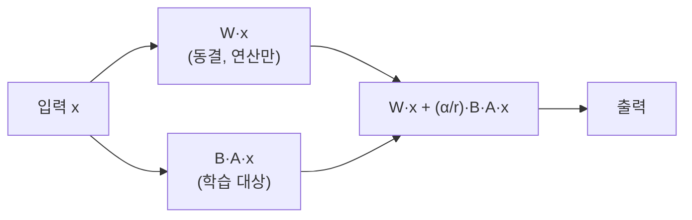
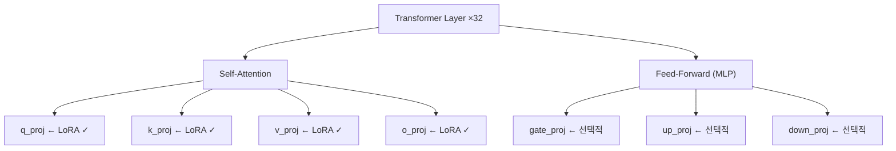
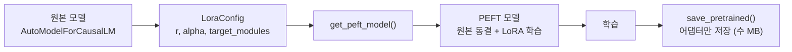

# LoRA/QLoRA 이론과 구조

> 전체 파라미터의 **1%만 학습**해서 Full Fine-tuning에 근접한 성능을 내는 원리를 수학적으로 이해한다

---

## 1. Full Fine-tuning의 한계

사전학습된 모델의 **모든 가중치를 업데이트**하는 방식.

| 모델 | 파라미터 | 학습 시 메모리 | 필요 GPU |
|------|----------|---------------|----------|
| Llama 3.1 8B | 8B | ~89 GB | A100 ×1 |
| Mistral 7B | 7B | ~78 GB | A100 ×1 |
| Llama 3.1 70B | 70B | ~782 GB | A100 ×10 |

학습 시 메모리 = 파라미터 × 12 bytes (가중치 2B + 그래디언트 2B + 옵티마이저 8B)

개인이 접근 가능한 GPU(RTX 4090, 24GB)로는 **8B 모델도 Full FT 불가능**하다.

---

## 2. LoRA 핵심 원리: 저랭크 분해

**핵심 아이디어**: 파인튜닝 시 가중치 변화량 ΔW는 **저차원(low-rank)**으로 충분히 표현된다.

$$W' = W + \Delta W = W + BA$$

- **W**: 원본 가중치 (동결, 학습 안 함)
- **B** ∈ R^(d×r): 0으로 초기화 (학습 시작 시 ΔW=0 보장)
- **A** ∈ R^(r×k): 랜덤 초기화
- **r** ≪ min(d, k): 랭크 (보통 8~64)

### 파라미터 절감 효과

4096×4096 가중치 기준:

| r | LoRA 파라미터 | 원본 대비 |
|---|--------------|-----------|
| 8 | 65,536 | 0.39% |
| 16 | 131,072 | 0.78% |
| 32 | 262,144 | 1.56% |
| 64 | 524,288 | 3.13% |

### 왜 저랭크로 충분한가

파인튜닝의 ΔW를 SVD(특이값 분해)하면 **상위 몇 개 특이값이 전체 변화의 99%를 설명**한다. 나머지는 노이즈다. LoRA는 이 본질적 저랭크 구조를 직접 활용한다.

---

## 3. 핵심 하이퍼파라미터

### r (rank)

저차원 행렬의 랭크. 높을수록 표현력 ↑, 과적합 위험 ↑

| r | 용도 |
|---|------|
| 8 | 간단한 태스크 (분류, 감성분석) |
| 16 | 범용 파인튜닝 (instruction following) |
| 32 | 구조적 출력 (SQL, 코드 생성) |
| 64 | 복잡한 추론 (수학, 논리) |

### alpha (스케일링 팩터)

실제 출력: `output = W·x + (alpha/r) × B·A·x`

alpha/r 비율이 LoRA 업데이트의 크기를 결정한다.

| 규칙 | 설명 |
|------|------|
| alpha = r × 2 | 가장 안전한 시작점 (권장) |
| alpha/r 클수록 | LoRA의 영향력 증가 |
| r 변경 시 alpha도 비례 | 스케일 일정하게 유지 |

### target_modules

| 범위 | 적합한 경우 |
|------|------------|
| q, v만 | 간단한 태스크, 메모리 부족 |
| q, k, v, o | 표준 설정 |
| attention + MLP 전체 | 복잡한 태스크, 메모리 여유 |

---

## 4. QLoRA: 4-bit 양자화 + LoRA

LoRA로 학습 파라미터는 줄었지만, **원본 모델 자체**를 메모리에 올려야 한다. QLoRA는 원본을 **4-bit로 압축**한다.

### 메모리 비교 (8B 모델)

| 방식 | 모델 메모리 | 학습 포함 총 메모리 |
|------|-----------|-------------------|
| Full FT (fp16) | 14.9 GB | ~89 GB |
| LoRA (fp16) | 14.9 GB | ~15.3 GB |
| QLoRA (NF4) | 3.7 GB | ~4.1 GB |

### NormalFloat4 (NF4)

QLoRA의 핵심 혁신. 신경망 가중치가 **정규분포**를 따르는 성질을 이용한다.

| 방식 | 원리 | 정밀도 |
|------|------|--------|
| 균등 INT4 | 값 범위를 16등분 | 중심부에서 정밀도 낭비 |
| NF4 | 정규분포의 동일 확률 구간 16등분 | 값이 많은 곳에 촘촘히 배치 |

NF4는 값이 집중된 중심부에 레벨을 더 많이 배치하여 **양자화 오차를 최소화**한다.

### Double Quantization

양자화 스케일 팩터 자체도 8-bit로 한번 더 양자화. 추가로 ~0.4GB 절감.

---

## 5. PEFT 라이브러리 사용법

### B의 0 초기화가 중요한 이유

B가 0이면 학습 시작 시 ΔW = B·A = 0. 즉 **학습 시작점이 사전학습 모델과 동일**하게 보장된다. 사전학습의 성과를 파괴하지 않고 점진적으로 적응한다.

---

## 6. Phase 3 → Phase 4 연결

| Phase 3 산출물 | Phase 4에서 사용 |
|---------------|-----------------|
| ChatML 변환된 데이터 | SFTTrainer의 text 필드 |
| 토큰 길이 분포 | max_seq_length 설정 |
| 데이터 카드 | 실험 기록 연결 |

---

## 핵심 원칙

> **LoRA는 "파라미터를 줄이는 꼼수"가 아니라, 파인튜닝의 본질적 저랭크 구조를 직접 활용하는 방법이다.**
> 원본 가중치를 건드리지 않으므로 여러 태스크에 각각 어댑터만 바꿔 끼울 수 있다.
