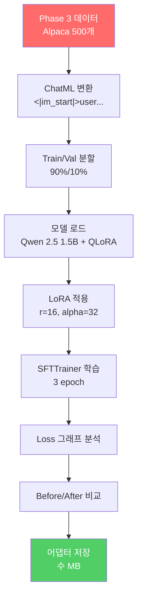
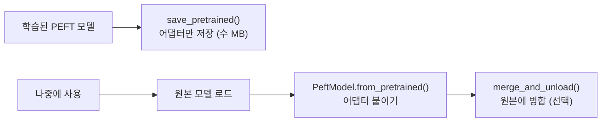

# SFT 첫 파인튜닝 실습

> Phase 3 데이터 + 01의 LoRA 이론을 결합하여 **처음으로 모델을 학습**시킨다

---

## 1. 전체 흐름



---

## 2. 데이터 준비

Phase 3 파이프라인을 재현한다:

| 단계 | 내용 |
|------|------|
| 로드 | Alpaca 500개 (실습용 소규모) |
| 필터 | output 30자 이상, 3000자 이하 |
| 변환 | ChatML 형식 (`<\|im_start\|>user...`) |
| 분할 | Train 90% / Val 10% |

---

## 3. 모델 로드 전략

| 환경 | 모델 | 방식 |
|------|------|------|
| GPU 있음 | Qwen 2.5 1.5B Instruct | QLoRA (4-bit NF4) |
| GPU 없음 | GPT-2 (124M) | LoRA (fp32, CPU) |

### QLoRA 로드 핵심 코드

```python
bnb_config = BitsAndBytesConfig(
    load_in_4bit=True,
    bnb_4bit_quant_type="nf4",
    bnb_4bit_compute_dtype=torch.bfloat16,
    bnb_4bit_use_double_quant=True,
)
model = AutoModelForCausalLM.from_pretrained(model_name, quantization_config=bnb_config)
model = prepare_model_for_kbit_training(model)
```

---

## 4. Training Arguments 핵심

| 인자 | 값 | 의미 |
|------|---|------|
| per_device_train_batch_size | 2 | GPU당 배치 (메모리에 직접 영향) |
| gradient_accumulation_steps | 8 | 실효 배치 = 2×8 = 16 |
| learning_rate | 2e-4 | LoRA 표준 학습률 |
| warmup_ratio | 0.03 | 처음 3% 동안 lr 점진 증가 |
| lr_scheduler_type | cosine | 자연스러운 수렴 유도 |
| gradient_checkpointing | True | 메모리 절약 (속도 소폭 감소) |

### gradient_accumulation이 필요한 이유


GPU 메모리는 per_device_batch만큼만 쓰면서, 실효 배치는 크게 유지할 수 있다.

---

## 5. Loss 그래프 해석법

| 패턴 | 진단 | 대응 |
|------|------|------|
| 꾸준히 감소 → 수렴 | 정상 학습 | 유지 |
| 초반 급감 후 정체 | 수렴 완료 | epoch 줄여도 됨 |
| 감소 후 다시 상승 | 과적합 | epoch 줄이기, 데이터 늘리기 |
| 전혀 안 떨어짐 | lr 문제 | lr 10배 올리기 |
| NaN 발생 | lr 과다 또는 데이터 문제 | lr 10배 낮추기, 데이터 점검 |

### Train-Eval Gap

| Gap 크기 | 해석 |
|----------|------|
| < 0.2 | 양호 |
| 0.2 ~ 0.5 | 주의 |
| > 0.5 | 과적합 위험 |

---

## 6. 모델 저장과 로드



| 저장 방식 | 크기 | 용도 |
|----------|------|------|
| 어댑터만 | 수 MB | 여러 태스크 전환, Hub 업로드 |
| 병합 저장 | 수 GB | 배포용, 추론 속도 동일 |

### merge_and_unload()

학습 시: `W' = W + (alpha/r) × B·A` (분리 상태)
병합 후: `W_merged = W + (alpha/r) × B·A` (하나의 행렬)

추론 시 추가 연산이 없어진다.

---

## 핵심 원칙

> **첫 파인튜닝의 목적은 "최고 성능"이 아니라 "전체 흐름을 한 번 돌려보는 것"이다.**
> 데이터 준비 → 모델 로드 → 학습 → 평가 → 저장의 파이프라인이 돌아가면, 이후는 설정 조정이다.
