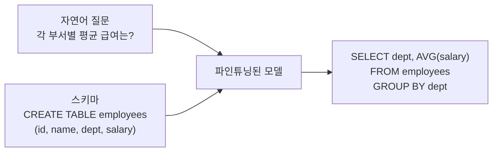
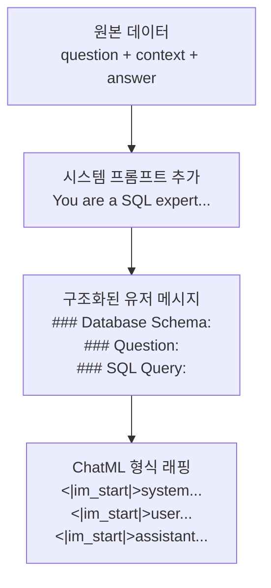
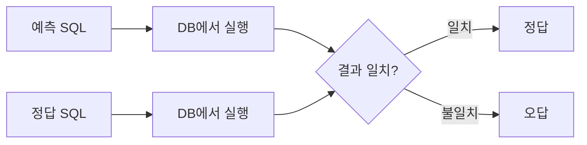
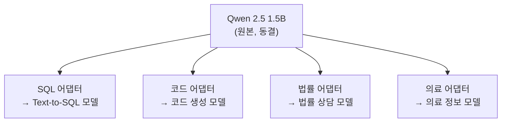

# Text-to-SQL 파인튜닝 프로젝트

> 범용 학습을 넘어 **특정 태스크에 집중**하는 도메인 특화 파인튜닝 첫 실전

---

## 1. Text-to-SQL이란

자연어 질문 + 테이블 스키마 → SQL 쿼리

---

## 2. 데이터셋

| 데이터셋 | 크기 | 구조 |
|----------|------|------|
| b-mc2/sql-create-context | 78K | question + CREATE TABLE + SQL |
| Clinton/Text-to-sql-v1 | 262K | 대규모 |
| gretelai/synthetic_text_to_sql | 100K | 합성 데이터 |

실습에서는 sql-create-context에서 3000개를 사용.

---

## 3. 데이터 전처리

### 프롬프트 설계가 성능을 좌우한다

시스템 프롬프트로 **역할을 명시**하고, 스키마와 질문을 **구조화된 헤더**로 구분한다. 이 형식이 모델의 입출력 매핑을 명확하게 만든다.

---

## 4. LoRA 설정: 02와의 차이

| 항목 | 02 (범용) | 03 (Text-to-SQL) | 이유 |
|------|----------|-------------------|------|
| r | 16 | **32** | SQL은 문법적 정확도가 중요 |
| alpha | 32 | **64** | r의 2배 유지 |
| 데이터 | Alpaca 500개 | SQL 3000개 | 도메인 집중 |

SQL 생성은 SELECT/FROM/WHERE 구조를 **정확히** 출력해야 한다. 한 글자 틀려도 쿼리가 실패한다. 표현력을 높이기 위해 r을 올렸다.

---

## 5. SQL 평가 방법

| 방법 | 정확도 | 난이도 |
|------|--------|--------|
| 문자열 정확 일치 | 낮음 (형식 차이에 민감) | 쉬움 |
| 키워드 매칭 | 중간 | 쉬움 |
| **Execution Accuracy** | **높음 (실제 DB 실행 결과 비교)** | 어려움 |
| LLM-as-Judge | 높음 | 중간 (API 비용) |

### Execution Accuracy

**가장 신뢰할 수 있는 평가**: SQL 문자열이 달라도 결과가 같으면 정답이다. 실전에서는 Spider/BIRD 벤치마크를 사용한다.

---

## 6. 범용 vs 도메인 특화

| 항목 | 범용 (Alpaca) | 도메인 특화 (SQL) |
|------|-------------|------------------|
| 학습 목표 | 다양한 지시 따르기 | SQL 문법 + 스키마 이해 |
| 데이터 특성 | 주제 다양 | 패턴 집중 |
| 평가 | 정성적 (사람이 판단) | 정량적 (실행 결과 비교) |
| r 설정 | 낮아도 됨 (16) | 높여야 함 (32+) |
| 실용성 | 범용 챗봇 | DB 쿼리 자동화 |

**핵심 교훈**: 소량의 도메인 특화 데이터가 대량의 범용 데이터보다 해당 태스크에서 더 효과적이다.

---

## 7. 어댑터 활용

하나의 원본 모델에 **여러 어댑터를 바꿔 끼울 수 있다**:

각 어댑터는 수 MB. 원본 모델 하나로 여러 전문 모델을 운영하는 효율적 구조.

---

## 핵심 원칙

> **도메인 특화 파인튜닝의 성패는 "데이터 품질"과 "프롬프트 설계"가 80%를 결정한다.**
> r을 올리거나 epoch을 늘리는 것은 나머지 20%의 영역이다.
