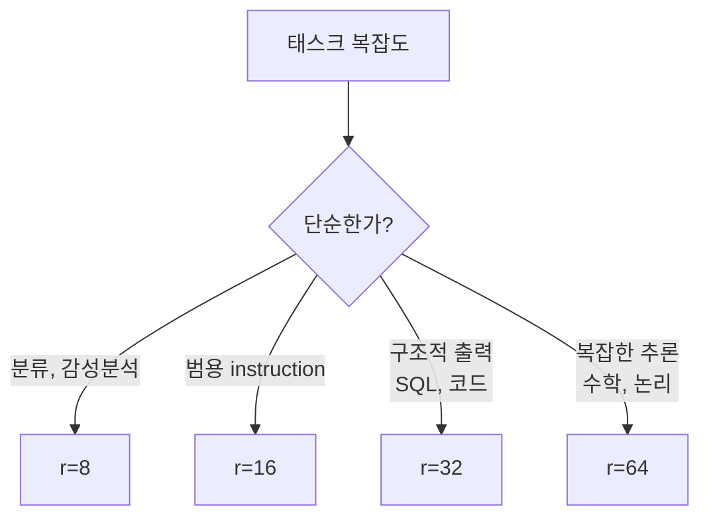
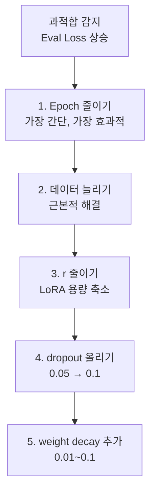
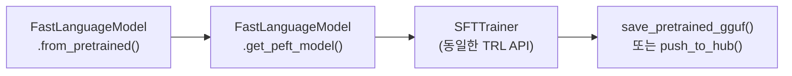
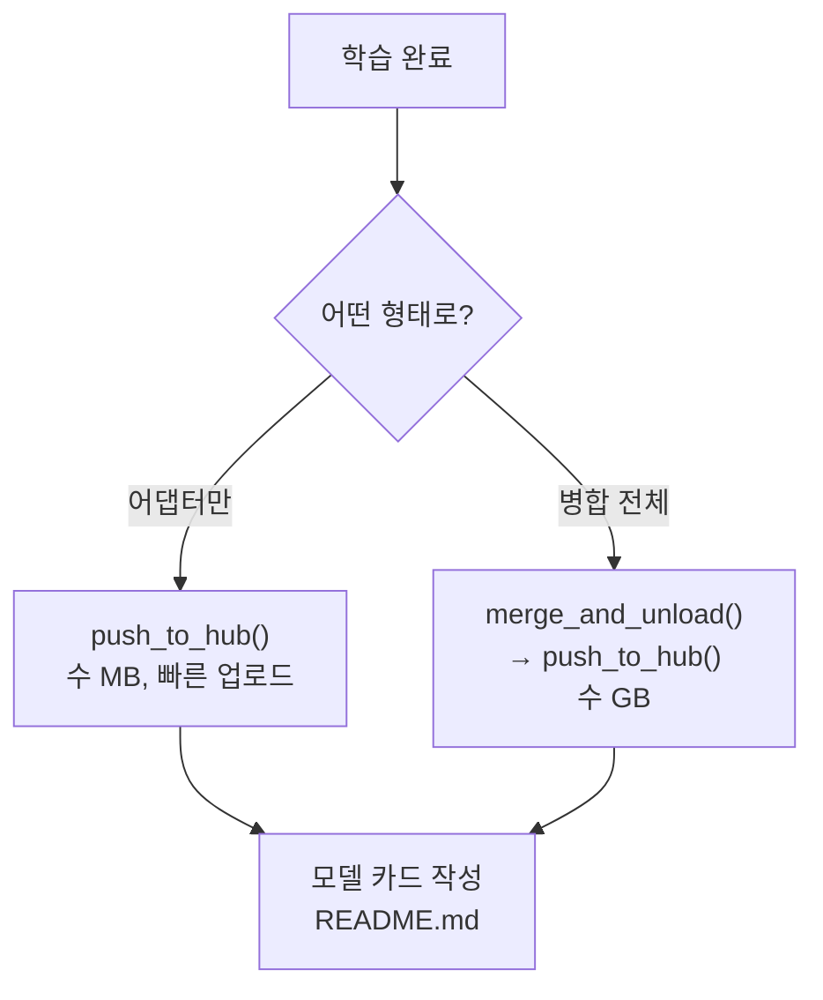

# 학습 분석과 최적화

> 하이퍼파라미터 튜닝, 과적합 진단, Unsloth 가속, HuggingFace 업로드까지 — **실전 워크플로우 완성**

---

## 1. 하이퍼파라미터 튜닝 원칙

**한 번에 하나의 변수만 변경한다.** 두 개 이상 바꾸면 원인을 알 수 없다.

| 실험 | 변경점 | 목적 |
|------|--------|------|
| baseline | r=16, lr=2e-4, 3ep | 기준 |
| small_rank | **r=8** | r 줄이면 어떻게 되나 |
| large_rank | **r=64** | r 늘리면 어떻게 되나 |
| low_lr | **lr=5e-5** | 학습률 낮추면 |
| high_lr | **lr=5e-4** | 학습률 높이면 |
| more_epochs | **5 epoch** | 더 오래 학습하면 |

### r 선택 가이드

### Learning Rate 범위

| 수준 | lr | 용도 |
|------|-----|------|
| 보수적 | 5e-5 | 안정적, 느린 수렴 |
| 표준 | 2e-4 | 대부분의 시작점 |
| 공격적 | 5e-4 | 빠른 수렴, 발산 위험 |

---

## 2. 과적합 진단

파인튜닝에서 **가장 빈번한 문제**.

### 3가지 패턴

| 패턴 | Train Loss | Eval Loss | 진단 |
|------|-----------|-----------|------|
| 정상 수렴 | ↓ | ↓ (비슷한 속도) | 양호 |
| 과적합 | ↓↓ | ↓ 후 ↑ | epoch 줄이기 |
| 학습 부족 | 천천히 ↓ | 천천히 ↓ | epoch 또는 lr 올리기 |

### 과적합 대응 (우선순위 순)

---

## 3. Unsloth

같은 모델, 같은 데이터에서 **2배 빠르고 70% 적은 메모리**를 쓴다.

| 항목 | HuggingFace | Unsloth |
|------|-------------|---------|
| 학습 속도 | 1x | **2x** |
| 메모리 사용 | 100% | **30%** |
| Qwen 7B 최소 VRAM | ~20 GB | **~9 GB** |
| GGUF 변환 | 별도 도구 | **내장** |
| API 호환성 | 표준 | 표준 (TRL 호환) |

### 핵심 코드 구조

기존 HuggingFace 코드에서 **모델 로드 부분만 바꾸면** 나머지는 동일하게 사용한다.

---

## 4. HuggingFace Hub 업로드

### 모델 카드 필수 항목

| 항목 | 내용 |
|------|------|
| 베이스 모델 | Qwen/Qwen2.5-1.5B-Instruct |
| 학습 방법 | QLoRA (NF4) |
| LoRA 설정 | r, alpha, target_modules |
| 학습 데이터 | 소스, 크기, 형식 |
| 학습 설정 | lr, epoch, batch size |
| 성능 | 평가 메트릭 |
| 한계 | 알려진 제약사항 |

---

## 5. 실험 기록 관리

| 규모 | 도구 | 특징 |
|------|------|------|
| 소규모 | JSON 파일 | 간단, 의존성 없음 |
| 중규모 | W&B (wandb.ai) | 자동 로깅, 시각화, 무료 |
| 대규모 | MLflow | 자체 호스팅, 모델 레지스트리 |

W&B 연동은 TrainingArguments에 `report_to="wandb"` 한 줄만 추가하면 된다.

---

## 6. 트러블슈팅 요약

| 증상 | 1순위 대응 | 2순위 대응 |
|------|----------|----------|
| OOM | batch_size 줄이기 | gradient_checkpointing |
| Loss 안 떨어짐 | lr 10배 올리기 | 데이터 형식 확인 |
| Loss NaN | lr 10배 낮추기 | max_grad_norm=1.0 |
| 학습 후 이상한 출력 | Chat Template 확인 | 과적합 여부 확인 |
| 학습이 느림 | Unsloth 사용 | max_seq_length 줄이기 |

---

## 7. Phase 4 체크포인트

| # | 질문 | 학습 위치 |
|---|------|----------|
| 1 | LoRA가 왜 효율적인지 수학적으로 설명할 수 있는가? | 01 |
| 2 | r, alpha 변경의 영향을 아는가? | 01, 04 |
| 3 | QLoRA의 4-bit NormalFloat를 설명할 수 있는가? | 01 |
| 4 | 파인튜닝한 모델을 HuggingFace에 업로드했는가? | 04 |
| 5 | 학습 loss 그래프를 해석할 수 있는가? | 02, 04 |

---

## 핵심 원칙

> **파인튜닝은 한 번에 성공하지 않는다. "실험 → 분석 → 조정"의 반복이 실력이다.**
> 기록하지 않은 실험은 존재하지 않은 것과 같다. 모든 실험을 기록하라.
