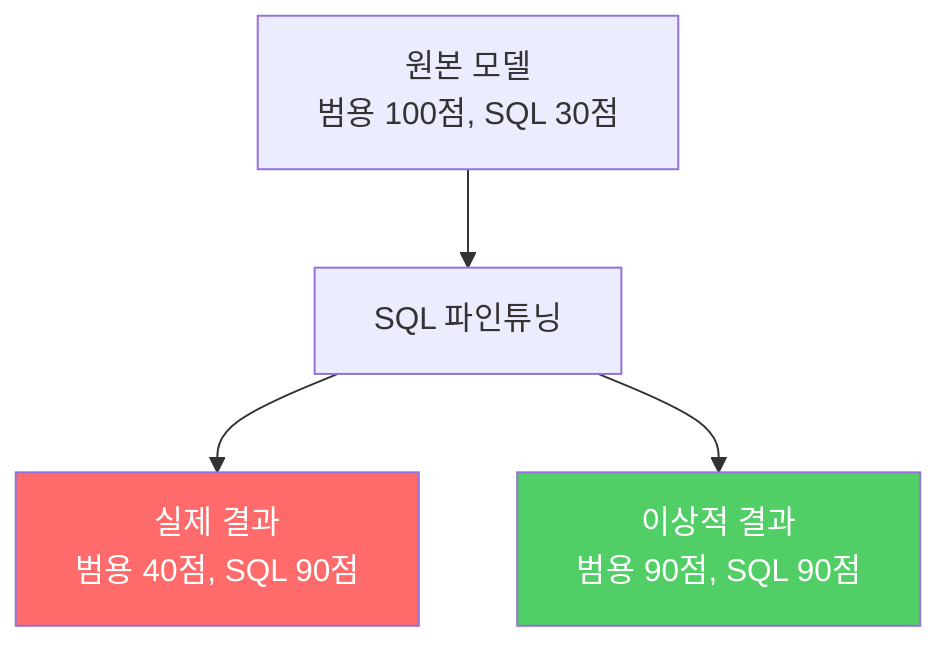
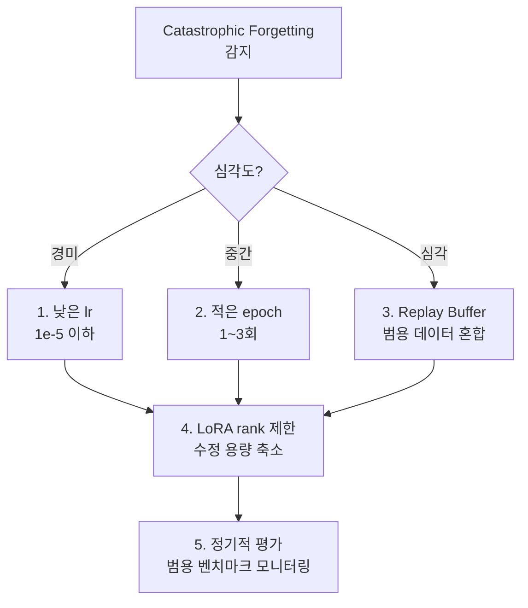
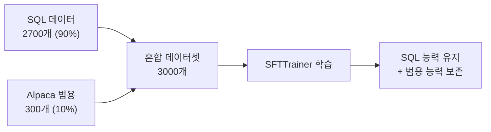
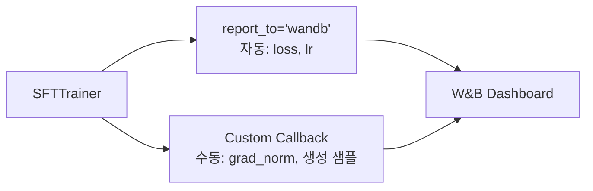
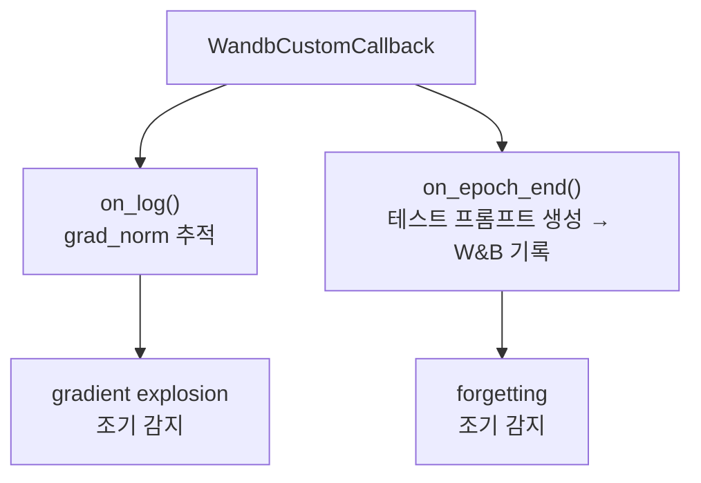

# Catastrophic Forgetting과 W&B 실전

> 파인튜닝의 가장 은밀한 실패 — 새로운 능력을 얻으면서 기존 능력을 잃는 현상을 진단하고 방지한다

---

## 1. Catastrophic Forgetting이란

파인튜닝 후 **도메인 태스크 성능은 오르지만 범용 능력이 붕괴**하는 현상.

| 증상 | 예시 |
|------|------|
| 범용 질문에 무의미한 답변 | "수도가 어디야?" → SQL 형식으로 응답 |
| 다른 언어 능력 소실 | 한국어 질문에 영어/SQL로 응답 |
| 추론 능력 저하 | 간단한 논리 문제에 실패 |

---

## 2. 5가지 방지 전략

| 전략 | 원리 | 구현 난이도 | 효과 |
|------|------|------------|------|
| 낮은 lr (1e-5 이하) | 원본 가중치 변화 최소화 | 쉬움 | 중간 |
| 적은 epoch (1-3) | 과도한 특화 방지 | 쉬움 | 중간 |
| **Replay Buffer** | **범용 데이터를 학습에 혼합** | **중간** | **높음** |
| LoRA rank 제한 | 수정 가능 용량 자체를 줄임 | 쉬움 | 낮음 |
| 정기적 평가 | 범용 벤치마크 모니터링 | 중간 | (예방) |

---

## 3. Replay Buffer

가장 효과적인 방지 전략. 도메인 데이터에 범용 데이터를 **일정 비율로 혼합**한다.

| 혼합 비율 | SQL 성능 | 범용 능력 | 권장 |
|----------|---------|----------|------|
| 0% (도메인만) | 최고 | 심각한 망각 | X |
| 5% | 높음 | 약간 보존 | 최소한 |
| **10%** | **높음** | **대부분 보존** | **권장** |
| 20% | 중간 | 잘 보존 | 보수적 |

---

## 4. W&B 실전 통합

Phase 4에서 `report_to="wandb"` 한 줄만 다뤘다. 실전에서는 **커스텀 메트릭**을 직접 로깅해야 한다.

### 추적해야 할 메트릭

| 메트릭 | 목적 | 위험 신호 |
|--------|------|----------|
| train_loss | 학습 진행 확인 | 정체 또는 NaN |
| eval_loss | 과적합 감지 | train과 갭 > 0.5 |
| grad_norm | gradient explosion 감지 | > 10이면 경고 |
| 생성 샘플 | 범용 능력 유지 확인 | 무의미한 출력 |

### Custom Callback 구조

---

## 5. Phase 4 → Phase 5 연결

| Phase 4 산출물 | Phase 5에서 사용 |
|---------------|-----------------|
| Text-to-SQL 어댑터 | Catastrophic forgetting 시연 |
| Alpaca 학습 데이터 | Replay buffer 범용 데이터로 재활용 |
| 실험 기록 JSON | W&B로 전환하는 대상 |
| Loss 그래프 해석 기초 | grad_norm 등 고급 메트릭으로 확장 |

---

## 6. Phase 5 체크포인트

| # | 질문 | 학습 위치 |
|---|------|----------|
| 1 | Catastrophic forgetting이 왜 발생하는지 설명할 수 있는가? | 01 |
| 2 | Replay buffer를 구현할 수 있는가? | 01 |
| 3 | W&B에서 grad_norm을 추적하고 해석할 수 있는가? | 01 |
| 4 | 학습 안정성 디버깅 체크리스트를 적용할 수 있는가? | 02 |

---

## 핵심 원칙

> **파인튜닝의 진짜 성공은 "새로운 능력"이 아니라 "기존 능력을 잃지 않으면서 새로운 능력을 얻는 것"이다.**
> 측정하지 않으면 잃어버린 것조차 모른다.
