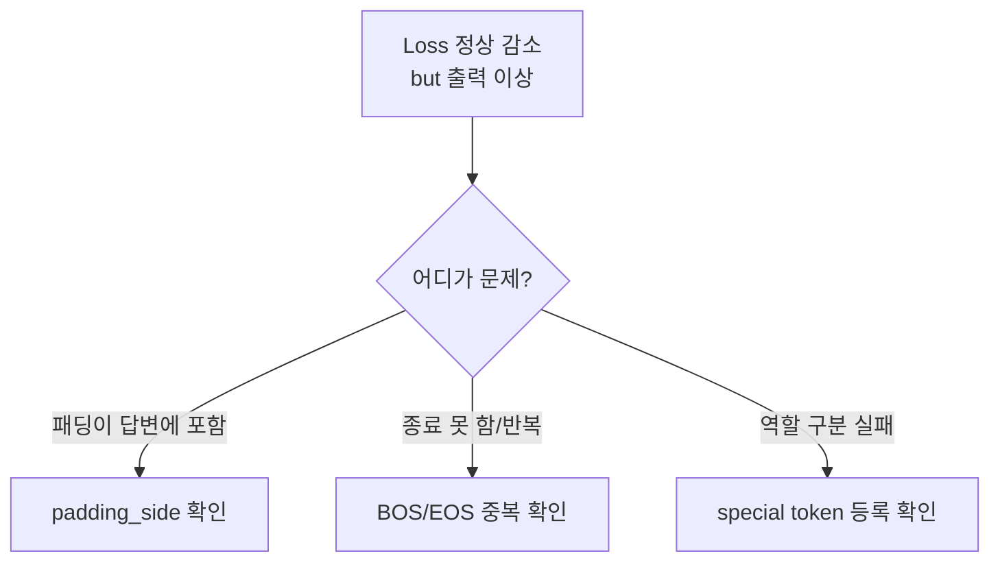
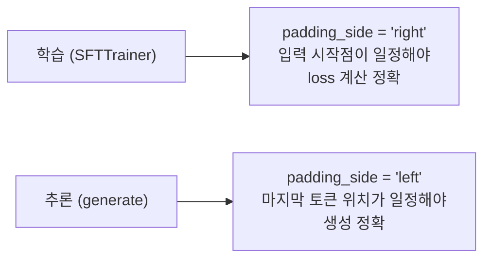
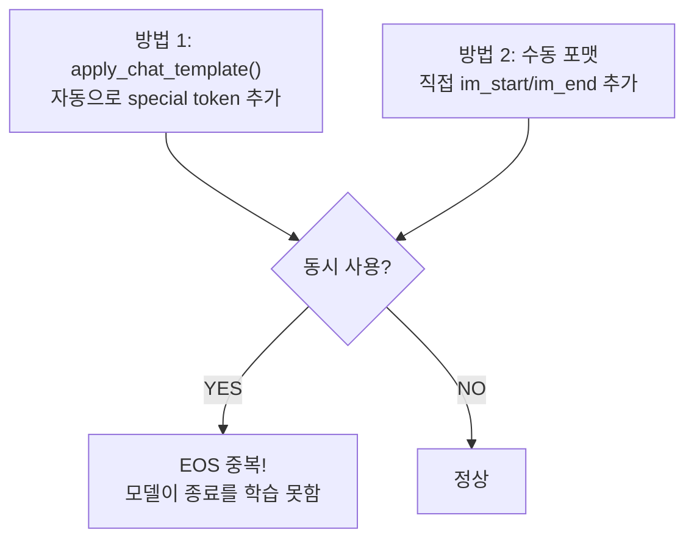

# 학습 안정성 디버깅 고급

> Loss는 내려가는데 모델이 이상하다면, 눈에 보이지 않는 곳에서 데이터가 오염되고 있다

---

## 1. 은밀한 3대 버그

Loss가 정상 감소해도 모델이 망가지는 원인들. Phase 4의 트러블슈팅(OOM, NaN, 과적합)과는 **다른 차원의 문제**.

| 버그 | 증상 | 원인 |
|------|------|------|
| padding_side 불일치 | 모델이 패딩을 "답변"으로 학습 | 학습/추론 시 방향 혼동 |
| BOS/EOS 중복 | 종료 못 하거나 이상 반복 | apply_chat_template + 수동 추가 충돌 |
| special token 미등록 | 역할 구분 실패, 형식 깨짐 | `<\|im_start\|>`가 여러 토큰으로 분해 |



---

## 2. Padding Side 규칙



| 모드 | padding_side | 이유 |
|------|-------------|------|
| 학습 (SFTTrainer) | right | 입력 시작점이 일정해야 loss 계산 정확 |
| 추론 (generate) | left | 마지막 토큰 위치가 일정해야 생성 시작점 정확 |

잘못 설정하면 attention mask가 오염되어 **모델이 [PAD] 토큰을 실제 텍스트로 학습**한다.

---

## 3. BOS/EOS 중복 방지



**규칙: 하나의 방법만 선택하라.**
- `apply_chat_template()` 사용 → 수동으로 special token 추가하지 않음
- 수동 포맷 → `add_special_tokens=False`로 인코딩

---

## 4. Special Token 등록 검증

`<|im_start|>`가 단일 토큰이 아니면 모델이 역할 경계를 인식하지 못한다.

| 확인 항목 | 기대값 | 확인 방법 |
|----------|--------|----------|
| `<\|im_start\|>` 토큰 ID | 단일 정수 | `len(tokenizer.encode(token)) == 1` |
| `<\|im_end\|>` 토큰 ID | 단일 정수 | 동일 |
| vocab_size 일치 | model >= tokenizer | `model.config.vocab_size >= len(tokenizer)` |

미등록 시 해결:
```
tokenizer.add_special_tokens({"additional_special_tokens": [...]})
model.resize_token_embeddings(len(tokenizer))
```

---

## 5. Pre-flight Checklist

학습 시작 **전에** 반드시 실행하는 종합 검증.

```
[1] tokenizer.padding_side 확인
[2] tokenizer.pad_token 설정 확인
[3] special token 단일 토큰 등록 확인
[4] model vocab_size >= tokenizer vocab_size 확인
[5] 데이터에 None / 빈 문자열 없음 확인
[6] BOS/EOS 중복 없음 확인
[7] 첫 번째 샘플 디코드하여 육안 확인
```

---

## 6. Phase 4 → Phase 5 보완 관계

| Phase 4 한계 | Phase 5 보완 |
|-------------|-------------|
| Loss 기반 트러블슈팅만 | 데이터 전처리 레벨 디버깅 |
| `report_to="wandb"` 한 줄 | Custom Callback + grad_norm + 생성 샘플 |
| 과적합 진단까지 | Catastrophic forgetting 진단/방지 |
| 명시적 에러만 (OOM, NaN) | 은밀한 버그 (padding, BOS/EOS, special token) |

---

## 핵심 원칙

> **학습이 "성공"한 것처럼 보이는 실패가 가장 위험하다.**
> Loss가 떨어졌다고 안심하기 전에, 모델이 실제로 무엇을 배웠는지 확인하라.
