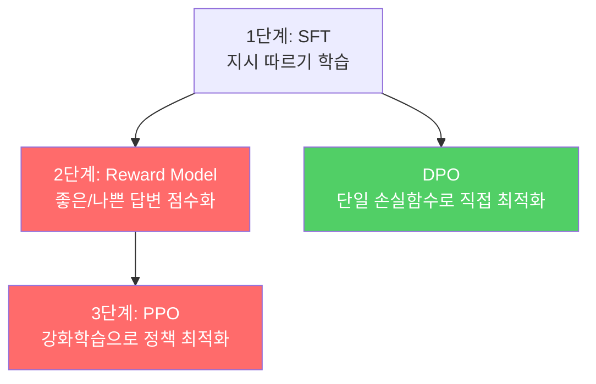
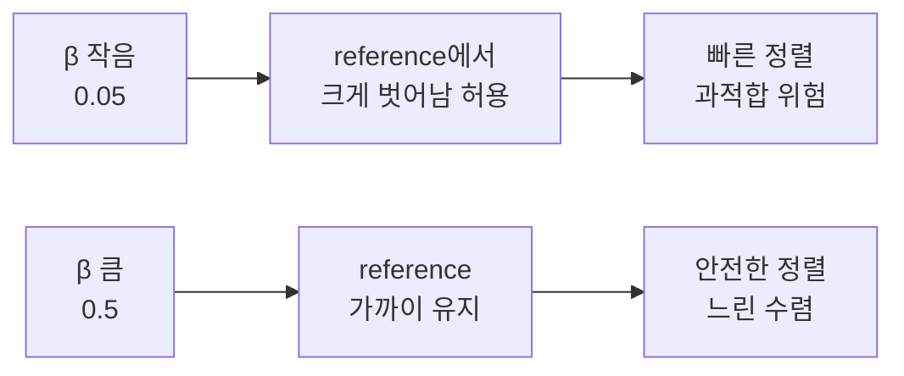
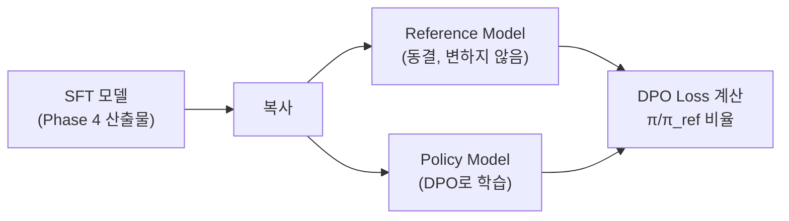
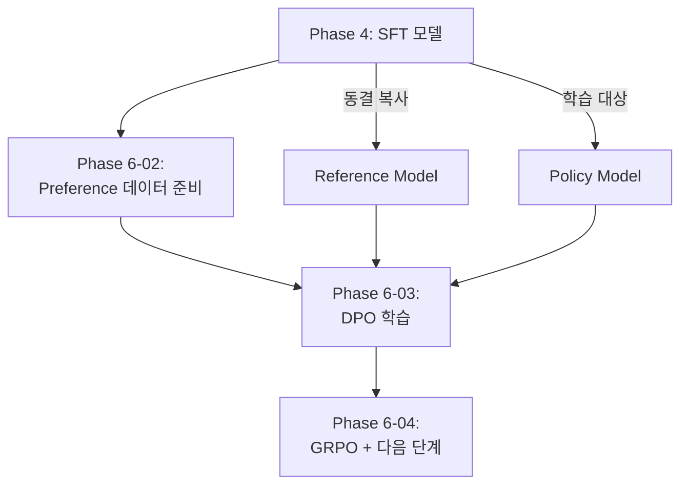

# RLHF에서 DPO로 - 이론

> SFT는 "따라해라", DPO는 "이것이 저것보다 낫다" — 모델에게 판단력을 심는다

---

## 1. SFT의 한계

Phase 4에서 SFT로 모델이 지시를 따르게 만들었다. 그런데 **같은 질문에 대해 좋은 답과 나쁜 답이 있을 때, SFT는 둘 다 "정답"으로 취급**한다.

| 학습 방식 | 가르치는 것 | 한계 |
|----------|-----------|------|
| SFT | "이렇게 답해라" | 여러 가능한 답 중 우열 구분 불가 |
| RLHF/DPO | "이 답이 저 답보다 낫다" | 상대적 선호도 학습 |

---

## 2. RLHF 전체 파이프라인

| 항목 | RLHF (PPO) | DPO |
|------|-----------|-----|
| 필요 모델 수 | 3 (SFT + Reward + Policy) | 2 (Reference + Policy) |
| 학습 안정성 | 불안정 (PPO 하이퍼파라미터 민감) | 안정 (분류 손실함수) |
| 구현 복잡도 | 높음 | 낮음 |
| 성능 | 이론상 우위 | 실전에서 동등 |
| 실무 채택률 | 감소 추세 | 증가 추세 |

---

## 3. DPO 손실 함수

$$L_{DPO} = -\log \sigma(\beta \times (\log \frac{\pi(w)}{\pi_{ref}(w)} - \log \frac{\pi(l)}{\pi_{ref}(l)}))$$

| 기호 | 의미 |
|------|------|
| π | policy model (학습 중) |
| π_ref | reference model (동결) |
| w | chosen (선호 응답) |
| l | rejected (비선호 응답) |
| β | KL 제약 강도 |
| σ | sigmoid 함수 |

### 직관적 이해

- **π(w) ↑**: chosen에 높은 확률 부여 → Loss 감소
- **π(l) ↓**: rejected에 낮은 확률 부여 → Loss 감소
- **π_ref로 나누기**: 원본 모델에서 너무 벗어나지 않도록 제약

---

## 4. β (beta) 하이퍼파라미터

reference model에서 얼마나 벗어나도 허용하는지를 결정한다.

| β | 효과 | 용도 |
|---|------|------|
| 0.05 | 공격적 학습, 빠른 정렬 | 과적합 위험 |
| **0.1** | **표준** | **대부분의 시작점** |
| 0.3~0.5 | 보수적, 안전한 정렬 | 느린 수렴 |

---

## 5. Reference Model

Reference model = SFT 학습이 끝난 직후의 모델 (동결). 학습 중 변하는 policy model이 reference에서 너무 멀어지면 penalty. 이것이 **KL divergence 제약** 역할을 한다.

TRL의 DPOTrainer에서 `ref_model=None`으로 설정하면 학습 시작 시 policy의 복사본을 자동으로 reference로 사용한다.

---

## 6. SFT → DPO 학습 파이프라인

---

## 핵심 원칙

> **DPO의 본질은 "정답을 가르치는 것"이 아니라 "비교하는 능력을 가르치는 것"이다.**
> 절대적으로 완벽한 답은 없어도, 상대적으로 나은 답은 항상 있다.
