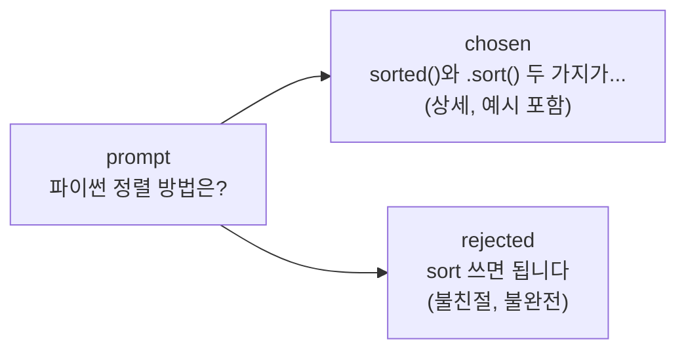
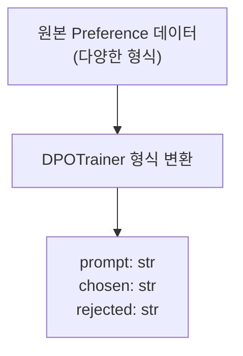
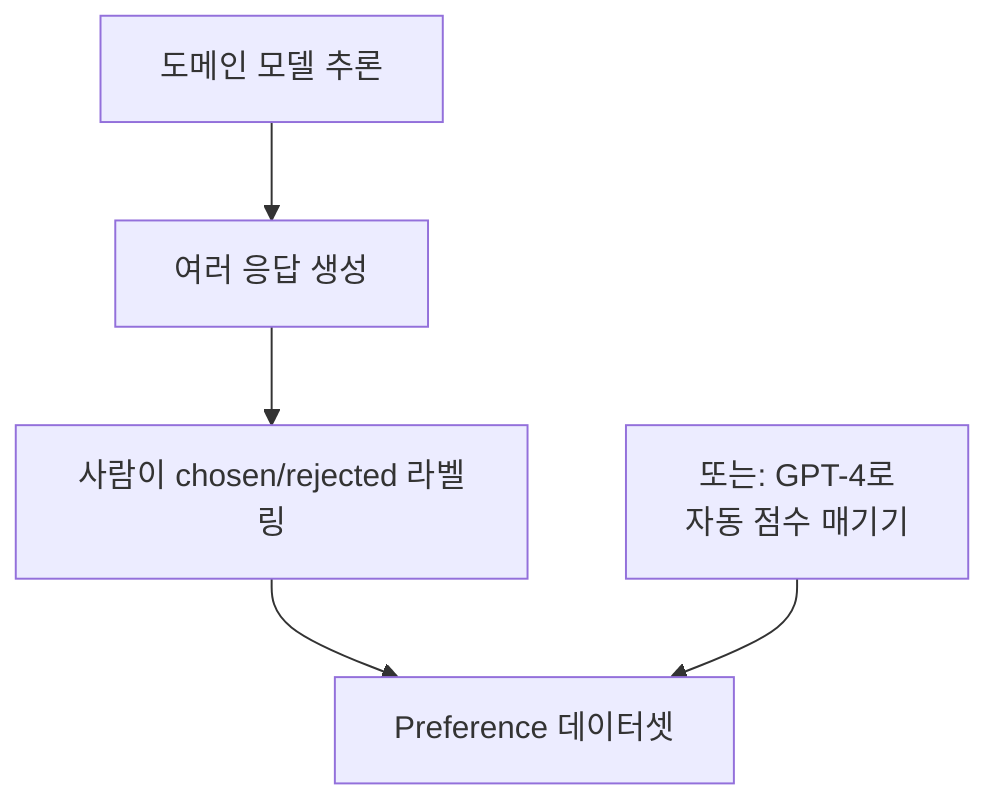

# Preference 데이터 준비

> DPO의 학습 품질은 "chosen과 rejected의 차이가 얼마나 의미 있는가"에 달려 있다

---

## 1. Preference 데이터 구조

SFT 데이터가 `instruction + output`이었다면, DPO 데이터는 `prompt + chosen + rejected`이다.

| 필드 | 역할 | 중요 조건 |
|------|------|----------|
| prompt | 사용자 입력 | 비어있으면 안 됨 |
| chosen | 선호 응답 | rejected보다 객관적으로 나아야 함 |
| rejected | 비선호 응답 | 완전히 틀린 것이 아니라 "덜 좋은" 것 |

---

## 2. 주요 데이터셋

| 데이터셋 | 크기 | 특징 | 적합한 용도 |
|----------|------|------|------------|
| HuggingFaceH4/ultrafeedback_binarized | 60K | GPT-4 점수 기반 | 범용 정렬 |
| Anthropic/hh-rlhf | 170K | Helpfulness/Harmlessness | 안전성 중시 |
| 커스텀 | 가변 | 도메인 특화 | 특정 태스크 |

### UltraFeedback

GPT-4가 여러 모델의 응답에 점수를 매겨 높은 점수 = chosen, 낮은 점수 = rejected로 구성. **가장 널리 사용**되는 범용 preference 데이터셋.

### Anthropic hh-rlhf

Anthropic이 만든 Helpfulness(도움) / Harmlessness(무해) 데이터. chosen/rejected가 전체 대화 형태로 포함되어 구조가 다름.

---

## 3. DPOTrainer 데이터 형식

TRL의 DPOTrainer가 기대하는 형식:
- `prompt`: 사용자 질문 (ChatML 형식)
- `chosen`: 선호 응답 (assistant 부분만)
- `rejected`: 비선호 응답 (assistant 부분만)

---

## 4. 커스텀 Preference 데이터

실전에서는 기존 데이터셋을 그대로 쓰지 않고, **자신의 도메인에 맞는 preference 데이터를 직접 만들어야** 한다.

---

## 5. 데이터 품질 기준

| 좋은 preference 쌍 | 나쁜 preference 쌍 |
|-------------------|-------------------|
| chosen이 구체적, rejected가 피상적 | 둘 다 비슷한 품질 |
| 차이가 명확하고 학습 가능 | chosen == rejected (동일) |
| 도메인에 맞는 판단 기준 | 랜덤 라벨링 |
| chosen이 항상 "더 나은" 이유가 있음 | 길이만 다르고 내용 유사 |

---

## 핵심 원칙

> **Preference 데이터는 "정답"을 모으는 것이 아니라 "비교"를 모으는 것이다.**
> chosen과 rejected의 차이가 클수록, 모델이 배우는 판단력도 명확해진다.
