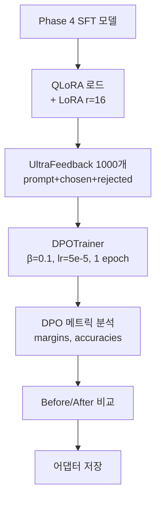
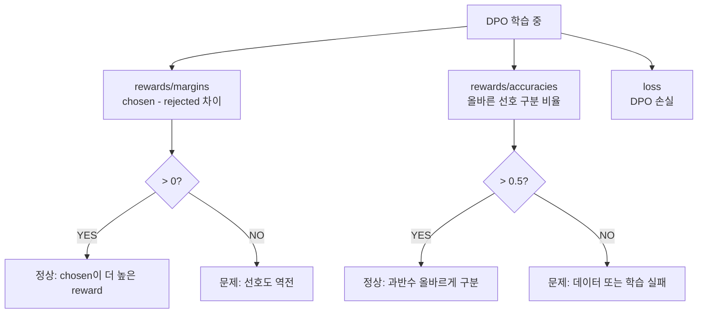
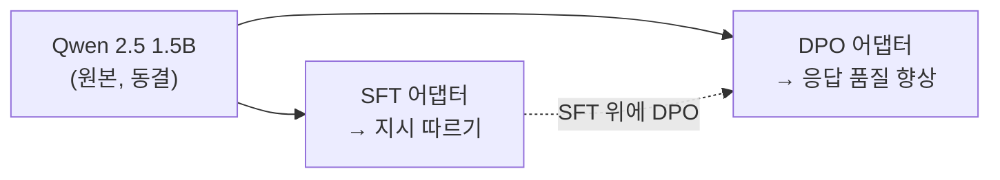

# DPO 파인튜닝 실습

> SFT 모델에 "판단력"을 심는 실전 — TRL DPOTrainer로 선호도 학습을 실행한다

---

## 1. DPO 학습 전체 흐름

---

## 2. DPOTrainer 핵심 설정

| 인자 | 값 | SFT 대비 차이 | 이유 |
|------|---|-------------|------|
| learning_rate | 5e-5 | SFT 2e-4의 1/4 | reference에서 벗어나지 않도록 |
| num_train_epochs | 1 | SFT 3의 1/3 | 과도한 정렬 방지 |
| beta | 0.1 | SFT에 없음 | KL divergence 제약 강도 |
| per_device_batch | 1 | SFT 2 | chosen+rejected 쌍으로 메모리 2배 |
| ref_model | None | - | 자동으로 policy 복사본 사용 |

---

## 3. DPO 메트릭 해석

| 메트릭 | 의미 | 건강한 값 |
|--------|------|----------|
| rewards/margins | chosen-rejected reward 차이 | > 0, 증가 추세 |
| rewards/accuracies | 올바른 선호 구분 비율 | > 0.5, 이상적으로 > 0.7 |
| loss | DPO 손실 | 감소 추세 |

---

## 4. SFT vs DPO 비교

| 단계 | SFT (Phase 4) | DPO (Phase 6) |
|------|-------------|--------------|
| 입력 데이터 | instruction + output | prompt + chosen + rejected |
| 학습 목표 | 정답을 따라해라 | 좋은 답을 선호해라 |
| lr | 2e-4 | 5e-5 (더 보수적) |
| epoch | 3 | 1 (보통) |
| 배치 메모리 | 1x | 2x (chosen+rejected 쌍) |
| 핵심 HP | r, alpha | β, lr |
| 평가 메트릭 | eval_loss | rewards/margins, accuracies |

---

## 5. 어댑터 스택

DPO는 SFT 위에 쌓는 구조. SFT가 "무엇을 답할지"를 배우고, DPO가 "어떻게 더 잘 답할지"를 배운다.

---

## 핵심 원칙

> **DPO는 SFT 위에 쌓는 "2층 건물"이다. 1층(SFT)이 부실하면 2층(DPO)도 무너진다.**
> SFT의 품질이 DPO의 상한선을 결정한다.
