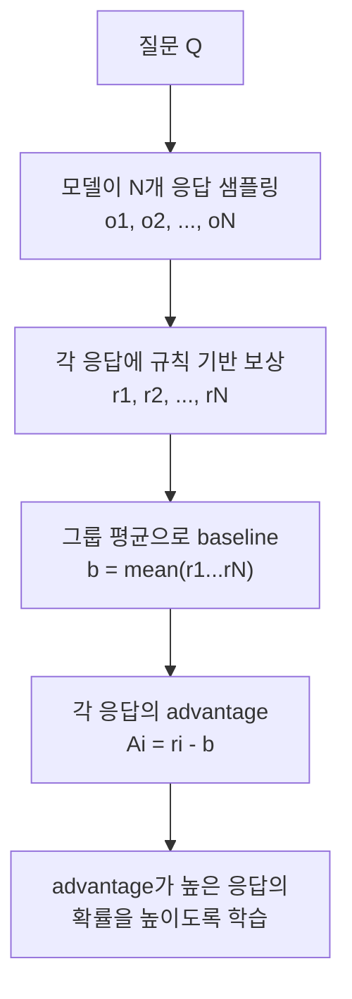
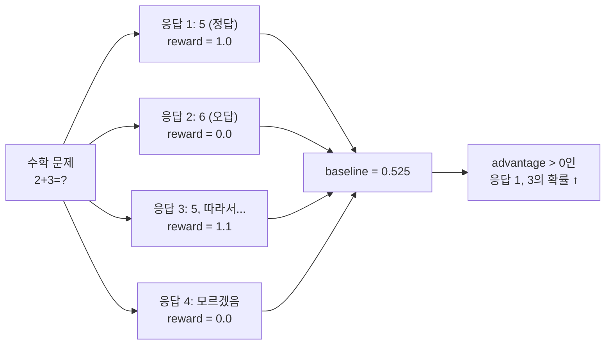
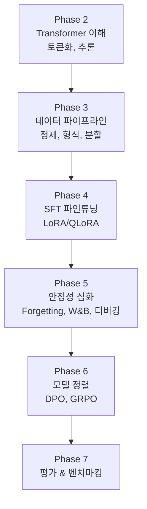

# GRPO와 다음 단계

> DPO가 "사람의 선호"를 학습한다면, GRPO는 "객관적 정답"으로 스스로 학습한다

---

## 1. DPO의 한계

| 상황 | DPO | GRPO |
|------|-----|------|
| "더 친절한 답변은?" | 적합 (주관적 선호) | 부적합 |
| "2+3의 정답은?" | 비효율 (preference 쌍 필요) | 적합 (정답 여부로 자동 보상) |
| "이 코드가 맞는가?" | 비효율 | 적합 (실행 결과로 검증) |

DPO는 **사람이 라벨링한 preference 쌍**이 필요하다. 수학/코드처럼 객관적 정답이 있는 태스크에서는 GRPO가 더 효율적이다.

---

## 2. GRPO 원리

DeepSeek R1에서 사용된 기법. **보상 모델 없이 규칙 기반 보상**으로 학습한다.

### 핵심 차이

| 항목 | DPO | GRPO |
|------|-----|------|
| 보상 신호 | implicit (손실함수 내장) | 규칙 기반 보상 함수 |
| 필요 데이터 | prompt + chosen + rejected | prompt + 정답 (자동 생성) |
| 라벨링 | 사람 필요 | **자동** |
| 적합한 태스크 | 주관적 품질 | 객관적 정답 |

---

## 3. GRPO 보상 함수 예시

보상 함수는 태스크에 따라 직접 설계한다:
- 수학: 정답 여부 + 풀이 과정 포함 여부
- 코드: 실행 성공 여부 + 테스트 통과 수
- SQL: 실행 결과 일치 여부

---

## 4. 정렬 기법 종합 비교

| 기법 | 보상 신호 | 필요 데이터 | 구현 난이도 | 적합한 태스크 |
|------|----------|-----------|-----------|------------|
| RLHF (PPO) | 학습된 Reward Model | Preference 쌍 | 매우 높음 | 범용 정렬 |
| **DPO** | **Implicit** | **Preference 쌍** | **낮음** | **범용 정렬** |
| **GRPO** | **규칙 기반 보상** | **문제 + 정답** | **중간** | **수학/코드/추론** |
| KTO | Binary (좋음/나쁨) | 단일 응답 + 라벨 | 낮음 | 데이터 적을 때 |
| ORPO | SFT+DPO 통합 | Preference 쌍 | 낮음 | 효율적 학습 |

---

## 5. Phase 2-6 전체 연결

---

## 6. Phase 6 체크포인트

| # | 질문 | 학습 위치 |
|---|------|----------|
| 1 | DPO의 손실 함수를 직관적으로 설명할 수 있는가? | 01 |
| 2 | Preference 데이터의 구조(chosen, rejected)를 이해하는가? | 02 |
| 3 | SFT 모델을 DPO로 추가 정렬해본 경험이 있는가? | 03 |
| 4 | GRPO의 원리와 DPO와의 차이를 설명할 수 있는가? | 04 |
| 5 | β(beta) 하이퍼파라미터의 역할을 아는가? | 01, 03 |

---

## 핵심 원칙

> **정렬의 목적은 "모델을 더 똑똑하게" 만드는 것이 아니라, "이미 아는 것을 더 잘 표현하게" 만드는 것이다.**
> 지식은 SFT에서, 판단력은 DPO에서, 추론력은 GRPO에서 온다.
