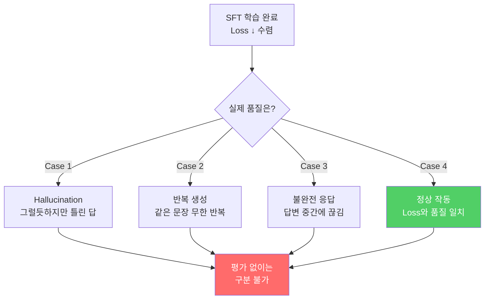
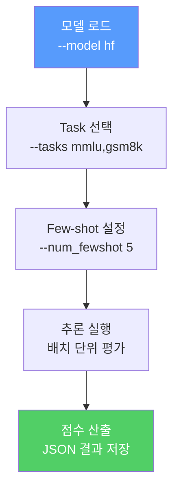
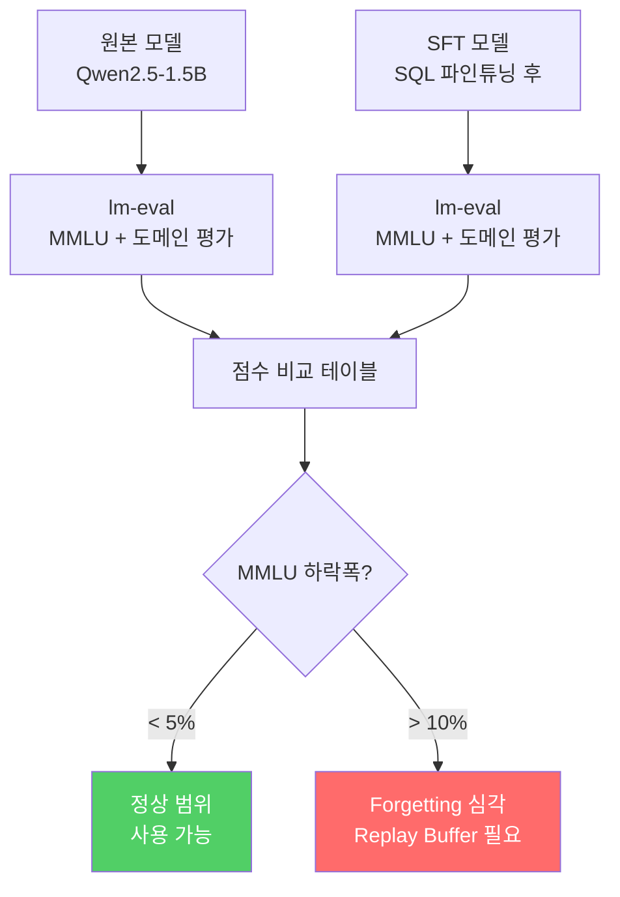

# LLM 벤치마크와 자동 평가

> Loss가 낮다고 좋은 모델이 아니다 — 평가하지 않은 모델은 아직 모델이 아니다

---

## 1. 평가가 필요한 이유

SFT로 loss를 낮췄다고 모델이 좋아진 것이 아니다. **Loss는 "토큰 예측 정확도"일 뿐, 사용자가 체감하는 품질과 직접 대응하지 않는다.**

| Loss 상태 | 실제 품질 | 원인 |
|-----------|----------|------|
| Loss ↓ 수렴 | 할루시네이션 증가 | 학습 데이터의 편향을 완벽히 암기 |
| Loss ↓ 수렴 | 반복 생성 | 다양성 붕괴 (mode collapse) |
| Loss ↓ 수렴 | 불완전한 응답 | EOS 토큰 학습 불균형 |
| Loss 약간 높음 | 오히려 품질 양호 | 적절한 일반화 |



---

## 2. 주요 벤치마크 지도

| 벤치마크 | 측정 대상 | 문제 수 | 평가 방식 |
|----------|----------|---------|----------|
| **MMLU** | 57과목 지식 (인문, 과학, 공학 등) | 14,042 | 4지선다 정확도 |
| **HumanEval** | 코딩 능력 (Python 함수 완성) | 164 | pass@k (실행 기반) |
| **GSM8K** | 수학 추론 (초등~중등 수준) | 8,500 | 최종 답 정확도 |
| **MT-Bench** | 멀티턴 대화 품질 | 80 (8카테고리 x 10) | GPT-4 Judge (1-10점) |
| **Chatbot Arena** | 종합 대화 능력 | 사용자 투표 기반 | ELO 레이팅 |


---

## 3. lm-evaluation-harness

EleutherAI의 표준 평가 프레임워크. 대부분의 논문과 리더보드가 이 도구를 기준으로 점수를 보고한다.



### 핵심 명령어

```bash
# 설치
pip install lm-eval

# MMLU 5-shot 평가
lm_eval --model hf \
    --model_args pretrained=your-model-path \
    --tasks mmlu \
    --num_fewshot 5 \
    --batch_size 8 \
    --output_path results/

# 복수 벤치마크 동시 평가
lm_eval --model hf \
    --model_args pretrained=your-model-path \
    --tasks mmlu,gsm8k,hellaswag \
    --num_fewshot 5 \
    --batch_size 4 \
    --output_path results/
```

---

## 4. DeepEval 프레임워크

LLM 출력의 **품질 차원**을 세분화하여 평가하는 프레임워크. 특히 RAG 파이프라인 평가에 강하다.

| 메트릭 | 측정 대상 | 설명 |
|--------|----------|------|
| **Faithfulness** | 사실 충실도 | 생성된 답변이 제공된 context에 근거하는가 |
| **Relevancy** | 질문 관련성 | 답변이 질문에 직접적으로 대응하는가 |
| **Hallucination** | 환각 탐지 | context에 없는 정보를 지어냈는가 |
| **Toxicity** | 유해성 | 유해하거나 편향된 내용을 포함하는가 |
| **Bias** | 편향성 | 특정 집단에 대한 편향이 있는가 |

```python
from deepeval.metrics import FaithfulnessMetric, HallucinationMetric
from deepeval.test_case import LLMTestCase

test_case = LLMTestCase(
    input="SQL에서 JOIN의 종류는?",
    actual_output=model_response,
    retrieval_context=[context_doc]
)

faithfulness = FaithfulnessMetric(threshold=0.7)
faithfulness.measure(test_case)
print(f"Faithfulness: {faithfulness.score}")
```

---

## 5. SFT 모델 정량 평가

파인튜닝 전후를 **동일한 벤치마크**로 비교해야 forgetting과 개선을 동시에 측정할 수 있다.



| 벤치마크 | 원본 모델 | SFT 모델 | 변화 | 해석 |
|----------|----------|---------|------|------|
| MMLU (범용 지식) | 58.3 | 54.1 | -4.2 | 경미한 forgetting |
| GSM8K (수학 추론) | 42.1 | 39.8 | -2.3 | 경미한 forgetting |
| SQL 정확도 (도메인) | 12.5 | 78.3 | **+65.8** | **목표 달성** |
| HumanEval (코딩) | 35.4 | 34.1 | -1.3 | 거의 영향 없음 |

---

## 핵심 원칙

> **벤치마크 점수는 모델의 '이력서'일 뿐이다. 실제 업무 능력은 직접 만든 평가셋에서 드러난다.**
> 이력서가 화려해도 면접에서 떨어질 수 있고, 이력서가 평범해도 실무에서 빛날 수 있다.
