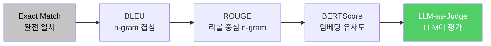
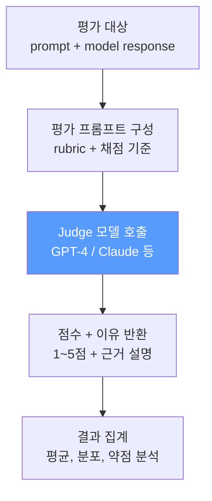

# 커스텀 평가셋 구축

> 범용 벤치마크는 남의 시험이다 — 당신의 모델은 당신의 시험으로 평가하라

---

## 1. 평가셋 설계 원칙

범용 벤치마크만으로는 **내 태스크에서 모델이 실제로 잘 작동하는지** 알 수 없다. 커스텀 평가셋은 모델의 "실무 면접"이다.

| 원칙 | 설명 | 주의사항 |
|------|------|---------|
| **100~500개** | 통계적 유의미성을 확보하는 최소 규모 | 50개 미만은 노이즈에 취약 |
| **난이도 분포** | Easy 30%, Medium 50%, Hard 20% | 한쪽에 쏠리면 변별력 상실 |
| **Contamination 방지** | 학습 데이터와 평가 데이터 완전 분리 | 해시 기반 중복 체크 필수 |
| **자동 + 수동 혼합** | 자동 메트릭 + 사람 평가 병행 | 자동만으로는 품질 보장 불가 |
| **버전 관리** | 평가셋도 Git으로 관리 | 변경 이력 추적 필수 |
| **정기적 갱신** | 모델이 암기할 수 있으므로 주기적 교체 | 연 1~2회 갱신 권장 |

---

## 2. 평가 메트릭 비교

평가 메트릭은 **단순한 문자열 일치에서 의미적 유사도, 그리고 LLM 판단**으로 진화해왔다.



| 메트릭 | 측정 대상 | 장점 | 단점 | 적합 태스크 |
|--------|----------|------|------|-----------|
| **Exact Match** | 정확한 문자열 일치 | 명확, 재현 가능 | 유사 답변 불인정 | 분류, 추출 |
| **BLEU** | n-gram precision | 번역 분야 표준 | 리콜 무시, 동의어 불인정 | 번역 |
| **ROUGE** | n-gram recall | 요약 분야 표준 | 의미적 유사성 미반영 | 요약 |
| **BERTScore** | 임베딩 코사인 유사도 | 의미적 유사성 반영 | 계산 비용 높음 | 생성 전반 |
| **LLM-as-Judge** | 종합 품질 판단 | 사람 평가에 가장 근접 | 비용, judge 편향 | 개방형 생성 |

---

## 3. LLM-as-Judge

사람 대신 **강력한 LLM이 평가자 역할**을 수행한다. 비용과 속도 면에서 사람 평가의 현실적 대안이다.



| Judge 모델 크기 | 특성 | 사람 일치도 | 권장 용도 |
|----------------|------|-----------|----------|
| 1.5B~3B | 채점 기준 이해 부족, 편향 심함 | 낮음 (0.3~0.4) | 비권장 |
| **7B~14B** | **실용적 수준, 비용 효율적** | **중간 (0.5~0.6)** | **빠른 반복 실험** |
| 70B+ | 사람 수준에 근접한 판단력 | 높음 (0.7~0.8) | 최종 평가 |
| GPT-4 / Claude | 가장 높은 신뢰도 | 최고 (0.8+) | 기준 평가 (gold standard) |

### Judge 프롬프트 구조

```
[System] 당신은 AI 응답 품질 평가자입니다.
[Rubric] 다음 기준으로 1~5점 채점하세요:
  - 정확성: 사실에 부합하는가
  - 완결성: 질문에 충분히 답했는가
  - 명확성: 이해하기 쉬운가
[Input] 질문: {question}
[Response] 모델 응답: {response}
[Output] 점수와 근거를 JSON으로 반환하세요.
```

---

## 4. 통합 평가 함수

모든 메트릭을 하나의 함수로 통합하여 일관된 평가 인터페이스를 제공한다.

```python
def evaluate_model(
    model,
    eval_dataset: list[dict],         # [{"input": ..., "expected": ...}]
    metrics: list[str] = ["exact_match", "bleu", "bertscore"],
    judge_model: str | None = None,   # LLM-as-Judge 사용 시
    judge_rubric: str | None = None,
    batch_size: int = 8,
    max_new_tokens: int = 512,
) -> dict:
    """
    Returns:
        {
            "exact_match": 0.72,
            "bleu": 0.45,
            "bertscore": 0.83,
            "llm_judge": 3.8,       # 1-5 scale
            "per_sample": [...],     # 개별 결과
            "failure_analysis": {    # 실패 패턴 분석
                "hallucination": 12,
                "incomplete": 5,
                "wrong_format": 3,
            }
        }
    """
    results = {}
    # 1. 모델 추론
    predictions = batch_generate(model, eval_dataset, batch_size, max_new_tokens)
    # 2. 자동 메트릭 계산
    for metric in metrics:
        results[metric] = compute_metric(metric, predictions, eval_dataset)
    # 3. LLM-as-Judge (선택)
    if judge_model:
        results["llm_judge"] = run_llm_judge(judge_model, judge_rubric, predictions)
    # 4. 실패 패턴 분석
    results["failure_analysis"] = analyze_failures(predictions, eval_dataset)
    return results
```

---

## 핵심 원칙

> **평가셋은 모델보다 오래 살아남는다. 좋은 평가셋 하나가 100번의 학습보다 가치 있다.**
> 모델은 교체되지만, 평가 기준은 축적된다. 평가셋에 투자하는 시간은 결코 낭비가 아니다.
