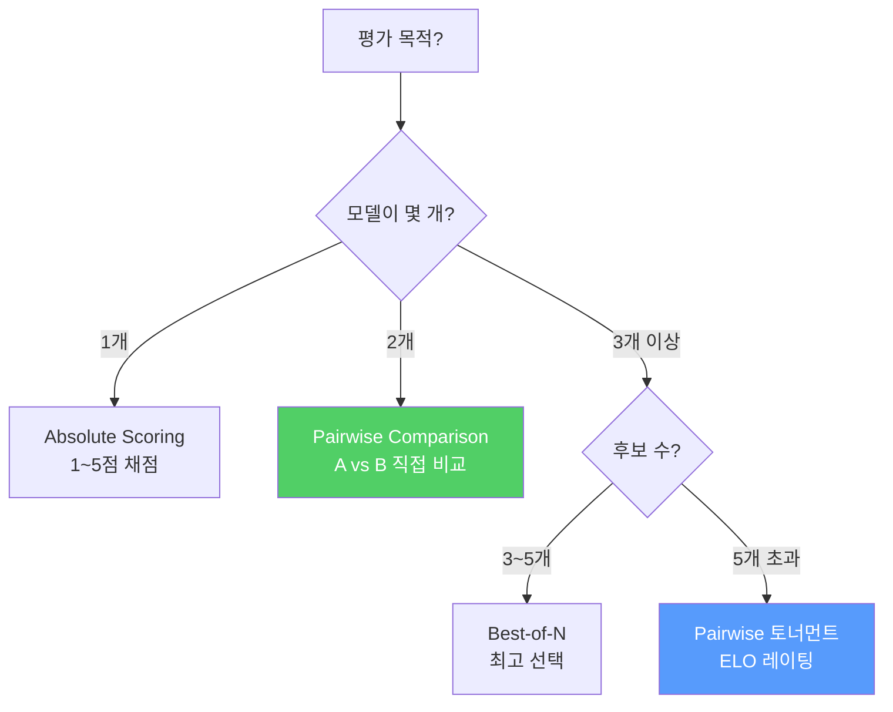
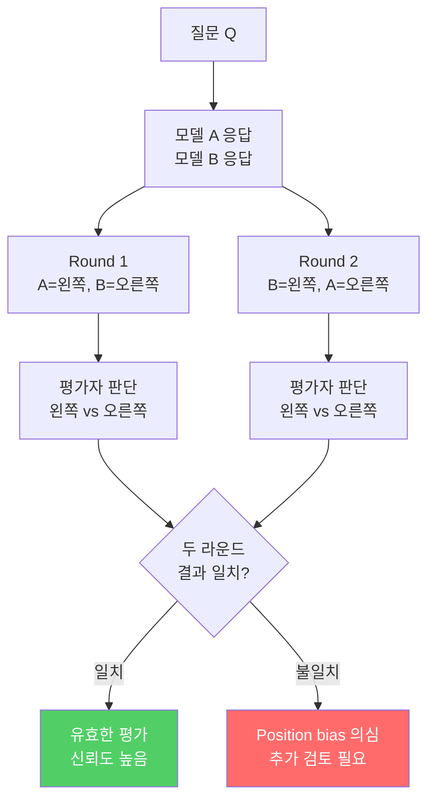
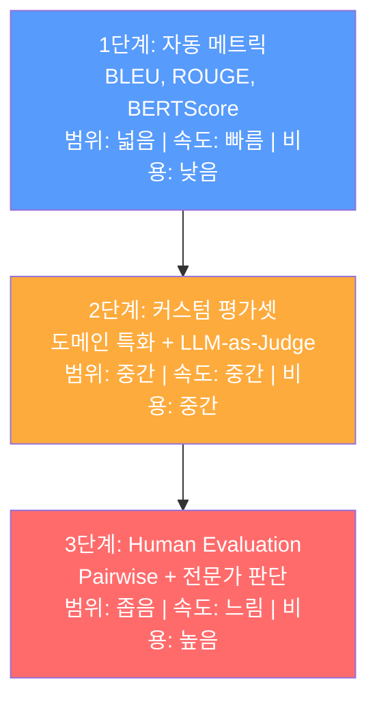

# A/B 테스트와 Human Evaluation

> 자동 메트릭은 '문법 검사기'에 불과하다 — 실제 품질은 사람만이 판단할 수 있다

---

## 1. 자동 메트릭의 한계

자동 메트릭은 **빠르고 재현 가능**하지만, 사람이 느끼는 품질과 괴리가 발생하는 맹점이 있다.

| 상황 | 자동 메트릭 판단 | 사람 판단 | 원인 |
|------|-----------------|----------|------|
| 동의어로 바꿔 쓴 정답 | BLEU ↓ (n-gram 불일치) | 정답 | 표면 형태만 비교 |
| 문법 완벽하지만 틀린 사실 | BERTScore ↑ (유사 임베딩) | 오답 | 사실성 미검증 |
| 정확하지만 불친절한 답변 | Exact Match 통과 | 불만족 | 사용자 경험 미반영 |
| 창의적이고 우수한 답변 | ROUGE ↓ (정답과 다른 표현) | 최우수 | 열린 생성 평가 불가 |

---

## 2. 평가 방식 비교

| 방식 | 설명 | 장점 | 단점 | 적합한 상황 |
|------|------|------|------|-----------|
| **Absolute Scoring** | 단일 응답에 1~5점 부여 | 직관적, 빠름 | 평가자 간 기준 편차 큼 | 초기 스크리닝 |
| **Pairwise Comparison** | A vs B 중 더 나은 것 선택 | 변별력 높음, 일관성 높음 | 비교 횟수 O(n^2) | 모델 간 비교 |
| **Best-of-N** | N개 중 최고를 선택 | 한 번에 여러 모델 비교 | N > 5이면 인지 부하 과다 | 최종 후보 선발 |

---

## 3. Pairwise Comparison

가장 **변별력 높고 일관된** 사람 평가 방식. 단, **position bias**를 반드시 제거해야 한다.

### Position Bias 제거 방법

| 방법 | 설명 | 구현 난이도 | 효과 |
|------|------|------------|------|
| **위치 교차 검증** | 같은 쌍을 A-B, B-A 순서로 2회 평가 | 쉬움 | 높음 |
| **무작위 배치** | 매 질문마다 A, B 위치를 랜덤화 | 쉬움 | 중간 |
| **Tie 옵션 허용** | "비슷하다" 선택지 추가 | 쉬움 | 중간 |
| **블라인드 평가** | 모델 이름을 숨기고 Model 1, 2로 표시 | 쉬움 | 높음 |

---

## 4. 평가자 간 일치도

여러 평가자가 참여할 때, **평가의 일관성**을 측정해야 한다. Cohen's Kappa가 표준 지표다.

| Cohen's Kappa | 해석 | 조치 |
|---------------|------|------|
| < 0.20 | 거의 일치 없음 | 평가 기준 재설계 필요 |
| 0.21 ~ 0.40 | 약한 일치 | 가이드라인 보강, 교육 필요 |
| 0.41 ~ 0.60 | 중간 일치 | 수용 가능, 개선 여지 |
| **0.61 ~ 0.80** | **강한 일치** | **실무 사용 가능 수준** |
| 0.81 ~ 1.00 | 거의 완벽한 일치 | 이상적 |

> Kappa < 0.4이면 평가 결과 자체를 신뢰할 수 없다. 평가를 시작하기 전에 **파일럿 라운드로 Kappa를 먼저 확인**하라.

---

## 5. 3단계 평가 피라미드

실무에서는 세 단계를 **피라미드 구조**로 조합한다. 아래에서 위로 갈수록 비용이 높지만 정확도도 높아진다.

| 단계 | 사용 시점 | 평가량 | 신뢰도 |
|------|----------|--------|--------|
| 1단계: 자동 메트릭 | 매 학습 실험마다 | 전체 평가셋 | 낮음~중간 |
| 2단계: 커스텀 평가셋 | 유망한 후보 모델에 | 100~500개 | 중간~높음 |
| 3단계: Human Evaluation | 최종 배포 후보에만 | 50~100개 | 높음 |

---

## 6. Phase 7 체크포인트

| # | 질문 | 학습 위치 |
|---|------|----------|
| 1 | MMLU, HumanEval, GSM8K의 측정 대상을 구분할 수 있는가? | 01 |
| 2 | lm-evaluation-harness로 모델을 평가해본 경험이 있는가? | 01 |
| 3 | BLEU, ROUGE, BERTScore의 차이를 설명할 수 있는가? | 02 |
| 4 | 커스텀 평가셋을 설계하고 구축할 수 있는가? | 02 |
| 5 | LLM-as-Judge의 원리와 한계를 아는가? | 02 |
| 6 | Pairwise comparison에서 position bias를 제거하는 방법을 아는가? | 03 |

---

## 핵심 원칙

> **모든 평가 메트릭은 사람의 판단을 근사하려는 시도다. 근사가 충분한지는, 결국 사람이 판단해야 한다.**
> 자동화의 끝에는 항상 사람이 서 있다. 그 사실을 잊는 순간, 평가는 의미를 잃는다.
