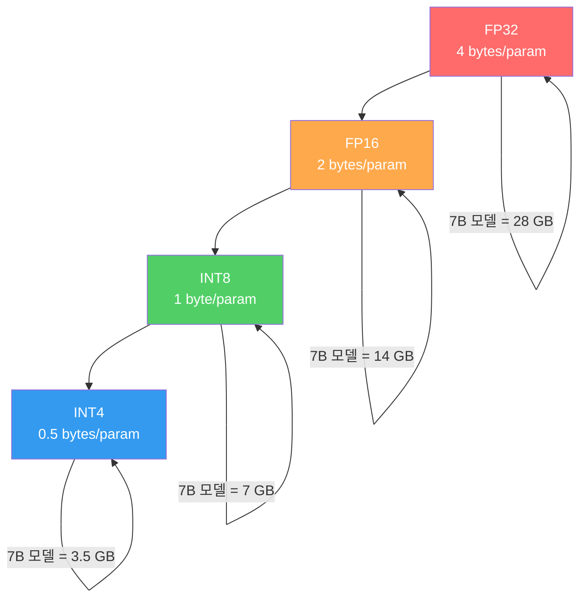
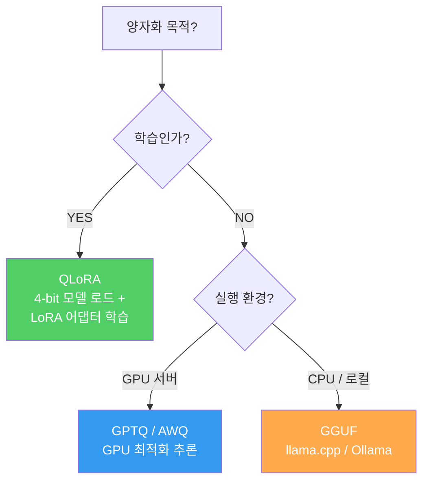
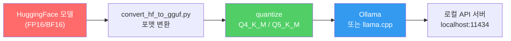

# 모델 양자화 실전

> 양자화는 '품질 희생'이 아니라 '불필요한 정밀도 제거'다 — 4-bit로 충분한 태스크에 16-bit를 쓰는 것이 진짜 낭비다

---

## 1. 양자화가 필요한 이유

모델의 가중치 정밀도를 낮추면 **모델 크기와 메모리 사용량이 비례하여 감소**한다. 핵심은 대부분의 추론 태스크에서 32-bit 정밀도가 필요하지 않다는 것이다.

| 정밀도 | 크기 감소 | 품질 손실 | 용도 |
|--------|----------|----------|------|
| FP32 | 기준 (1×) | 없음 | 학습 원본 |
| FP16/BF16 | 2× | 거의 없음 | 학습 및 추론 |
| INT8 | 4× | 매우 적음 | 추론 최적화 |
| INT4 | 8× | 태스크 의존 (1~3%) | 추론 + 메모리 제한 환경 |

---

## 2. 학습용 vs 추론용 양자화

양자화 기법은 **목적에 따라 완전히 다른 방식**을 사용한다. 학습용은 역전파가 가능해야 하고, 추론용은 순전파 속도만 중요하다.

| 기법 | 목적 | 캘리브레이션 | 속도 | 호환성 |
|------|------|-------------|------|--------|
| **QLoRA** | 학습 (파인튜닝) | 불필요 (NF4 직접 양자화) | 학습 시 FP16 대비 ~동일 | bitsandbytes + PEFT |
| **GPTQ** | 추론 (GPU) | 필요 (캘리브레이션 데이터셋) | FP16 대비 2~4× 빠름 | AutoGPTQ, transformers |
| **AWQ** | 추론 (GPU) | 필요 (활성화 기반) | GPTQ 대비 ~동등 또는 우위 | AutoAWQ, vLLM |
| **GGUF** | 추론 (CPU/혼합) | 불필요 (사후 양자화) | CPU에서 실용적 속도 | llama.cpp, Ollama |

---

## 3. GPTQ / AWQ 실전

GPTQ는 **레이어별 최적 양자화**를 수행하며, AWQ는 **중요한 가중치 채널을 보호**하는 방식이다. 둘 다 캘리브레이션 데이터셋이 필요하다.

| 지표 | 원본 (FP16) | GPTQ 4-bit | AWQ 4-bit |
|------|------------|------------|-----------|
| 모델 크기 | 14.9 GB | 3.9 GB | 3.9 GB |
| VRAM 사용 | 15.2 GB | 4.5 GB | 4.3 GB |
| 추론 속도 (tok/s) | 45 | 85 | 90 |
| 정확도 (MMLU) | 64.2% | 63.1% | 63.5% |

GPTQ vs AWQ 선택 기준:
- **GPTQ**: 넓은 생태계, 커뮤니티 모델 많음 (TheBloke 등)
- **AWQ**: 최신 기법, vLLM과 최적 호환, 활성화 기반으로 품질 우위

---

## 4. GGUF와 로컬 추론

GGUF는 llama.cpp에서 사용하는 포맷으로, **CPU에서도 실용적인 속도로 추론**할 수 있게 한다. GPU가 없는 환경에서 LLM을 실행하는 사실상 유일한 선택지.

| GGUF 양자화 레벨 | 크기 (7B 기준) | 품질 | 용도 |
|-----------------|---------------|------|------|
| Q2_K | ~2.7 GB | 눈에 띄는 품질 저하 | 메모리 극한 환경 |
| Q4_K_M | ~4.1 GB | 실용적 품질 유지 | **범용 추천** |
| Q5_K_M | ~4.8 GB | 거의 원본 수준 | 품질 중시 |
| Q8_0 | ~7.2 GB | 원본과 거의 동일 | 메모리 여유 시 |

---

## 핵심 원칙

> **양자화는 '품질 희생'이 아니라 '불필요한 정밀도 제거'다. 4-bit로 충분한 태스크에 16-bit를 쓰는 것이 진짜 낭비다.**
> 양자화 전후 반드시 태스크별 품질을 검증하라. 벤치마크 수치가 아니라 실제 사용 시나리오에서의 품질이 기준이다.
