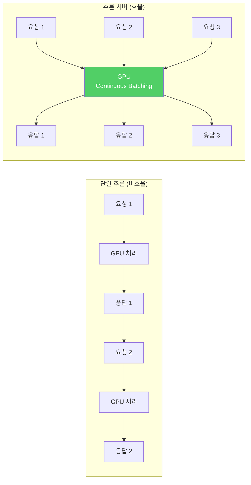
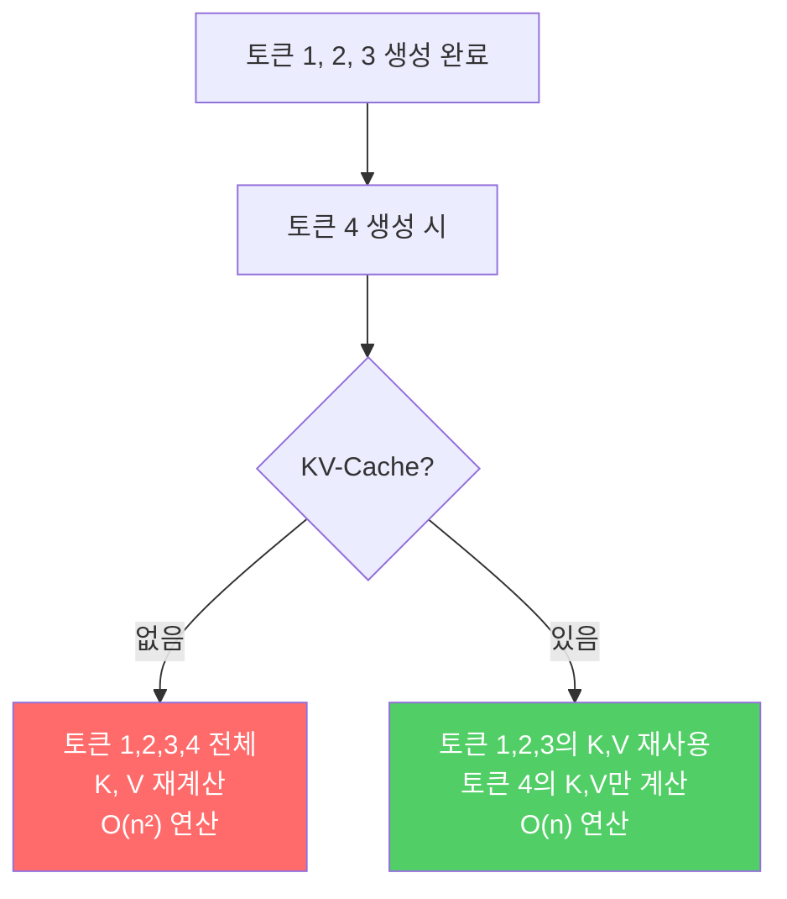
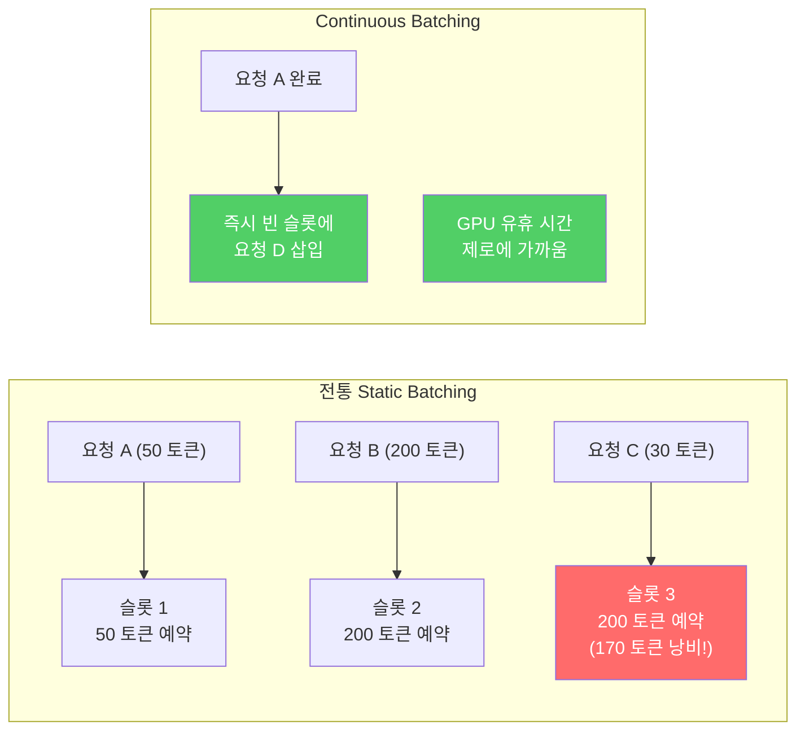

# 추론 서버와 최적화

> 추론 최적화의 본질은 '모델을 빠르게 하는 것'이 아니라 'GPU의 빈 시간을 없애는 것'이다

---

## 1. 추론 서버가 필요한 이유

`model.generate()`를 직접 호출하는 것은 **단일 요청 처리**에 불과하다. 실제 서비스에서는 수십~수천 명이 동시에 요청한다.

| 항목 | model.generate() | 추론 서버 (vLLM 등) |
|------|-----------------|-------------------|
| 동시 처리 | 1개 (순차) | 수십~수백 개 |
| 배칭 | 수동 구현 필요 | 자동 Continuous Batching |
| 스트리밍 | 직접 구현 | 내장 지원 |
| 메모리 관리 | 모델 전체 상주 | PagedAttention 최적화 |
| API 인터페이스 | 없음 | OpenAI 호환 API |



---

## 2. KV-Cache

Transformer의 autoregressive 생성에서 **이미 계산한 이전 토큰의 Key, Value를 재사용**하는 기법. 이것 없이는 토큰을 하나 생성할 때마다 전체 시퀀스를 다시 계산해야 한다.



| 항목 | KV-Cache 없음 | KV-Cache 있음 |
|------|-------------|-------------|
| 토큰당 연산 | O(n) — 전체 재계산 | O(1) — 새 토큰만 계산 |
| 총 연산 (n 토큰) | O(n²) | O(n) |
| 메모리 | 최소 | 추가 메모리 필요 (캐시 저장) |
| 실전 사용 | 사용하지 않음 | **항상 사용** |

KV-Cache의 대가는 **메모리**다. 시퀀스가 길수록, 배치가 클수록 캐시가 VRAM을 점유한다. 이 문제를 해결하는 것이 PagedAttention이다.

---

## 3. PagedAttention & Continuous Batching

### 전통 배칭의 문제



### PagedAttention

vLLM의 핵심 혁신. 운영체제의 **가상 메모리 페이징**을 KV-Cache에 적용한 것이다.

- 전통 방식: 각 시퀀스에 **연속된 메모리 블록**을 최대 길이만큼 미리 할당 → 내부 단편화
- PagedAttention: KV-Cache를 **고정 크기 블록(page)으로 분할**, 필요할 때만 할당 → 메모리 낭비 제거

이 두 기법의 결합으로 vLLM은 동일 GPU에서 **2~4배 더 많은 동시 요청**을 처리한다.

---

## 4. vLLM + FastAPI

vLLM은 OpenAI 호환 API 서버를 내장하고 있어 별도의 FastAPI 래핑 없이도 바로 사용할 수 있다.

```bash
# vLLM 서버 실행
python -m vllm.entrypoints.openai.api_server \
    --model meta-llama/Llama-3.1-8B-Instruct \
    --quantization awq \
    --max-model-len 4096 \
    --port 8000
```

```bash
# API 호출 (OpenAI 호환)
curl http://localhost:8000/v1/chat/completions \
    -H "Content-Type: application/json" \
    -d '{
        "model": "meta-llama/Llama-3.1-8B-Instruct",
        "messages": [{"role": "user", "content": "Hello!"}]
    }'
```

| 지표 | HF generate | vLLM |
|------|------------|------|
| 단일 추론 (tok/s) | 45 | 52 |
| 동시 10건 (tok/s 총합) | 45 (순차 처리) | 380 |
| 동시 50건 (tok/s 총합) | 45 (순차 처리) | 1,200 |
| 첫 토큰 지연 (TTFT) | 0.8s | 0.3s |

단일 추론은 비슷하지만, **동시 요청에서 처리량이 압도적으로 차이**난다.

---

## 5. 추론 최적화 기법 종합

| 기법 | 원리 | 효과 | 적용 방법 |
|------|------|------|----------|
| **KV-Cache** | 이전 토큰 K,V 재사용 | O(n²) → O(n) | 모든 프레임워크 기본 적용 |
| **Continuous Batching** | 완료 요청 슬롯에 즉시 새 요청 삽입 | GPU 유휴 시간 제거 | vLLM, TGI 내장 |
| **PagedAttention** | KV-Cache를 페이지 단위 동적 할당 | 메모리 낭비 제거, 동시 처리 2~4× | vLLM 내장 |
| **Flash Attention** | IO-aware attention 계산 | 메모리 절감 + 속도 향상 | flash-attn 설치, model.config |
| **Speculative Decoding** | 작은 모델이 draft → 큰 모델이 검증 | 생성 속도 2~3× (품질 동일) | vLLM `--speculative-model` |

---

## 핵심 원칙

> **추론 최적화의 본질은 '모델을 빠르게 하는 것'이 아니라 'GPU의 빈 시간을 없애는 것'이다.**
> 단일 추론 속도에 집착하기 전에, 동시 처리량과 메모리 효율을 먼저 확보하라.
