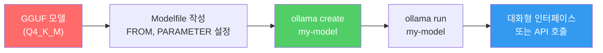
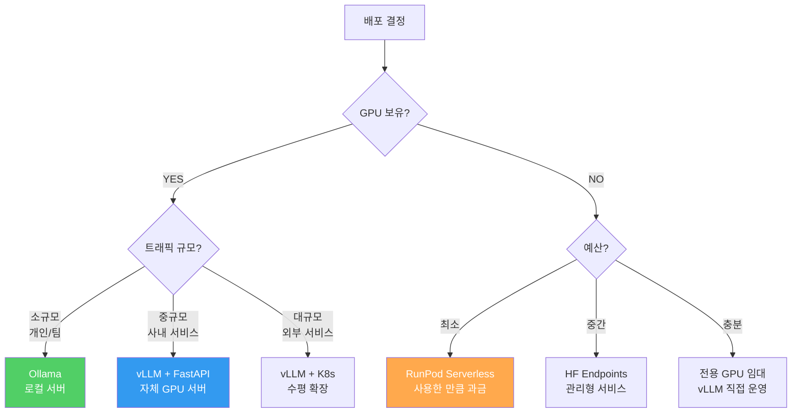
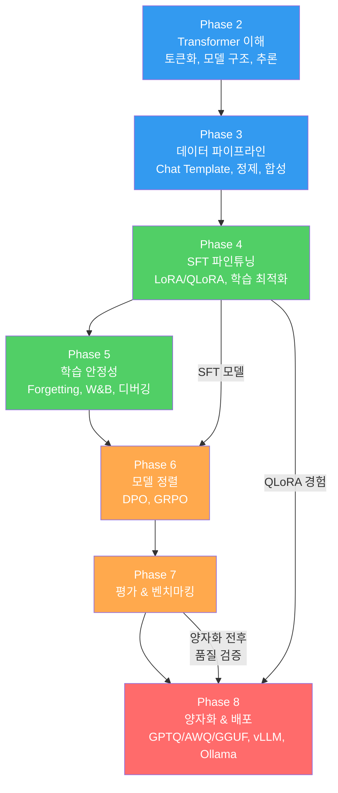

# 배포 옵션과 프로덕션

> 배포 없는 모델은 존재하지 않는 모델이다 — 최적의 배포는 '돌아가는 배포'를 개선한 것이다

---

## 1. 5대 배포 옵션

| 옵션 | 비용 | 난이도 | 확장성 | 최적 용도 |
|------|------|--------|--------|----------|
| **Ollama** | 무료 (로컬 HW) | 매우 쉬움 | 단일 머신 | 개인 개발, 프로토타이핑 |
| **vLLM + FastAPI** | GPU 서버 비용 | 중간 | 수평 확장 가능 | 프로덕션 API 서버 |
| **HF Endpoints** | 종량제 | 매우 쉬움 | 자동 스케일링 | 빠른 배포, 소규모 트래픽 |
| **TGI** | GPU 서버 비용 | 중간 | 수평 확장 가능 | HF 생태계 선호 시 |
| **RunPod / Modal** | 종량제 (GPU 시간) | 쉬움 | 자동 스케일링 | GPU 없는 팀, 버스트 트래픽 |

---

## 2. Ollama 로컬 배포

가장 빠르게 모델을 실행하는 방법. GGUF 포맷의 양자화 모델을 **명령어 하나로** 로컬에서 실행한다.



Modelfile 예시:
```
FROM ./my-model-Q4_K_M.gguf
PARAMETER temperature 0.7
PARAMETER top_p 0.9
SYSTEM "당신은 도움이 되는 AI 어시스턴트입니다."
```

```bash
# 모델 생성 및 실행
ollama create my-model -f Modelfile
ollama run my-model

# API 호출 (OpenAI 호환)
curl http://localhost:11434/v1/chat/completions \
    -H "Content-Type: application/json" \
    -d '{
        "model": "my-model",
        "messages": [{"role": "user", "content": "Hello!"}]
    }'
```

---

## 3. 클라우드 배포 옵션



| 판단 기준 | 선택지 |
|----------|--------|
| GPU 없음 + 예산 최소 | RunPod Serverless, Modal |
| GPU 없음 + 빠른 배포 | HF Inference Endpoints |
| GPU 있음 + 개인/소규모 | Ollama |
| GPU 있음 + 프로덕션 | vLLM + FastAPI |
| 보안 민감 (온프레미스) | vLLM 자체 운영 |

---

## 4. Phase 2-8 전체 파이프라인



| Phase | 산출물 | 다음 Phase에서 사용 |
|-------|--------|-------------------|
| Phase 2 | 토큰화, 모델 로드 능력 | 모든 Phase의 기반 |
| Phase 3 | 정제된 학습 데이터 | Phase 4 SFT 입력 |
| Phase 4 | SFT 파인튜닝 모델 | Phase 6 정렬 입력 |
| Phase 5 | 안정적 학습 프로세스 | Phase 4, 6의 품질 보장 |
| Phase 6 | 정렬된 모델 | Phase 7 평가 대상 |
| Phase 7 | 평가 파이프라인 | Phase 8 양자화 품질 검증 |
| Phase 8 | **배포된 서비스** | **최종 산출물** |

---

## 5. Phase 8 체크포인트

| # | 질문 | 학습 위치 |
|---|------|----------|
| 1 | GPTQ, AWQ, GGUF의 차이와 각각의 적합한 사용 시나리오를 설명할 수 있는가? | 01 |
| 2 | 모델을 4-bit로 양자화하고 양자화 전후 품질을 검증할 수 있는가? | 01 |
| 3 | KV-Cache와 PagedAttention의 원리를 설명할 수 있는가? | 02 |
| 4 | vLLM 서버를 실행하고 OpenAI 호환 API로 호출할 수 있는가? | 02 |
| 5 | Ollama로 GGUF 모델을 로컬에 배포하고 API로 호출할 수 있는가? | 03 |
| 6 | 상황(예산, 트래픽, GPU 유무)에 맞는 배포 옵션을 선택하고 근거를 제시할 수 있는가? | 03 |

---

## 핵심 원칙

> **배포를 고민하는 시간이 학습 시간보다 길어지면, 그냥 Ollama로 시작하라. 최적의 배포는 '돌아가는 배포'를 개선한 것이지, '계획된 완벽한 배포'가 아니다.**
> Phase 2에서 시작된 여정이 Phase 8의 배포로 완성된다. 모델이 사용자에게 도달하지 않으면, 모든 학습은 무의미하다.
