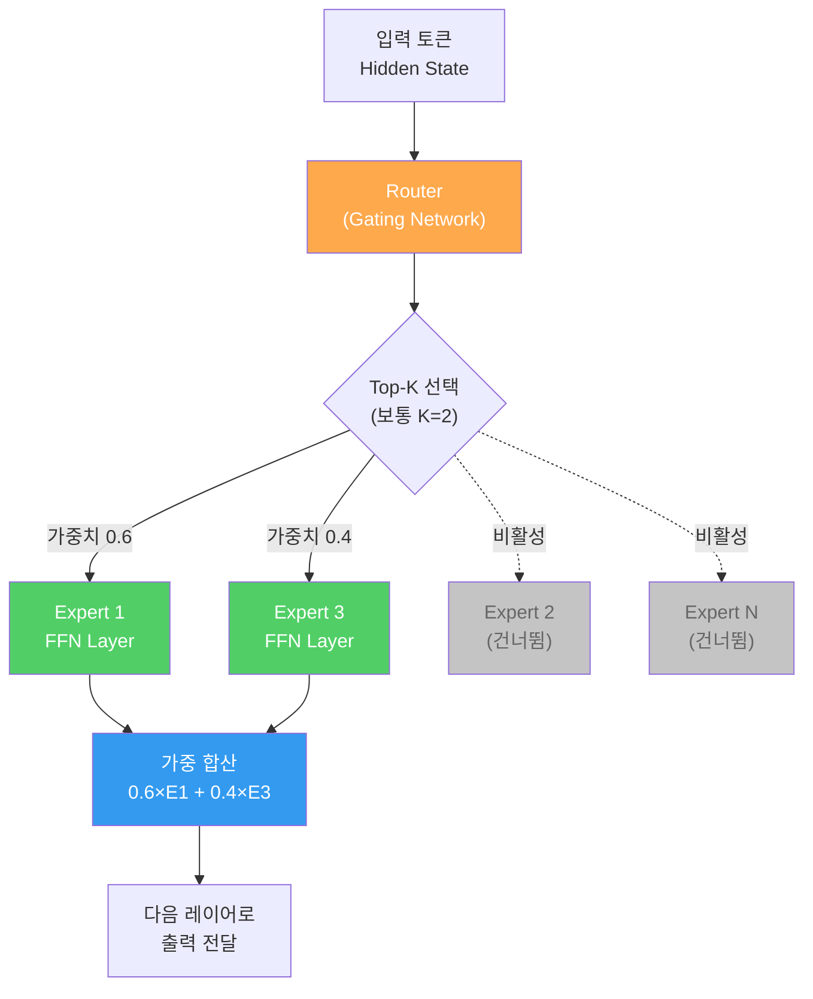
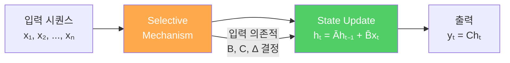
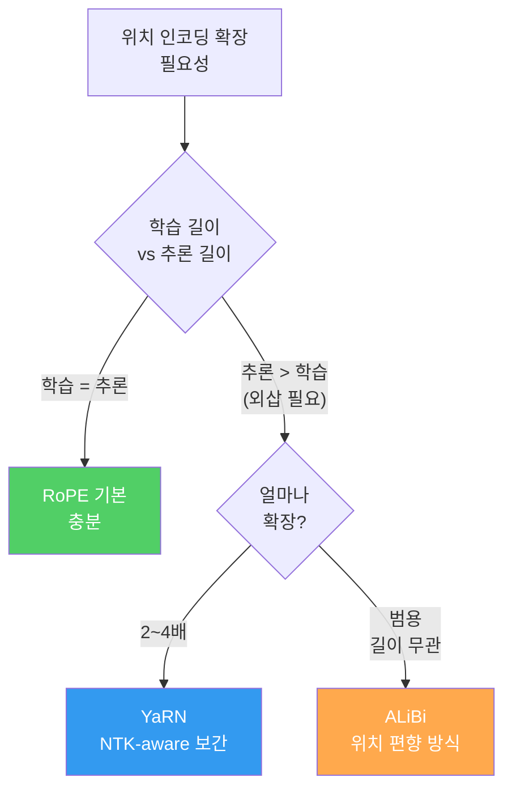
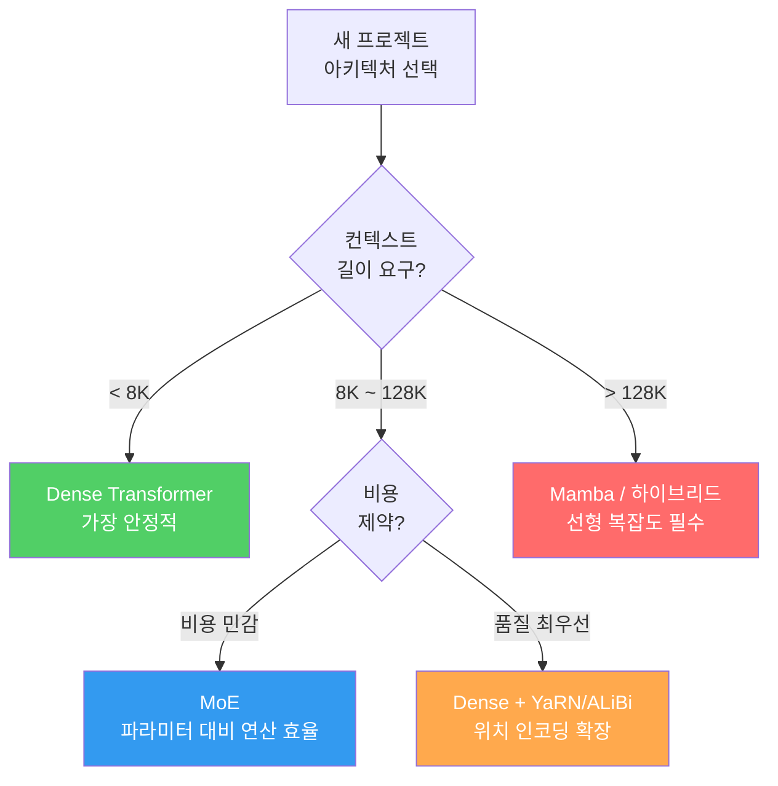

# 최신 아키텍처 이해

> Transformer는 정답이 아니라 현재의 최선이다 — 최선은 언제든 교체된다

---

## 1. Mixture of Experts (MoE)

모든 파라미터를 매번 활성화하는 Dense 모델은 **연산 낭비**다. MoE는 입력 토큰마다 **일부 Expert만 선택적으로 활성화**하여 파라미터 수 대비 실제 연산량을 극적으로 줄인다.

### MoE 핵심 구성 요소

| 구성 요소 | 역할 | 예시 |
|-----------|------|------|
| Expert | 독립적 FFN 레이어 | Mixtral: 8개 Expert |
| Router (Gate) | 토큰별 Expert 선택 및 가중치 할당 | Softmax 기반 Top-K |
| Top-K | 활성화할 Expert 수 | K=2 (Mixtral 기본) |
| Load Balancing Loss | Expert 간 균등 분배 유도 | Auxiliary Loss 추가 |

### MoE의 핵심 문제: Load Balancing

Router가 특정 Expert에만 토큰을 몰아주면 나머지 Expert는 학습되지 않는다. 이를 방지하기 위해 **Auxiliary Loss**를 추가하여 Expert 간 부하를 분산시킨다.

---

## 2. Mamba / SSM (State Space Model)

Transformer의 Self-Attention은 시퀀스 길이에 대해 **O(n^2)** 복잡도를 가진다. SSM은 이를 **O(n)** 선형 복잡도로 해결한다.

### Mamba의 핵심 아이디어

기존 SSM은 입력과 무관한 **고정 파라미터**를 사용했다. Mamba는 **Selective SSM**으로, 입력에 따라 파라미터를 동적으로 결정하여 "어떤 정보를 기억하고 어떤 정보를 잊을지" 선택한다.

### Transformer vs MoE vs Mamba 비교

| 항목 | Transformer (Dense) | MoE Transformer | Mamba / SSM |
|------|-------------------|-----------------|-------------|
| Attention 복잡도 | O(n^2) | O(n^2) | O(n) — 선형 |
| 학습 시 메모리 | 높음 | 매우 높음 (Expert 전체 로드) | 낮음 |
| 추론 시 메모리 | 높음 | 낮음 (활성 Expert만) | 매우 낮음 |
| 활성 파라미터 비율 | 100% | ~25% (Top-2/8) | 100% (모델 자체가 작음) |
| Long Context 성능 | KV Cache 폭발 | KV Cache 폭발 | 고정 상태 크기 |
| 학습 병렬화 | 우수 (행렬 연산) | 우수 | 보통 (순차 의존성) |
| 생태계 성숙도 | 최고 | 높음 (Mixtral, GPT-4) | 초기 단계 |
| 대표 모델 | LLaMA, GPT-3 | Mixtral 8x7B, GPT-4 | Mamba, Jamba |

---

## 3. Long Context 기법 — 위치 인코딩

Transformer가 128K, 1M 이상의 긴 문맥을 처리하려면 **위치 인코딩의 확장**이 핵심이다. 학습 시 본 적 없는 위치에서도 올바르게 동작해야 한다.

### 위치 인코딩 비교

| 항목 | RoPE | YaRN | ALiBi |
|------|------|------|-------|
| 방식 | 회전 행렬로 위치 인코딩 | RoPE + NTK-aware 주파수 보간 | Attention에 거리 기반 선형 편향 |
| 학습 길이 외삽 | 약함 (학습 길이 밖에서 성능 급락) | 강함 (2~8배 확장 가능) | 매우 강함 (이론상 무제한) |
| 구현 위치 | Q, K 벡터에 회전 적용 | Q, K 벡터에 수정된 회전 적용 | Attention Score에 편향 추가 |
| 추가 학습 필요 | 없음 | 없음 (Fine-tuning 시 성능 향상) | 없음 |
| 채택 모델 | LLaMA, Mistral, Qwen | LLaMA 확장 모델들 | BLOOM, MPT |
| 장점 | 상대 위치 인코딩, 효율적 | 학습 없이 컨텍스트 확장 | 구현 간단, 외삽 안정적 |
| 단점 | 외삽 한계 | 극단적 확장 시 품질 저하 | 절대 위치 정보 부재 |

### Long Context의 실전 과제

위치 인코딩을 확장해도 **"Lost in the Middle"** 문제가 존재한다. 모델은 긴 문맥의 처음과 끝은 잘 기억하지만, 중간 부분의 정보를 놓치는 경향이 있다. 이를 해결하기 위해 **Ring Attention**, **Sliding Window Attention** 등의 기법이 연구되고 있다.

---

## 4. 아키텍처 선택 의사결정

---

## 핵심 원칙

> **Transformer는 정답이 아니라 현재의 최선이다.** MoE는 "모든 뉴런이 매번 필요한가?"를 의심했고, Mamba는 "Attention이 유일한 방법인가?"를 의심했다. 다음 돌파구는 항상 당연한 것을 의심하는 데서 나온다.

---

## 체크포인트

| # | 확인 항목 | 완료 |
|---|----------|------|
| 1 | MoE의 Router → Expert 선택 → 가중 합산 흐름을 설명할 수 있는가 | ☐ |
| 2 | Load Balancing Loss가 왜 필요한지 설명할 수 있는가 | ☐ |
| 3 | Mamba의 Selective SSM이 기존 SSM과 다른 점을 말할 수 있는가 | ☐ |
| 4 | Transformer O(n^2) vs Mamba O(n) 복잡도 차이의 실전 영향을 이해하는가 | ☐ |
| 5 | RoPE, YaRN, ALiBi의 핵심 차이와 각각의 적합 상황을 설명할 수 있는가 | ☐ |
| 6 | "Lost in the Middle" 문제가 무엇이며 왜 발생하는지 아는가 | ☐ |
| 7 | 주어진 요구사항에 맞는 아키텍처를 선택할 수 있는가 | ☐ |
