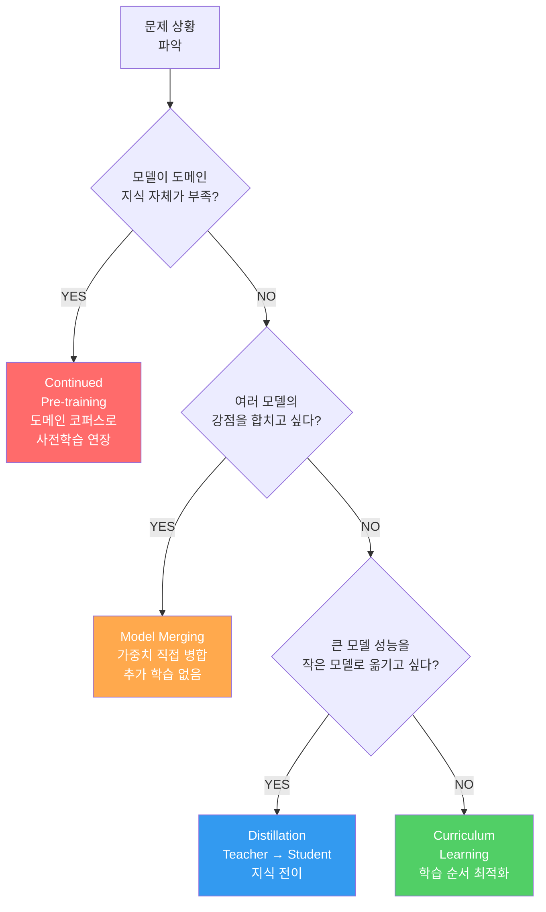
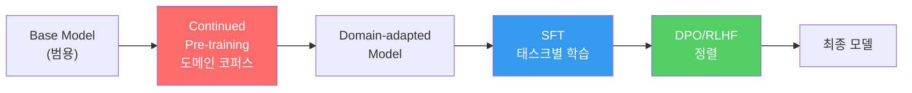
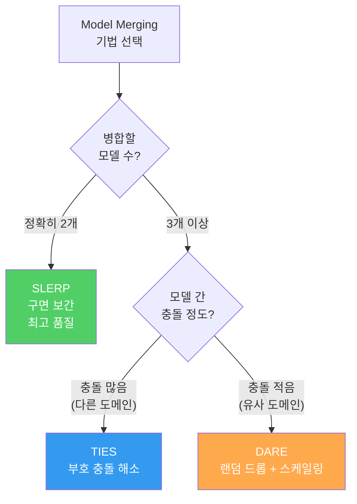
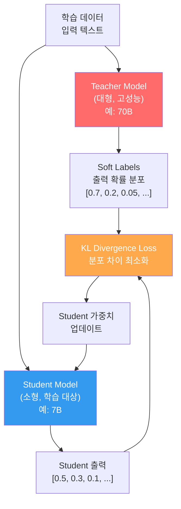
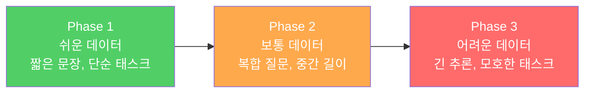
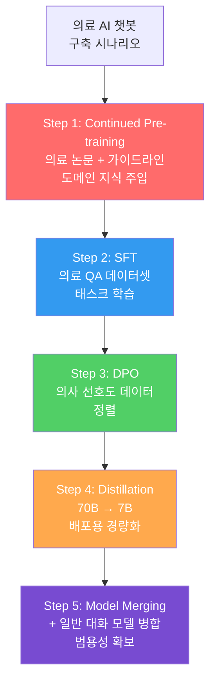

# 고급 학습 기법

> 학습 데이터를 바꾸기 전에, 학습 방법을 바꿔라 — 같은 데이터도 학습 전략에 따라 완전히 다른 모델이 된다

---

## 1. 4가지 고급 학습 기법 개관

파인튜닝만으로는 해결되지 않는 문제들이 있다. **도메인 지식 주입, 모델 결합, 모델 경량화, 학습 효율 극대화** 각각에 최적화된 기법이 존재한다.

---

## 2. Continued Pre-training (지속적 사전학습)

Fine-tuning은 **태스크 수행 방식**을 가르치고, Continued Pre-training은 **도메인 지식 자체**를 주입한다. 의료, 법률, 금융 등 특수 도메인에서 모델이 기본 용어조차 모를 때 필요한 기법이다.

### Continued Pre-training vs Fine-tuning 비교

| 항목 | Continued Pre-training | Fine-tuning (SFT) |
|------|----------------------|-------------------|
| 목적 | 도메인 지식 주입 | 태스크 수행 능력 부여 |
| 데이터 형태 | 비구조화 텍스트 (논문, 문서, 코드) | 구조화된 instruction-response 쌍 |
| 데이터 양 | 수 GB ~ 수십 GB | 수천 ~ 수만 샘플 |
| 학습률 | 사전학습의 1/10 ~ 1/100 | 1e-5 ~ 5e-5 |
| 학습 기간 | 수일 ~ 수주 | 수시간 ~ 수일 |
| Catastrophic Forgetting 위험 | 높음 (일반 능력 손실) | 보통 |
| 결과 | 도메인 이해력 향상 | 지시 따르기 능력 향상 |
| 일반적 순서 | **먼저** 실행 | Continued Pre-training **이후** 실행 |

### 실전 파이프라인

---

## 3. Model Merging (모델 병합)

서로 다른 강점을 가진 모델들의 **가중치를 직접 합쳐** 새로운 모델을 만드는 기법이다. 추가 학습 없이 수학 모델 + 코딩 모델 + 대화 모델을 하나로 결합할 수 있다.

### Model Merging 기법 비교

| 기법 | 방식 | 특징 | 장점 | 단점 |
|------|------|------|------|------|
| **TIES** | 부호 충돌 해소 후 병합 | 파라미터 부호가 다른 경우 다수결로 결정 | 부호 간섭 최소화 일관된 병합 | 소수 의견 Expert 손실 가능 |
| **DARE** | 랜덤 드롭 후 스케일링 | 대부분의 delta를 랜덤하게 0으로 설정 | 간섭 최소화 대규모 병합에 유리 | 드롭 비율 튜닝 필요 |
| **SLERP** | 구면 선형 보간 | 가중치 벡터를 구면 위에서 보간 | 2개 모델 병합 시 최고 품질 방향 보존 | 2개 모델만 병합 가능 |

### 주의사항
- 같은 **베이스 아키텍처**의 모델만 병합 가능 (LLaMA + LLaMA = OK, LLaMA + Mistral = X)
- 병합 후 **반드시 평가** 필요 — 항상 좋아지는 것은 아니다
- [mergekit](https://github.com/cg123/mergekit) 라이브러리가 사실상 표준 도구

---

## 4. Knowledge Distillation (지식 증류)

큰 모델(Teacher)의 **출력 분포**를 작은 모델(Student)이 학습하여, 작은 모델로도 큰 모델에 근접한 성능을 달성하는 기법이다.

### Distillation의 핵심: 왜 Soft Label인가?

| 라벨 종류 | 예시 | 정보량 |
|-----------|------|--------|
| Hard Label | [1, 0, 0, 0] | 정답만 알려줌 |
| Soft Label | [0.7, 0.2, 0.05, 0.05] | "정답은 A이지만 B도 약간 가능하다"는 관계 정보 포함 |

Soft Label에는 **클래스 간 유사도 정보**가 담겨 있다. "고양이"를 예측할 때 "호랑이"에 0.15의 확률이 있다면, 이것은 두 개념이 유사하다는 Teacher의 지식이다.

### Distillation Temperature

Temperature(T)를 높이면 확률 분포가 부드러워져서(soft) 더 많은 관계 정보를 Student에게 전달할 수 있다.

| Temperature | 분포 | 효과 |
|-------------|------|------|
| T = 1 | 원본 그대로 | 기본 |
| T = 2~5 | 부드러움 (soft) | 관계 정보 최대 전달 |
| T > 10 | 균등 분포에 가까움 | 정보 희석 |

---

## 5. Curriculum Learning (커리큘럼 학습)

인간이 쉬운 것부터 어려운 것 순서로 학습하듯, 모델에게도 **학습 데이터의 난이도 순서를 제어**하여 학습 효율과 최종 성능을 높이는 기법이다.

| 전략 | 순서 | 효과 |
|------|------|------|
| Easy-to-Hard | 쉬운 것 → 어려운 것 | 안정적 수렴, 일반적 추천 |
| Hard-to-Easy | 어려운 것 → 쉬운 것 | 특정 도메인에서 효과적 |
| Mixed + Pacing | 혼합하되 비율 조절 | 난이도 비율을 에폭별로 변경 |

### 난이도 측정 기준 예시
- **문장 길이**: 짧은 문장 = 쉬움
- **모델 Loss**: 현재 모델의 Loss가 낮은 샘플 = 쉬움
- **레이블 복잡도**: 단순 분류 < 다중 레이블 < 자유 생성

---

## 6. 기법 조합 실전 시나리오

---

## 핵심 원칙

> **학습 데이터를 바꾸기 전에, 학습 방법을 바꿔라.** 같은 1만 개의 데이터도 Curriculum Learning으로 순서를 바꾸면 성능이 달라지고, Distillation으로 70B의 지식을 담으면 7B가 달라진다. 데이터를 더 모으는 것은 가장 마지막 수단이다.

---

## 체크포인트

| # | 확인 항목 | 완료 |
|---|----------|------|
| 1 | Continued Pre-training과 Fine-tuning의 목적 차이를 설명할 수 있는가 | ☐ |
| 2 | 어떤 상황에서 Continued Pre-training이 필요한지 판단할 수 있는가 | ☐ |
| 3 | TIES, DARE, SLERP 각각의 병합 방식과 적합 상황을 구분할 수 있는가 | ☐ |
| 4 | Model Merging의 제약 조건 (같은 아키텍처)을 이해하는가 | ☐ |
| 5 | Distillation에서 Soft Label이 Hard Label보다 유리한 이유를 설명할 수 있는가 | ☐ |
| 6 | KL Divergence Loss의 역할을 직관적으로 설명할 수 있는가 | ☐ |
| 7 | Curriculum Learning의 난이도 측정 기준을 3가지 이상 알고 있는가 | ☐ |
| 8 | 주어진 시나리오에서 4가지 기법 중 적절한 것을 선택할 수 있는가 | ☐ |
