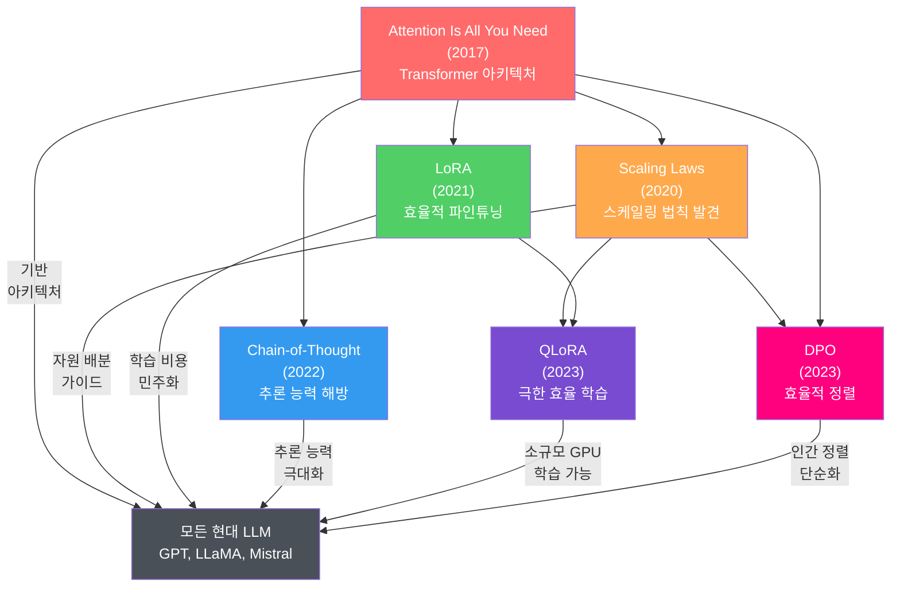
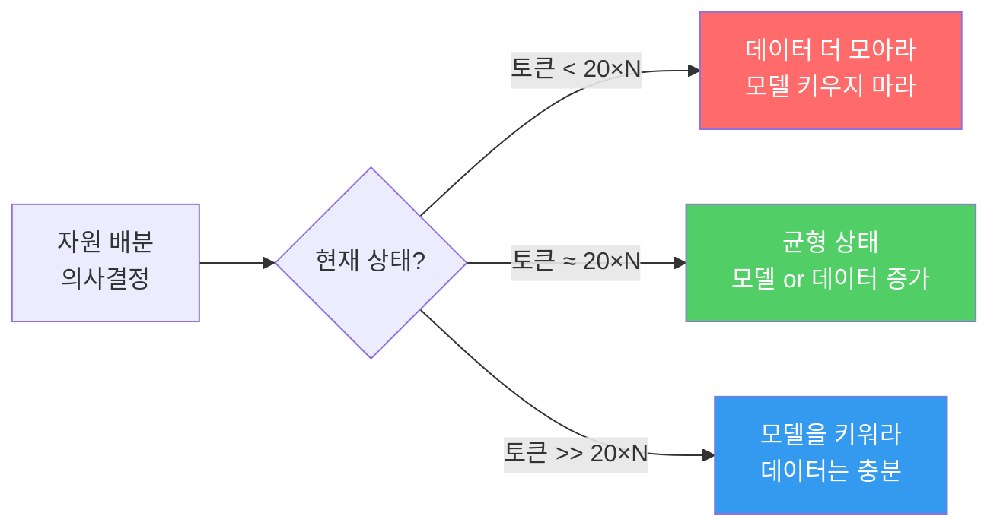
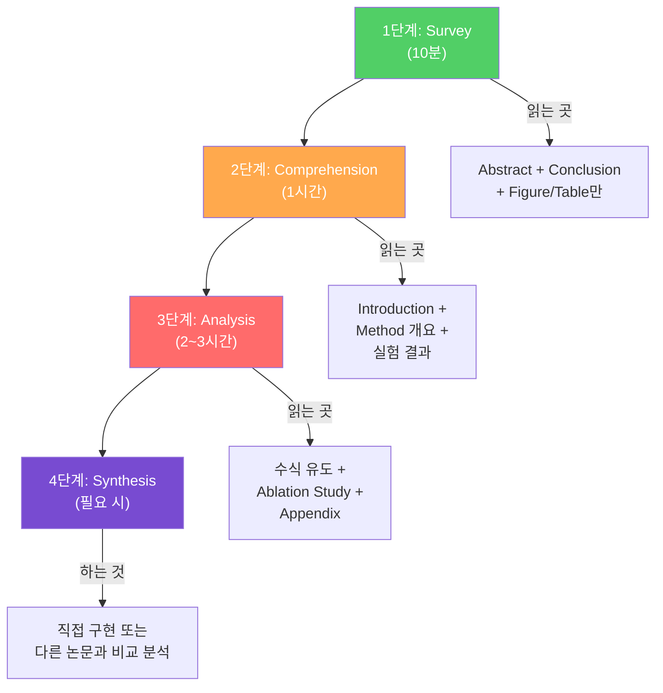

# 핵심 논문 리뷰와 구현

> 논문을 읽는 이유는 따라하기 위해서가 아니라, 왜 그렇게 했는지 이해하기 위해서다

---

## 1. 6대 필독 논문 요약

이 6편의 논문은 현대 LLM의 근간을 이루는 핵심 아이디어들이다. 각 논문이 어떤 문제를 해결했고, 학습 로드맵의 어디에 적용되었는지를 연결하는 것이 핵심이다.

| # | 논문명 | 연도 | 핵심 기여 | Phase에서 사용한 곳 |
|---|--------|------|----------|-------------------|
| 1 | **Attention Is All You Need** | 2017 | RNN/CNN 없이 Attention만으로 시퀀스 모델링 — Transformer 탄생 | Phase 2: Transformer 기초 |
| 2 | **LoRA: Low-Rank Adaptation** | 2021 | 전체 가중치 동결 + 저랭크 행렬만 학습 → 파인튜닝 비용 90% 이상 감소 | Phase 4: LoRA/QLoRA 실전 |
| 3 | **QLoRA** | 2023 | 4-bit 양자화 + LoRA 결합 → 48GB GPU 1장으로 65B 학습 | Phase 4: 효율적 파인튜닝 |
| 4 | **DPO: Direct Preference Optimization** | 2023 | Reward Model 없이 선호도 직접 학습 → RLHF 파이프라인 단순화 | Phase 6: 선호도 정렬 |
| 5 | **Scaling Laws for Neural LMs** | 2020 | 모델 크기, 데이터, 연산량의 거듭제곱 법칙 발견 | Phase 9: 자원 배분 전략 |
| 6 | **Chain-of-Thought Prompting** | 2022 | "단계별로 생각하자"로 추론 능력 극대화 | 프롬프트 엔지니어링 전반 |

---

## 2. 논문 간 영향 관계

---

## 3. 각 논문 핵심 해부

### 3-1. Attention Is All You Need (2017)

| 항목 | 내용 |
|------|------|
| 해결한 문제 | RNN의 순차 처리 병목 → 병렬 처리 불가 |
| 핵심 아이디어 | Self-Attention으로 모든 위치 간 관계를 한 번에 계산 |
| 핵심 수식 | Attention(Q,K,V) = softmax(QK^T / √d_k)V |
| 임팩트 | NLP를 넘어 Vision, Audio, 멀티모달까지 확장 |

### 3-2. LoRA (2021)

| 항목 | 내용 |
|------|------|
| 해결한 문제 | 전체 파인튜닝의 비용 — 모든 파라미터 업데이트 필요 |
| 핵심 아이디어 | W = W₀ + BA (B: d×r, A: r×d, r << d) |
| 실전 효과 | 학습 파라미터 0.1~1%, 메모리 70% 절감 |
| 핵심 통찰 | 파인튜닝 시 가중치 변화는 저랭크 구조를 가진다 |

### 3-3. QLoRA (2023)

| 항목 | 내용 |
|------|------|
| 해결한 문제 | LoRA로도 큰 모델은 GPU 메모리 부족 |
| 핵심 아이디어 | NF4 양자화 + Double Quantization + Paged Optimizer |
| 실전 효과 | 단일 48GB GPU에서 65B 모델 학습 가능 |
| 핵심 통찰 | NormalFloat4가 INT4보다 LLM 가중치 분포에 최적 |

### 3-4. DPO (2023)

| 항목 | 내용 |
|------|------|
| 해결한 문제 | RLHF의 복잡성 — Reward Model + PPO 불안정 |
| 핵심 아이디어 | Reward Model을 Policy에 내재화 → 분류 손실로 직접 최적화 |
| 실전 효과 | 모델 3개 → 2개, 학습 안정성 대폭 향상 |
| 핵심 통찰 | 최적 정책은 Reward function의 닫힌 형태 해로 표현 가능 |

### 3-5. Scaling Laws (2020)

| 항목 | 내용 |
|------|------|
| 해결한 문제 | 모델을 키우면 얼마나 좋아지는가? 자원을 어디에 써야 하는가? |
| 핵심 발견 | Loss는 모델 크기, 데이터 크기, 연산량의 거듭제곱 함수 |
| Chinchilla Optimal | **최적 토큰 수 ≈ 20 × 파라미터 수** |
| 핵심 통찰 | 모델을 키우는 것보다 데이터와 연산의 균형이 중요 |

#### Chinchilla Optimal 비율

| 파라미터 수 | 최적 토큰 수 | 설명 |
|------------|------------|------|
| 1B | 20B 토큰 | 소형 모델 |
| 7B | 140B 토큰 | LLaMA 2 7B |
| 13B | 260B 토큰 | LLaMA 2 13B |
| 70B | 1.4T 토큰 | LLaMA 2 70B |

### 3-6. Chain-of-Thought Prompting (2022)

| 항목 | 내용 |
|------|------|
| 해결한 문제 | LLM의 추론 능력 한계 — 복잡한 문제에서 바로 답 출력 |
| 핵심 아이디어 | "Let's think step by step" → 중간 추론 과정 생성 유도 |
| 실전 효과 | GSM8K (수학) 정확도 17.1% → 58.1% (PaLM 540B) |
| 핵심 통찰 | 모델은 이미 추론 능력을 가지고 있다, 꺼내는 방법이 필요할 뿐 |

---

## 4. 논문 읽기 방법론 4단계

논문을 처음부터 끝까지 순서대로 읽는 것은 가장 비효율적인 방법이다.

| 단계 | 시간 | 목표 | 핵심 질문 |
|------|------|------|----------|
| **Survey** | 10분 | 이 논문이 나에게 필요한가? | "무엇을 해결하고, 결과가 어떤가?" |
| **Comprehension** | 1시간 | 핵심 아이디어 이해 | "왜 이 방법을 선택했는가?" |
| **Analysis** | 2~3시간 | 수식과 실험 깊이 이해 | "이 가정이 깨지면 어떻게 되는가?" |
| **Synthesis** | 필요 시 | 재현 및 확장 | "내 문제에 어떻게 적용하는가?" |

### 읽기 핵심 원칙
- **80%의 논문은 1단계에서 걸러진다** — 모든 논문을 깊게 읽을 필요 없다
- **Ablation Study가 가장 중요한 섹션이다** — 무엇이 진짜 효과가 있었는지 보여준다
- **Related Work는 마지막에 읽어라** — 먼저 읽으면 편향이 생긴다

---

## 5. 논문에서 실전으로의 연결

| 논문 | 실전 도구 | 코드 1줄 요약 |
|------|----------|-------------|
| Attention Is All You Need | `transformers` | `model = AutoModel.from_pretrained()` |
| LoRA | `peft` | `model = get_peft_model(model, lora_config)` |
| QLoRA | `bitsandbytes` + `peft` | `BitsAndBytesConfig(load_in_4bit=True)` |
| DPO | `trl` | `DPOTrainer(model, ref_model, ...)` |
| Scaling Laws | 설계 원칙 | tokens = 20 * num_params |
| Chain-of-Thought | 프롬프트 설계 | `"Let's think step by step"` |

---

## 핵심 원칙

> **논문을 읽는 이유는 따라하기 위해서가 아니라, 왜 그렇게 했는지 이해하기 위해서다.** LoRA의 코드를 복사하는 것은 누구나 할 수 있다. "가중치 변화가 저랭크 구조를 가진다"는 통찰을 이해해야 다음 문제를 스스로 풀 수 있다.

---

## Phase 9 전체 체크포인트

| # | 확인 항목 | 관련 섹션 | 완료 |
|---|----------|----------|------|
| 1 | MoE의 Router → Expert 선택 흐름을 그릴 수 있는가 | 01: 아키텍처 | ☐ |
| 2 | Transformer vs MoE vs Mamba의 핵심 차이 3가지를 말할 수 있는가 | 01: 아키텍처 | ☐ |
| 3 | RoPE, YaRN, ALiBi 중 상황에 맞는 것을 선택할 수 있는가 | 01: 아키텍처 | ☐ |
| 4 | Continued Pre-training이 필요한 상황을 판단할 수 있는가 | 02: 고급 학습 | ☐ |
| 5 | TIES, DARE, SLERP 중 적절한 Merging 기법을 선택할 수 있는가 | 02: 고급 학습 | ☐ |
| 6 | Distillation에서 Soft Label의 의미를 설명할 수 있는가 | 02: 고급 학습 | ☐ |
| 7 | 6편 논문 각각의 핵심 기여를 한 문장으로 요약할 수 있는가 | 03: 논문 리뷰 | ☐ |
| 8 | Chinchilla Optimal 비율 (토큰 ≈ 20 × 파라미터)을 적용할 수 있는가 | 03: 논문 리뷰 | ☐ |
| 9 | 논문 읽기 4단계 방법론을 실천하고 있는가 | 03: 논문 리뷰 | ☐ |
| 10 | 각 논문의 통찰을 실전 코드/도구와 연결할 수 있는가 | 03: 논문 리뷰 | ☐ |
