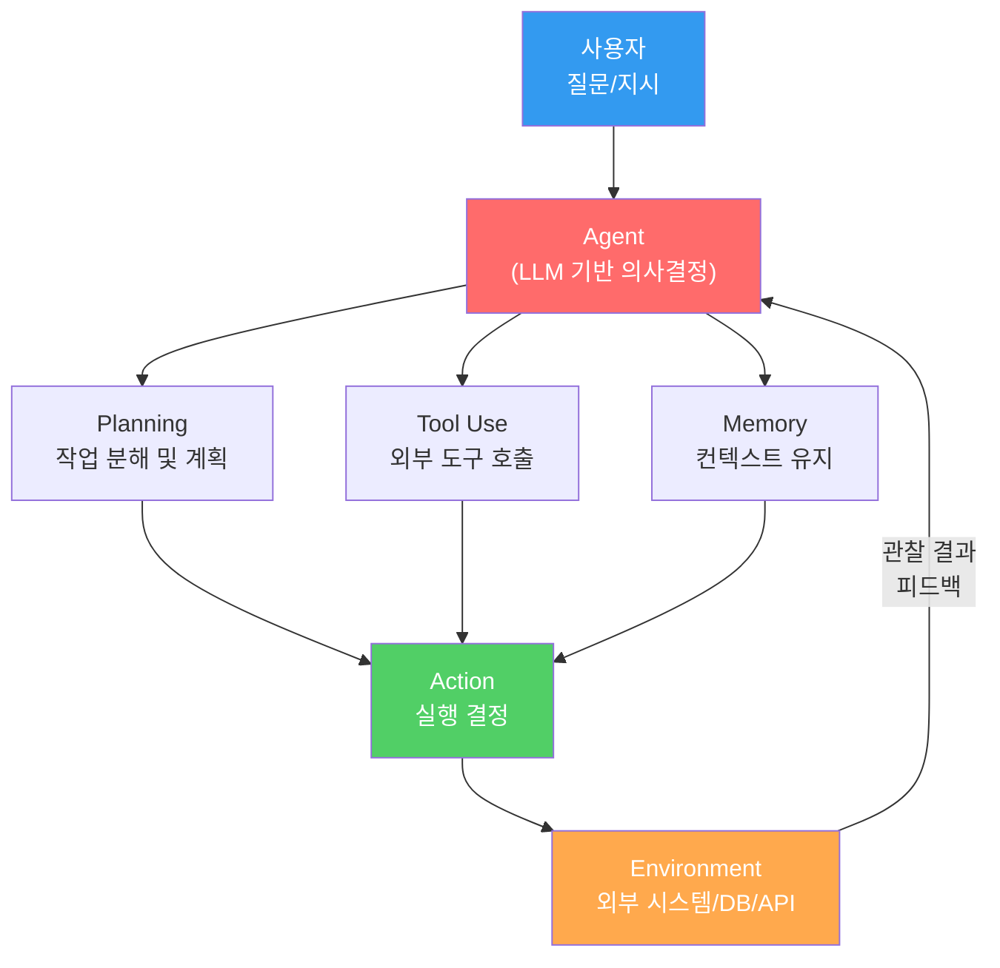
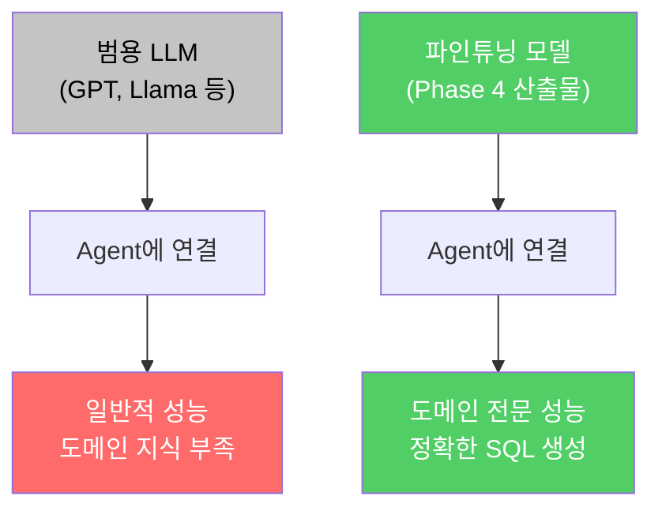

# 파인튜닝 모델 + 에이전트 통합

> 모델은 '뇌'이고 에이전트는 '몸'이다 — 뇌를 바꾸면 행동이 바뀐다

---

## 1. LLM Agent 아키텍처

에이전트는 단순 질의응답을 넘어, **스스로 계획하고 도구를 사용하며 결과를 기억하는** 자율적 시스템이다.



---

## 2. LLM Agent 4대 요소

| 요소 | 역할 | 구현 예시 |
|------|------|----------|
| **Planning** | 복잡한 작업을 하위 단계로 분해 | Chain-of-Thought, ReAct 프롬프팅 |
| **Tool Use** | 외부 API/DB/파일 시스템 호출 | Function Calling, SQL 실행 |
| **Memory** | 대화 히스토리 및 중간 결과 저장 | 단기: 대화 버퍼, 장기: 벡터 DB |
| **Action** | 계획과 도구를 기반으로 실제 행동 수행 | 코드 실행, API 호출, 응답 생성 |

---

## 3. Tool-Use 데이터 형식 (Function Calling)

파인튜닝 모델에게 도구 사용 능력을 가르치려면, **학습 데이터에 함수 호출 형식을 포함**해야 한다.

```json
{
  "messages": [
    {
      "role": "system",
      "content": "당신은 SQL 전문가입니다. 필요 시 execute_sql 함수를 호출하세요."
    },
    {
      "role": "user",
      "content": "직원 수가 가장 많은 부서는?"
    },
    {
      "role": "assistant",
      "content": null,
      "function_call": {
        "name": "execute_sql",
        "arguments": "{\"query\": \"SELECT department, COUNT(*) as cnt FROM employees GROUP BY department ORDER BY cnt DESC LIMIT 1\"}"
      }
    },
    {
      "role": "function",
      "name": "execute_sql",
      "content": "{\"department\": \"Engineering\", \"cnt\": 142}"
    },
    {
      "role": "assistant",
      "content": "직원 수가 가장 많은 부서는 Engineering으로, 총 142명입니다."
    }
  ]
}
```

---

## 4. LangChain 핵심 컴포넌트

| 컴포넌트 | 역할 | 설명 |
|----------|------|------|
| **LLM** | 추론 엔진 | OpenAI, Ollama, HuggingFace 등 모델 래퍼 |
| **Prompt** | 입력 구성 | PromptTemplate, ChatPromptTemplate로 동적 프롬프트 생성 |
| **Chain** | 파이프라인 연결 | 여러 단계를 순차적으로 연결 (LCEL: `\|` 연산자) |
| **Tool** | 외부 도구 | SQL 실행, 웹 검색, 계산기 등 |
| **Memory** | 상태 관리 | ConversationBufferMemory, 대화 히스토리 유지 |

---

## 5. Ollama + LangChain 연결

Phase 8에서 배포한 Ollama 모델을 LangChain 에이전트의 **두뇌**로 연결한다.

```python
from langchain_ollama import ChatOllama
from langchain_core.prompts import ChatPromptTemplate
from langchain_core.output_parsers import StrOutputParser

# Phase 4에서 파인튜닝한 모델을 Ollama로 로드
llm = ChatOllama(
    model="my-sql-model",       # Ollama에 등록한 모델명
    base_url="http://localhost:11434",
    temperature=0.1,             # SQL 생성이므로 낮은 temperature
)

# 프롬프트 템플릿
prompt = ChatPromptTemplate.from_messages([
    ("system", "당신은 SQL 전문가입니다. 주어진 스키마를 참고하여 SQL을 생성하세요.\n스키마: {schema}"),
    ("human", "{question}"),
])

# LCEL 체인 구성
chain = prompt | llm | StrOutputParser()

# 실행
result = chain.invoke({
    "schema": "employees(id, name, department, salary)",
    "question": "부서별 평균 급여는?"
})
print(result)
```

---

## 6. SQL Agent 파이프라인


| 단계 | 담당 | 핵심 기술 |
|------|------|----------|
| 질문 분석 | LLM (Planning) | 의도 파악, 필요 테이블 식별 |
| SQL 생성 | LLM (파인튜닝 모델) | Phase 4 Text-to-SQL 모델 |
| SQL 실행 | Tool (sqlite3) | 데이터베이스 직접 쿼리 |
| 결과 해석 | LLM (Action) | 쿼리 결과를 자연어로 변환 |

---

## 7. 파인튜닝 모델이 에이전트에 주는 이점



| 비교 항목 | 범용 LLM | 파인튜닝 모델 |
|----------|----------|-------------|
| SQL 정확도 | 60~70% | 85~95% |
| 도메인 스키마 이해 | 프롬프트 의존 | 학습에 내재 |
| 응답 형식 일관성 | 불안정 | 안정적 |
| 추론 비용 | API 과금 | 로컬 무료 (Ollama) |

---

## 8. Phase 10-01 체크포인트

| # | 질문 | 확인 |
|---|------|------|
| 1 | LLM Agent의 4대 요소(Planning, Tool Use, Memory, Action)를 설명할 수 있는가? | |
| 2 | Function Calling 데이터 형식의 구조를 이해하고 학습 데이터를 구성할 수 있는가? | |
| 3 | LangChain의 핵심 컴포넌트(LLM, Prompt, Chain, Tool, Memory)의 역할을 설명할 수 있는가? | |
| 4 | Ollama 모델을 LangChain에 연결하여 체인을 구성할 수 있는가? | |
| 5 | 파인튜닝 모델을 에이전트의 추론 엔진으로 사용했을 때의 이점을 설명할 수 있는가? | |

---

## 핵심 원칙

> **에이전트의 '뇌'를 바꾸면 행동이 바뀐다.** 범용 LLM은 범용 에이전트를 만들고, 도메인 특화 파인튜닝 모델은 도메인 전문가 에이전트를 만든다. Phase 4에서 만든 모델이 여기서 비로소 '일하는 시스템'이 된다.
