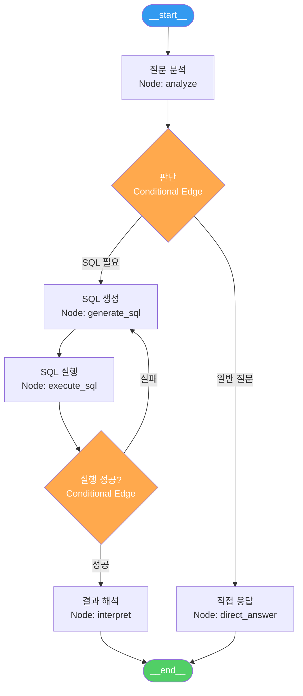
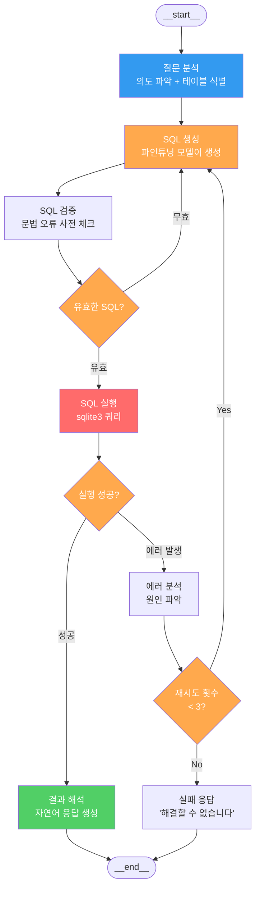
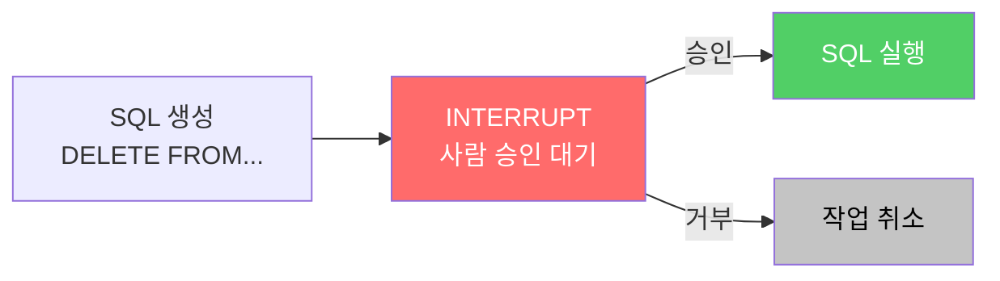

# LangGraph 마스터하기

> Chain은 직선도로, Graph는 도시 전체 도로망이다 — 현실의 문제는 직선으로 풀리지 않는다

---

## 1. LangGraph State Graph

LangGraph는 에이전트 워크플로우를 **노드(처리 단계)**와 **엣지(흐름)**로 구성하는 그래프 기반 프레임워크다.



---

## 2. LangGraph vs LangChain 비교

| 비교 항목 | LangChain (LCEL) | LangGraph |
|----------|-----------------|-----------|
| **구조** | 직선형 체인 (A→B→C) | 그래프 (분기 + 루프) |
| **조건 분기** | RunnableBranch (제한적) | Conditional Edge (자유롭게) |
| **루프/재시도** | 직접 구현 필요 | 내장 지원 |
| **상태 관리** | 수동 (변수 전달) | StateGraph (자동) |
| **Human-in-the-Loop** | 미지원 | 내장 interrupt 지원 |
| **체크포인팅** | 미지원 | 내장 (중단/재개) |
| **적합 용도** | 단순 파이프라인, 프로토타입 | 복잡한 멀티스텝 에이전트 |
| **비유** | 직선도로 | 도시 전체 도로망 |

---

## 3. 핵심 개념

| 개념 | 설명 | 코드 예시 |
|------|------|----------|
| **StateGraph** | 상태를 공유하는 그래프 정의 | `StateGraph(AgentState)` |
| **Nodes** | 각 처리 단계 (함수) | `graph.add_node("analyze", analyze_fn)` |
| **Edges** | 노드 간 고정 연결 | `graph.add_edge("analyze", "generate")` |
| **Conditional Edges** | 조건에 따른 분기 | `graph.add_conditional_edges("execute", route_fn)` |
| **Human-in-the-Loop** | 사람 승인 후 진행 | `interrupt_before=["execute"]` |
| **Checkpointing** | 상태 저장/복원 | `MemorySaver()` 또는 `SqliteSaver` |

---

## 4. 멀티스텝 SQL 에이전트

실패 시 자동으로 재생성하는 **자기 교정(Self-Correcting)** 에이전트.



---

## 5. StateGraph 구현 패턴

```python
from typing import TypedDict, Annotated
from langgraph.graph import StateGraph, END
from langgraph.checkpoint.memory import MemorySaver

# 1. 상태 정의
class SQLAgentState(TypedDict):
    question: str           # 사용자 질문
    schema: str             # DB 스키마
    sql: str                # 생성된 SQL
    result: str             # 실행 결과
    error: str              # 에러 메시지
    retry_count: int        # 재시도 횟수
    final_answer: str       # 최종 응답

# 2. 노드 함수 정의
def generate_sql(state: SQLAgentState) -> dict:
    """파인튜닝 모델로 SQL 생성"""
    sql = llm.invoke(f"Schema: {state['schema']}\nQuestion: {state['question']}")
    return {"sql": sql, "retry_count": state.get("retry_count", 0) + 1}

def execute_sql(state: SQLAgentState) -> dict:
    """SQL 실행"""
    try:
        result = db.execute(state["sql"])
        return {"result": str(result), "error": ""}
    except Exception as e:
        return {"error": str(e)}

# 3. 조건 분기 함수
def should_retry(state: SQLAgentState) -> str:
    if not state.get("error"):
        return "interpret"
    if state["retry_count"] < 3:
        return "generate_sql"
    return "fail"

# 4. 그래프 구성
graph = StateGraph(SQLAgentState)
graph.add_node("generate_sql", generate_sql)
graph.add_node("execute_sql", execute_sql)
graph.add_node("interpret", interpret_result)
graph.add_node("fail", failure_response)

graph.set_entry_point("generate_sql")
graph.add_edge("generate_sql", "execute_sql")
graph.add_conditional_edges("execute_sql", should_retry)
graph.add_edge("interpret", END)
graph.add_edge("fail", END)

# 5. 컴파일 (체크포인팅 포함)
app = graph.compile(checkpointer=MemorySaver())
```

---

## 6. Human-in-the-Loop 패턴

위험한 작업(DELETE, UPDATE) 전에 사람의 승인을 요구하는 패턴.



```python
# 위험 SQL 감지 시 interrupt
graph.compile(
    checkpointer=MemorySaver(),
    interrupt_before=["execute_sql"]  # 실행 전 중단
)

# 사용자 승인 후 재개
result = app.invoke(None, config)  # 중단된 지점부터 재개
```

| 패턴 | 적용 시점 | 이유 |
|------|----------|------|
| `interrupt_before` | 실행 전 승인 | DELETE/UPDATE 등 위험 SQL |
| `interrupt_after` | 실행 후 확인 | 결과 검증이 필요한 경우 |
| 자동 진행 | 승인 불필요 | SELECT 등 읽기 전용 쿼리 |

---

## 7. Phase 10-02 체크포인트

| # | 질문 | 확인 |
|---|------|------|
| 1 | LangGraph와 LangChain의 근본적 차이를 설명할 수 있는가? | |
| 2 | StateGraph의 Node, Edge, Conditional Edge 개념을 이해하는가? | |
| 3 | 실패 시 자동 재시도하는 멀티스텝 에이전트를 설계할 수 있는가? | |
| 4 | Human-in-the-Loop 패턴의 필요성과 구현 방법을 설명할 수 있는가? | |
| 5 | Checkpointing을 활용하여 에이전트 상태를 저장/복원할 수 있는가? | |

---

## 핵심 원칙

> **Chain은 직선도로, Graph는 도시 전체 도로망이다.** 현실의 문제는 "질문→답변"의 직선이 아니라, 분기하고 실패하고 재시도하는 복잡한 경로를 거친다. LangGraph는 이 복잡성을 구조적으로 다룬다.
