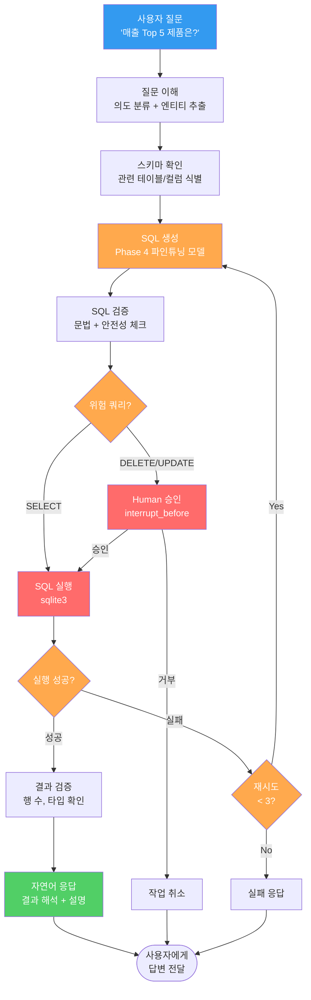
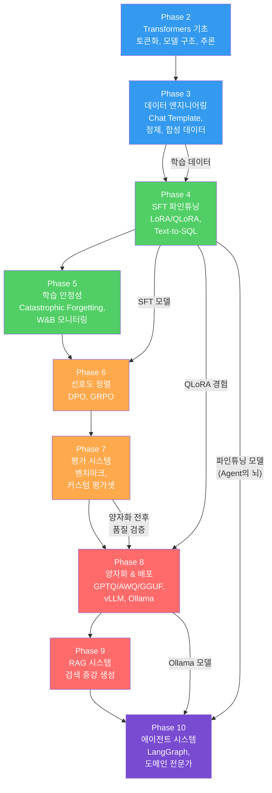

# 도메인 전문가 에이전트 + 전체 회고

> 기술의 가치는 배운 양이 아니라, 하나의 문제를 끝까지 풀어본 경험에서 나온다

---

## 1. SQL 전문가 에이전트 전체 워크플로우

Phase 2~10의 모든 기술이 결합된 최종 시스템.

---

## 2. 기술 스택

| 계층 | 기술 | 역할 | 출처 Phase |
|------|------|------|-----------|
| **추론 엔진** | Ollama | 파인튜닝 모델 로컬 서빙 | Phase 8 |
| **모델 (뇌)** | Phase 4 SFT 모델 | Text-to-SQL 특화 추론 | Phase 4 |
| **워크플로우** | LangGraph | 멀티스텝 상태 관리 + 분기 | Phase 10 |
| **도구** | sqlite3 | SQL 실행 | Phase 10 |
| **데이터** | Phase 3 데이터 | 학습 데이터 파이프라인 | Phase 3 |
| **정렬** | DPO/GRPO | 모델 품질 정렬 | Phase 6 |
| **평가** | Phase 7 평가셋 | 성능 검증 | Phase 7 |
| **양자화** | GGUF (Q4_K_M) | 경량화 + 배포 | Phase 8 |

---

## 3. Phase 2-10 전체 파이프라인

---

## 4. 각 Phase별 핵심 산출물

| Phase | 주제 | 핵심 산출물 | 다음 단계에서의 역할 |
|-------|------|-----------|-------------------|
| **Phase 2** | Transformers 기초 | 토큰화/모델 로드 능력 | 모든 Phase의 기반 기술 |
| **Phase 3** | 데이터 엔지니어링 | 정제된 Chat 형식 학습 데이터 | Phase 4 SFT의 입력 데이터 |
| **Phase 4** | SFT 파인튜닝 | Text-to-SQL 파인튜닝 모델 | Phase 6 정렬, Phase 10 에이전트의 뇌 |
| **Phase 5** | 학습 안정성 | 안정적 학습 프로세스 + 모니터링 | Phase 4, 6의 품질 보장 |
| **Phase 6** | 선호도 정렬 | DPO/GRPO 정렬 모델 | Phase 7 평가 대상 |
| **Phase 7** | 평가 시스템 | 벤치마크 + 커스텀 평가 파이프라인 | Phase 8 양자화 품질 검증 |
| **Phase 8** | 양자화 & 배포 | GGUF 양자화 모델 + Ollama 서빙 | Phase 10 에이전트의 추론 엔진 |
| **Phase 9** | RAG 시스템 | 검색 증강 생성 파이프라인 | 에이전트의 지식 확장 도구 |
| **Phase 10** | 에이전트 시스템 | **도메인 전문가 에이전트** | **최종 통합 산출물** |

---

## 5. 다음 단계: 실전 프로젝트 아이디어

| # | 프로젝트 | 활용 기술 | 난이도 |
|---|---------|----------|--------|
| 1 | **사내 DB 자연어 인터페이스** — 비개발자가 자연어로 사내 DB 조회. 스키마 자동 탐색 + SQL 생성 + 실행 + 시각화까지 | Phase 4 SFT + Phase 10 LangGraph + Streamlit | 중 |
| 2 | **도메인 문서 기반 Q&A 봇** — 사내 매뉴얼/규정집을 RAG로 검색하고, 파인튜닝 모델로 도메인 정확도 높인 챗봇 | Phase 9 RAG + Phase 4 SFT + Phase 10 Agent | 중상 |
| 3 | **자동 데이터 분석 에이전트** — CSV 업로드 시 자동으로 EDA 수행, 인사이트 도출, 보고서 생성하는 멀티스텝 에이전트 | Phase 10 LangGraph + Tool Use + Code Execution | 상 |

---

## 6. Phase 10 체크포인트

| # | 질문 | 학습 위치 |
|---|------|----------|
| 1 | LLM Agent의 4대 요소를 설명하고, 각각의 구현 방법을 제시할 수 있는가? | 01 |
| 2 | 파인튜닝 모델을 LangChain/Ollama로 연결하여 체인을 구성할 수 있는가? | 01 |
| 3 | LangGraph의 StateGraph, Node, Conditional Edge 개념을 이해하고 구현할 수 있는가? | 02 |
| 4 | 실패 자동 재시도 + Human-in-the-Loop을 포함한 멀티스텝 에이전트를 설계할 수 있는가? | 02 |
| 5 | Phase 4 파인튜닝 모델을 에이전트의 뇌로 통합하여 도메인 전문가 시스템을 구축할 수 있는가? | 03 |

---

## 7. 전체 커리큘럼 최종 체크포인트

| Phase | 핵심 역량 | 자기 진단 |
|-------|----------|----------|
| **Phase 2** | Transformer 모델을 로드하고 토큰화/추론을 수행할 수 있는가? | |
| **Phase 3** | Chat Template 형식으로 학습 데이터를 구성하고 정제할 수 있는가? | |
| **Phase 4** | LoRA/QLoRA로 모델을 파인튜닝하고 학습 곡선을 분석할 수 있는가? | |
| **Phase 5** | Catastrophic Forgetting을 진단하고 학습을 안정화할 수 있는가? | |
| **Phase 6** | DPO로 모델을 선호도 정렬하고 beta의 영향을 이해하는가? | |
| **Phase 7** | 벤치마크와 커스텀 평가셋으로 모델 성능을 정량 측정할 수 있는가? | |
| **Phase 8** | 모델을 양자화하고 Ollama/vLLM으로 배포할 수 있는가? | |
| **Phase 9** | RAG 파이프라인을 구축하여 외부 지식을 모델에 연결할 수 있는가? | |
| **Phase 10** | LangGraph로 멀티스텝 에이전트를 설계하고 파인튜닝 모델을 통합할 수 있는가? | |

---

## 핵심 원칙

> **기술의 가치는 배운 양이 아니라, 하나의 문제를 끝까지 풀어본 경험에서 나온다.** Phase 2에서 토큰 하나를 이해하는 것으로 시작해, Phase 10에서 자율적으로 판단하는 에이전트를 만들었다. 이 전체 여정을 관통하는 하나의 프로젝트를 완성하라. 그것이 열 개의 Phase를 배운 것보다 더 큰 가치를 만든다.
